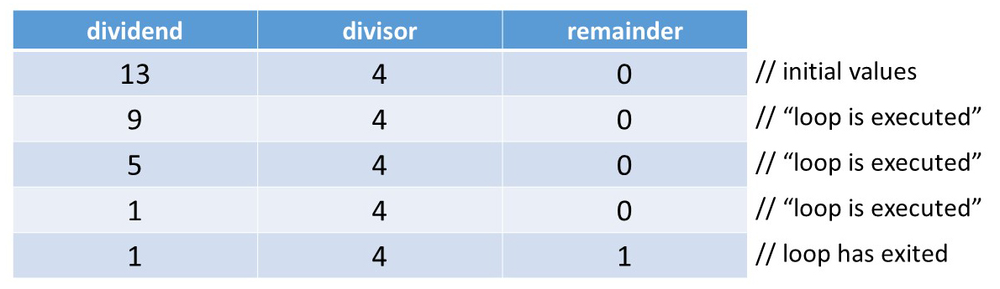
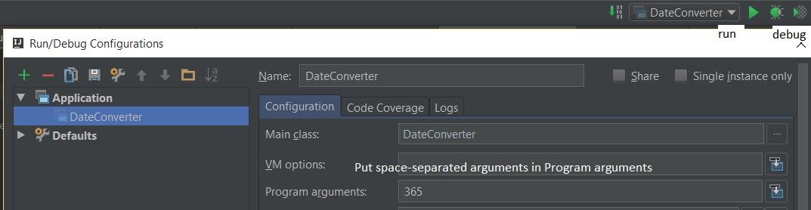
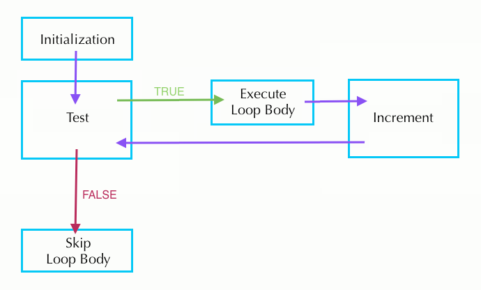
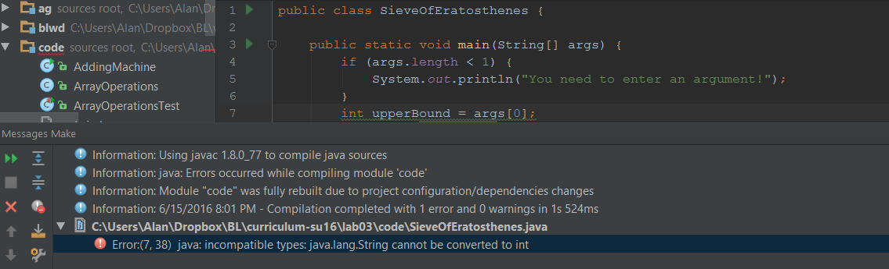

## Before You Begin ##

> Make sure you've read the [Collaboration Guide](../../guides/collaboration-guide) to see what's going on with all this partnership business.

In beacon, select your partner.

Once confirmed, your partnership page on beacon will contain a link to view the repository on GitHub, which should
have a name of the form `su20-s***-s***`.

Both of you should clone this repository. Make sure you **do not** clone this repository inside of another
repository--you will experience git problems if you do so.
```sh
$ git clone https://github.com/Berkeley-CS61B-Student/su20-s***-s***.git
```

Change directory into it:
```sh
$ cd su20-s***-s***
```

And add the skeleton remote:
```sh
$ git remote add skeleton https://github.com/cs61bl/skeleton-su20.git
```

You'll then be able to pull as usual:
```sh
$ git pull skeleton master
```

> If you get an error similar to "fatal: refusing to merge unrelated
> histories", you can fix this by, for this time only, running:
>
> ```sh
> $ git pull --rebase --allow-unrelated-histories skeleton master
> ```

You should be using this shared repository for this week's labs and the project.
Both you and your partner will work together on the same code base. After adding and commiting your own work, you can receive your partner's work:

```sh
$ git pull origin master
```

Make sure to pull the code for Lab 3 from GitHub.


### Learning Goals for Today

First off, this lab will provide an introduction to Java loops and conditionals (the `if`, `while` and `for` statements), followed by a brief explanation of Java Arrays. We assume no prior experience with any of these topics in Java, but we _do_ assume some prior knowledge of these concepts from an earlier course (like Python flow control and lists as taught in CS61A).

Because of this, there is a lot of information presented in this lab, but hopefully most of it will be review that can be skimmed through quickly.

This course strives to teach you how to "program", and this includes not just teaching you how to write code, but how to do a variety of activities. Today's lab includes some exercises that tests your ability not only to write code, but also to analyze code (to figure out what code does), to test code (to see if given code is doing what it should do) and to evaluate multiple versions of code.

## Review of if/else and while

### How `if` and `if ... else` Work

You've already seen some of this from the first lab, and hopefully in another course, so it should be a bit of a review — but read on!

An `if` statement starts with the word `if`. It is followed by a _condition_ statement **in parentheses** that is either true or false (a _boolean expression_). There is then a sequence of statements surrounded by braces, which is called the _body_. For example:

```java
if (year % 4 == 0) {
    System.out.println (year + " might be a leap year.");
}
```

(Note: like in Python, the `%` symbol above is called _mod_, and it takes the remainder after division. The above statement is checking if `year` has no remainder when divided by 4).

The braces after an `if` statement aren't technically necessary if there is only one statement in the sequence; however, it is good practice to always include them since it makes it easier to add lines to the body later.

Unlike other languages (Python in particular), the condition of the `if` statement _must_ be a boolean statement or a statement that reduces to a boolean expression. "if (5):" is a legal statement in Python, but will throw an error in Java.

Boolean expressions often involve comparisons. The comparison operators in Java are `==` and `!=` for equality and inequality testing, and `>`, `>=`, `<`, and `<=` for comparison of magnitudes. Multiple comparisons can be chained together with the logical operators `&&` (and) and `||` (or). If instead you wish to negate an expression, you can prefix your expression with `!`, the Java negation operator.

The block of statements following the `if` statement above will not execute if `year`'s value is not divisible by 4. If you wanted something to happen when the test fails, use the `else` keyword. Here's an example:

```java
if (year % 4 == 0) {
    System.out.println (year + " might be a leap year.");
} else {
    System.out.println (year + " is definitely not a leap year.");
}
```

You can also add further tests that are executed only if above boolean expressions evaluate to false, for example:

```java
if (year % 4 != 0) {
    System.out.println (year + " is not a leap year.");
} else if (year % 100 != 0) {
    System.out.println (year + " is a leap year.");
} else if (year % 400 != 0) {
    System.out.println (year + " is not a leap year.");
} else {
    System.out.println (year + " is a leap year.");
}
```

Note that only one body section, the one corresponding to the first true boolean expression (or `else` if none are true), will execute. After that, your program will continue on, skipping all the remaining code in this `if` structure. This implies that none of the conditions below the first true boolean expression will be evaluated.

One consequence of conditions reveals in non-void methods. Recall that in Java, you must return something of the return type. Consider the following code snippet

```java
public int relu(int x) {
    if (x < 0) {
        return 0;
    }
}
```

As the code is, it will not compile. That is because currently, a value is only returned when `x` is less than 0. What happens when that's not the case? Java must be assured that `relu()` _always_ returns an int, and thus will not allow you to compile your code.

A correct version looks like this:
```java
public int relu(int x) {
    if (x < 0) {
        return 0;
    } else {
        return x;
    }
}
```

### How `while` Works

The `while` statement is used to repeat a sequence of statements. It consists of the word `while`, followed by a continuation _test_ in parentheses, also called the _condition_. It is then followed by a sequence of statements to repeat enclosed in braces, called the _loop body_.

The `while` statement works by evaluating the condition. If the condition is true (the test succeeds), the entire loop body is executed, and the condition is checked again. If it succeeds again, the entire loop body is executed again. This continues, possibly infinitely.

A common mistake when first learning a Java-like language is to think that the behavior of `while` is to stop as soon as the test becomes false, possibly in the middle of the loop. This is not the case. The test is checked only at the end of a complete iteration, and so this is the only time the loop can stop.

Here's an example that implements the remainder operation `dividend % divisor`, and produces some output. We assume all variables have already been declared, and that `divisor` and `dividend` have already been assigned positive values.

```java
while (dividend >= divisor) {
    dividend = dividend - divisor;
    System.out.println ("loop is executed");
}
remainder = dividend;
```

All statements of the loop body are executed, even if one of them affects the truth value of the test. In the example above, values of 9 for `dividend` and 4 for `divisor` result in two lines of output. We show a representation with values of 13 for `dividend` and 4 for `divisor` and initially 0 for `remainder`. This results in 3 lines of output.

When debugging `while` loop code, sometimes it's useful to make charts like the one below to keep track of the value of each variable.



### Exercise: Date Converter

The program `DateConverter.java` in the `lab03` skeleton folder is missing two
assignment statements. The missing statements can either be at the beginning,
the end, or at both the beginning and the end of the loop.

#### Date Converter Tests
In a bit, you'll determine what the statements are and where they go. But
first, you'll come up with a small but comprehensive set of tests for the code
before writing the code itself. This technique is called *test-driven
development*, and we'll be doing it more in subsequent labs.

Create a table with 6 pairs of Input and Output. Ensure you have some edge cases to
test for odd behavior! The input should be in the form of a day number in 2020, 
an integer between 1 and 365, and the corresponding date output. An example is 365 is 12/31.

This will not be handed in or graded, but later in the lab you will be using these input and 
outputs to verify the correctness of your code.

#### Implement and Test

Testing the code involves supplying a value for `dayOfYear` on the command
line. A few new things about the code:

- The value for `dayOfYear` is read from `args[0]`, which is a command line argument. Review the previous labs if you don't remember how to run a program with different command line arguments.

- The statement `import java.io.*;` makes Java library methods involving input and output accessible inside the program. You don't have to worry about this.

- The five lines starting with `try {` catches an _exception_ that would occur if the command line argument isn't an integer. We'll learn about exceptions in a couple of weeks.

Complete `DateConverter.java` by putting in two assignment statements as specified above. Once you're done with that, compile your program and try each one of your test cases.

IntelliJ will automatically compile your code when you save the file; in order to provide an input argument go to Run -> Edit Configurations, and put the arguments in the Program Arguments box:



You can run it with the green play button in the top right (as labeled). Clicking the name of the class in the top right will allow you to change the class that is run. Another way is to right click the name of the class you want to run in the left sidebar and select "Run".

#### Testing
Using the Input and Output table you created earlier, test your program. Does it provide the expected output for all of your inputs?

### Exercise: A Jigsaw Puzzle - Drawing a Triangle

The file `TriangleDrawer.stuff` contains a collection of statements. Some of the statements, together with some extra right braces, form the body of a main method that, when executed, will print the triangle:

    *
    **
    ***
    ****
    *****
    ******
    *******
    ********
    *********
    **********

(Each line has one more asterisk than its predecessor; the number of asterisks in the last line is the value of the `SIZE` variable.)

First, switch places with your partner. Copy and paste statements from the `TriangleDrawer.stuff` file into the main method of a new class you create called `TriangleDrawer.java`. You'll have to add some right braces in addition to the copied lines that you've chosen and rearranged. (You won't need all the statements. You shouldn't need to use any statement more than once.)

Many students encounter infinite loops in their first solutions to this problem. If you get an infinite loop, be sure to hit the big red square button ("Terminate") in IntelliJ's console to stop the program.

## Review of For statements

### The `for` Statement

The `for` statement provides another way in Java to repeat a sequence of statements, similar to `while` but slightly different. It starts with `for`, continues with _loop information_ inside parentheses, and ends with the _loop body_ (the segment to be repeated) enclosed in curly braces.

```java
for (loop-information) {
    loop-body;
}
```

Loop information consists of _initializations_, a _test_ (condition), and _increments_. These three sections are separated by semicolons, and any of these may be omitted. If there is more than one initialization or increment, they are separated by commas. If the test succeeds, the loop continues.

```java
for (initialization; test; increment) {
    loop-body;
}
```

Loop execution proceeds as follows:

1. Initializations are performed.
2. The test is evaluated.
    - If the condition is false, the loop is finished and execution continues with the code following the for loop.
    - If the condition is true, the loop body is executed, increments are performed, and we loop back to the top of step 2 where the test is evaluated again. (Note: We never re-initialize.)



The following loops are several equivalent ways to compute `n` factorial
(the product of all the positive integers up through `n`).

- Two initializations in loop-information

```java
for (int k = n, product = 1; k > 0; k = k - 1) {
    product = product * k;
}
```

- Product initialized outside for loop

```java
int product = 1;
for (int k = n; k > 0; k = k - 1) {
    product = product * k;
}
```

- Decrement performed inside the loop-body

```java
int product = 1;
for (int k = n; k > 0; ) {
    product = product * k;
    k = k - 1;
}
```

- While loop equivalent

```java
int product = 1;
int k = n;
while (k > 0) {
    product = product * k;
    k = k - 1;
}
```

Look over these four options and decide with your partner which is the easiest to read. Why?

As the last loop demonstrates, the `for` loop is basically a
repackaged `while` loop that puts all the information about how long the
loop should continue in one place. Thus, a `for` loop is generally easier
to understand than an equivalent `while` loop.

### Shortcuts for Incrementing/Decrementing

Let `k` be an integer variable. Then the three following statements are
equivalent in that they all increment `k`.

```java
k = k + 1;
k += 1;
k++;
```

Similarly, these three statements all decrement `k` by 1.

```java
k = k - 1;
k -= 1;
k--;
```

Note: The motivation for this shorthand notation is that the operations of
incrementing and decrementing by 1 are very common. While it is legal to
increment or decrement variables within larger expressions like

```java
System.out.println(values[k++]);
```

this is a risky practice very susceptible to off-by-one errors. Therefore,
we ask that you only use the `++` or `--` operations on lines **by themselves**.


### The Break Statement

The `break` statement "breaks out of" a loop (both for and while loops). In other words, it stops the execution of the loop body, and continues with the statement immediately following the loop. An example of its use would be a program segment that searches an array named `values` for a given `value`, setting the variable found to true if the value is found and to false if it is not in the array.

```java
boolean found = false;
for (int k = 0; k < values.length; k++) {
    if (values[k] == value) {
        found = true;
        break;
    }
}
```

This `break` statement allows us to save computation time. If we find the value within
the array before the end, we don't waste more time looping through the rest
of the array.

However, the `break` statement is not always necessary, and code with a lot
of breaks can be confusing. Abusing the break statement is often considered
poor style. When using `break`, first consider if instead it would be more
appropriate to put another condition in the test.

### The Continue Statement

The `continue` statement skips the current iteration of the loop body,
increments the variables in the loop information, then evaluates the loop
test. This example checks how many 0's there are in array `values`:

```java
int count = 0;
for (int i = 0; i < values.length; i++) {
    if (values[i] != 0) {
        continue;
    }
    count += 1;
}
System.out.println("Number of 0s in values array: " + count);
```

Similar to the `break` statement, the `continue` allows us to save time by
skipping sections of the loop. In this case, the `continue` allows us to add
to the `count` only when there is a 0 in the array. Removing continue will
give an incorrect output.

The difference between `break` and `continue` is that `break` immediately stops the loop and moves on to the code directly following it. In comparison, `continue` stops going through the current iteration of the loop body and immediately continues on to the next iteration as given by the loop information.

Like with `break`, abusing `continue` is often considered poor style. Try not
to go crazy with nested breaks and continues.

Both `break` and `continue` apply to only the closest loop it is enclosed in. For instance, in the case of the following nested loop, the `break` will only exit out of the inner for loop, not the outer one.

```java
for (int i = 0; i < values.length; i++) {
    for (int j = i + 1; j < values.length; j++) {
        if (values[i] == value[j]) {
            break;
        }
    }
}
```

### Exercise: Another Jigsaw Puzzle

Make a new Java file called `TriangleDrawer2.java` (you might want to copy and paste from `TriangleDrawer.java`). In this file, rewrite the program so that it produces the exact same output, but using `for` loops and no `while` loops. If you have having trouble, re-read the parts above describing how to convert a `while` loop to a `for` loop.

## Arrays

### Array Definition and Use

 An array is an indexed sequence of elements, all the same type. Real-life examples of arrays include the following:

- post office boxes
- book pages
- egg cartons
- chessboards/checkerboards

We declare an array variable by giving the type of its elements, a pair of square brackets, and the variable name, for example:

```java
int[] values;
```

Note that we don't specify the length of the array in its declaration.

Arrays are basically objects with some special syntax. To initialize an array, we use the new operator as we do with objects; the argument to new is the type of the array, which includes the length. For example, the statement

```java
values = new int[7];
```

stores a reference to a 7-element integer array in the variable `values`. This initializes the array variable itself. If we want to declare and initialize the array at the same time, we can:

```java
int[] values = new int[7];
```

The elements of the array are indexed from `0` to `(array length) - 1` and the element at a particular index can be changed with an assignment statement. For example, to set the second element to `4` we write:

```java
values[1] = 4;
```

For an `int` array, Java will (by default) set all of the elements to `0`. Similarly, `double` arrays will be filled with `0.0`, `boolean` with `false`, etc. For arrays of references to non-primitive objects (review Lab 2 if you need a refresher), the array will be initialized with `null`.

If you know what every value in your array should be at initialization time, you can use this simplified syntax to directly initialize the array to the desired values. Note that you don't have to provide the array length because you're explicitly telling Java how long your array should be.

```java
int[] oneThroughFive = new int[]{1, 2, 3, 4, 5};
//This also works but only if you declare and instantiate in the same line
int[] oneThroughFive = {1, 2, 3, 4, 5};
```

To access an array element, we first give the name of the array, and then supply an index expression for the element we want in square brackets. For example, if we want to access the `k`th element of values (0-indexed), we can write,

```java
values[k]
```

If the value of the index expression is negative or greater than/equal to the length of the array, an exception is thrown (negative indexing is not allowed).

Every array has an instance variable named `length` that stores the number of elements that array can hold. For the `values` array just defined, `values.length` is 7. The length variable can't be changed; once we create an array of a given length, we can't shrink or expand that array.

### `for` Statements with Arrays

`for` statements work well with arrays. Consider, for example, an array named `values`. It is very common to see code like the following:

```java
    for (int k = 0; k < values.length; k += 1) {
        // do something with values[k]
    }
```

### Exercise: An Adding Machine Simulator

Consider a program that simulates an old-fashioned adding machine. The user types integers as input, one per line. Input should be handled as follows:

- A nonzero value should be added into a subtotal.

- A zero value should print the subtotal and reset it to zero.

- Two consecutive zeroes should print the total of all values inputted, then print out every value that was inputted in sequence (_not_ including zeroes) then terminate the program.

Here's an example of how the program should behave.

| _user input_ | _printed output_ |
|:------------:|:----------------:|
| 0            | subtotal 0       |
| 5            |                  |
| 6            |                  |
| 0            | subtotal 11      |
| -5           |                  |
| 5            |                  |
| 0            | subtotal 0       |
| 13           |                  |
| -8           |                  |
| 0            | subtotal 5       |
| 0            | total 16         |
|              | 5                |
|              | 6                |
|              | -5               |
|              | 5                |
|              | 13               |
|              | -8               |

If your partner has been coding recently, please switch places. Then, complete the framework in `AddingMachine.java` to produce the simulator program. You can add code anywhere in the program, though you shouldn't have to remove any.

A few more details:

- You can assume that we will never enter more than `MAXIMUM_NUMBER_OF_INPUTS` non-zero values during any run of the program. In real life, you'll never have a guarantee like this, but you haven't been taught the proper Java to handle an arbitrarily long sequence of inputs.

- To exit the `main` method, execute a `return;` statement somewhere inside the method. Because the `main` method is of type `void`, it can't return a value. Therefore, the appropriate `return` statement doesn't have an argument.

- This code introduces the `Scanner` class. A `Scanner` can be used to read user input. Here the `Scanner` is created with `System.in` as an argument, which means that it is expecting input from the command line (or from IntelliJ's Console).

    - You can do a variety of things with a `Scanner`, but in this exercise you'll find it most useful to use code like this:
    ```java
    int k;
    k = scanner.nextInt();
    ```

    - Here, `scanner` reads everything it can from its input and stores the result in an integer `k`. Because `scanner`'s input is the command line, the program will actually stop and wait at this part of the code until the user types in something at the command line and hits enter. For example, if the user types `100`, then the program will store the value `100` in `k` before continuing on.

### Exercise: Insert & Delete

Look at the files `ArrayOperations.java` and `ArrayOperationsTest.java`.

Fill in the blanks in the `ArrayOperations` class. Your methods should pass
the tests in `ArrayOperationsTest`.

Note: Before trying to program an algorithm, you should usually try a small
case by hand. For each of the exercises today, work with a partner to do
each algorithm by hand before writing any code.

- The `insert` method takes three arguments: an `int` array, a position in the
array, and an `int` to put into that position. All the subsequent elements
in the array are moved over by one position to make room for the new element.
The last value in the array is lost.

For example, let `values` be the array {1, 2, 3, 4, 5}. Calling

```java
insert(values, 2, 7)
```

would result in `values` becoming {1, 2, 7, 3, 4}.

- The `delete` method takes two arguments: an `int` array and a position in
the array. The subsequent elements are moved down one position, and the
value 0 is assigned to the last array element.

For example, let `values` be the array {1, 2, 3, 4, 5}. Calling

```java
delete(values, 2)
```

would result in `values` becoming {1, 2, 4, 5, 0}.

For today don't worry about the methods being called with incorrect input.

### Exercise: It's all Greek to Me

So far all the exercises have involved writing your own code. This is an important skill, but is far from the only thing you need to be a successful programmer. Equally important is debugging code. `SieveOfEratosthenes.template` is a file that has been provided for you. When you call this program from the command line, you provide it a single integer input as such:

```sh
java SieveOfEratosthenes 500
```

This program calculates all prime numbers smaller than the input value and prints them out in increasing order.
(If the input number is prime, it itself is not printed; only primes smaller than it are printed.) It uses the algorithm known as the Sieve of Eratosthenes, which is one of the fastest prime number finding algorithms there is (even though it's over 2000 years old!). However, the file as it has been given to you is buggy and incomplete (in fact, it won't even compile). You have several tasks ahead of you.

First, read the wikipedia page on the [Sieve of Eratosthenes](https://en.wikipedia.org/wiki/Sieve_of_Eratosthenes) so that you understand how the algorithm works and rename `SieveOfEratosthenes.template` to be `SieveOfEratosthenes.java`.

Second, attempt to compile `SieveOfEratosthenes.java`.
In IntelliJ, you can compile (and run) by clicking on the green triangular play button in the left margin of line 1 of your file.
The output you should see looks something like this:

```sh
    SieveOfEratosthenes.java:7: error: incompatible types
        int upperBound = args[0];
                             ^
  required: int
  found:    String
1 error
```

Or, in IntelliJ it will show a red squiggly underline and an error message if you try to run it:



Fortunately, just seeing the red squigglies in your code will let you know right away if something you've typed won't compile.

Before anything else, try to understand what the Java compiler is telling you. Once you understand what is going wrong, you'll probably realize you don't know how to fix this problem: _DON'T ASK FOR HELP JUST YET_. An important part of CS61BL is teaching you how to debug and look for help on your own and with your partner. Once you've realized what the error is, you and your partner should try searching for how to solve this problem online (Google is your friend). (IntelliJ trick for after you figure out how to fix it: press Alt+Enter to bring up options to quick fix, quick-import, or quick-change any code your cursor is on! Abuse it!).

Third and finally, fix all the bugs in `SieveOfEratosthenes.java` and complete the unfinished parts so that it works as intended.

> Hint: If you're having trouble figuring out what to do in the corrupted part, try to fill in the blanks here..."when i is 2, we need to mark numbers a, b, c, d, e, and f as not prime; when i is 3, we need to mark ...".

### Multidimensional Arrays

Having an array of objects is very useful, but often you will want to have an array _of arrays_ of objects. Java does this in a very natural way. We've already learned that to declare an array, we do:

```java
int[] array;
```

Similarly, to declare an array of arrays, we do:

```java
int[][] arrayOfArrays;
```

When constructing an array of arrays, you _must_ declare how many arrays it contains (because this is the actual array you are constructing), but you don't have to declare the length of each array. To declare an array of 10 arrays, you do this:

```java
int[][] arrayOfArrays = new int[10][];
```

To construct the first array in the array of arrays, you could do:

```java
arrayOfArrays[0] = new int[5];
```

And you could access the first index of the first array as:

```java
arrayOfArrays[0][0] = 1;
```

Hopefully this all makes sense. Alternatively, you can fix the length of each array in the array of arrays as the same length like this:

```java
int[][] tenByTenArray = new int[10][10];
```

An array of arrays, when the different sub-arrays can be of different sizes, is called a _jagged array_. If they are all the same size, it is often convenient to forget altogether that you have an array of arrays, and instead to simply imagine you had a multi-dimensional array. For instance, you could create a 3-dimensional array (to represent points in space, for example) like this:

```java
int[][][] threeDimensionalArray = new int[100][100][100];
```

This 3D array has 100x100x100 = 1,000,000 different values. Multidimensional arrays are extremely useful, and you'll be encountering them a lot.

## Conclusion

### Wrap-Up

Today's lab reintroduced a number of concepts in programming (such as loops and conditionals) which you have likely seen before, and explained to you how they work in Java. The exercises gave you practice both with writing your own code from scratch, and with debugging and interpreting code which has been given to you.

If you found the information presented in today's lab interesting, I would recommend reading into the Java documentation on [Control Flow](https://docs.oracle.com/javase/tutorial/java/nutsandbolts/flow.html) and [Enums](https://docs.oracle.com/javase/tutorial/java/javaOO/enum.html). If you've noticed that Java Arrays have some pretty large weaknesses compared to lists in say, Python, I would recommend reading the Java Documentation for the [ArrayList class](https://docs.oracle.com/javase/tutorial/collections/implementations/list.html) (which we'll be talking about in a week or two).

If you found the information presented in today's lab difficult, I would recommend reading this tutorial on [Java conditionals](https://javatutorial.net/java-control-flow-statements), and the follow-up tutorials on [Java loops](https://javatutorial.net/java-loops) and [Java Arrays](https://javatutorial.net/java-array), as well as reading the relevant textbook chapters. In general, nothing in this lab should be new to you (except maybe some Java syntax), so if you're having a lot of trouble, please let a TA know.

### Deliverables

Here's a short recap of what you need to do to finish this lab.

Ensure you have saved, `git add`ed, `git commit`ed, and `git push`ed all of your files!

-	Make sure that you have Intellij fully setup! All future labs and projects should be done in Intellij. This is for your benefit! 

-   Submit the following files to Gradescope for grading.
    - `TriangleDrawer.java`
    - `TriangleDrawer2.java`
    - `AddingMachine.java`
    - `ArrayOperations.java`
    - `SieveOfEratosthenes.java`
