## Before You Begin

> You should continue working with your partner which you should have committed to by Monday's lab. You should work out of
your `su20-p***` repository.

Pull the skeleton code from GitHub as usual. Open IntelliJ and remember to click on
**Import Project** and select the `lab06` directory in your `su20-p***` repository.

## Linked Lists

In today's lab, we're going to continue our discussion of **linked lists** by
introducing a new way of organizing programs through **encapsulation**. By hiding
our linked list behind an abstraction barrier, it will no longer be naked and will be more user-friendly.

We will first define a few terms.

Module
: A set of methods that work together as a whole to perform some task or set of
related tasks.

Encapsulated
: A module is said to be encapsulated if its implementation is completely
hidden, and it can be accessed only through a documented interface.

## Enhancement 1: Encapsulation

The implementation of `IntList` that we learned about in [Lab 5](../lab05)
is impractical to use at scale. In it, the notion of a node in the list and the list itself
are not separate. This means that someone who wants to use the `IntList` class
would need to spend a lot of time adding `null` checks and handling errors that
might come as a result of accidentally or intentionally modifying the `item`
or `next` of a list. By giving users direct control to the `IntList` data
structure's internals, in some ways, we've actually made it *harder* to reason
about the correctness of a program.

We want to separate the idea of the list as an entity from an entry in the
list, much like an [*abstraction barrier*](http://composingprograms.com/pages/22-data-abstraction.html#abstraction-barriers). We'll
see that this design philosophy of encapsulation will come up over and over
again for each of the data structures we study in the coming weeks.

Let's update our lab 5 `IntList` with encapsulation, which we will now call
a `SLList` (Singly Linked List).
Note that in order to emphasize the encapsulation in box-and-pointer diagrams, we
will be breaking the normal box-and-pointer rule that we don't put Objects
inside other Objects.

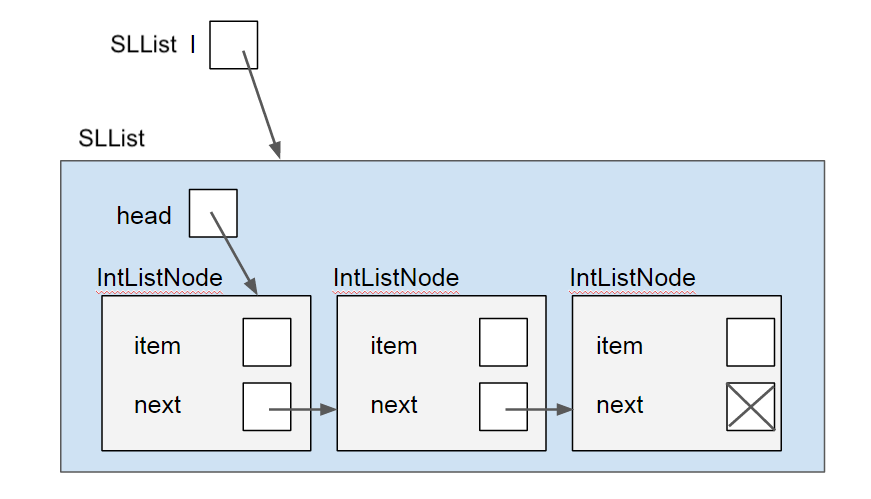

All operations on the list are handled through an instance of an `SLList` object, which keeps a single instance variable `head` in order to track the first node in the linked list. The `SLList` object operates directly on the `IntListNode`s that make up the `SLList`. Note that `IntListNode` does not need any methods (other than some utility methods such as `toString()` and `equals()`, which you will use later). The main effect of using encapsulation, by using a reference to the `head` of a list, is allowing users that wants to interact with the `SLList` to know nothing about the internal representation of the list or how the operations will take place. Instead, the users could simply operate on list as a whole and the `SLList` representation itself will take care of the operations, including any null checks, size checks, or further operations.

## Enhancement 2: Sentinel

Although encapsulation shields users of our data structure from having to deal with
cumbersome null checks, we as the implementors of our linked list class still have to handle them.
However, we can eliminate null checks and simplify our code greatly with usage of a `sentinel` _node_ instead of a just the `head` pointer. The sentinel node always exists (even when our list is empty), and does not represent an actual node in the list. Its `next` field represents the front of the list, unless the list is empty. The sentinel's `item` is some meaningless value (in this example, we have chosen [42](https://en.wikipedia.org/wiki/42_%28number%29#The_Hitchhiker's_Guide_to_the_Galaxy), but it doesn't matter what its value is; **a sentinel's item should never be accessed**). The last node in the list should have its `next` pointing back at the `sentinel`, and an empty list is represented by just a `sentinel` node whose `next` points back to itself. In a box-and-pointer diagram, a empty singly-linked list with a sentinel looks like this:

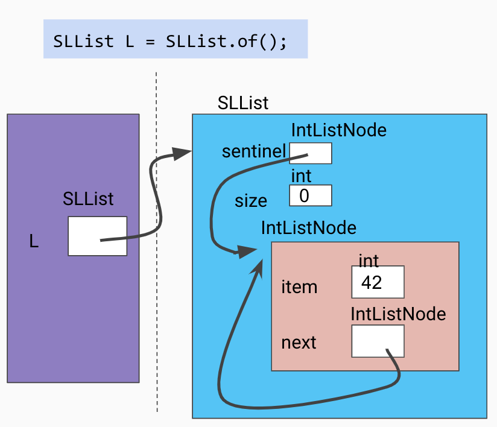

and a 2-item singly-linked list with a sentinel looks like this:

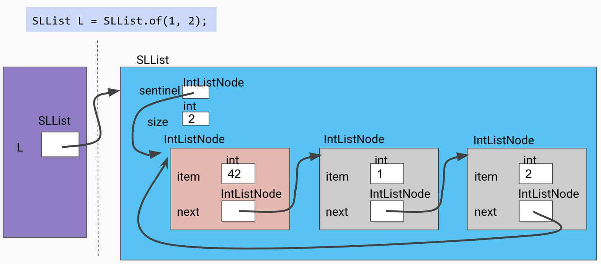

This has many benefits. When iterating through the list, we do not need to worry about reaching a null pointer at any point; when our moving pointer reaches the sentinel, it's the end of the list. When inserting and removing nodes, we don't need to manually handle being near the end or beginning or being the first or last element inserted or removed of the list; the code can be written with disregard for null-checking edge cases and it will still work properly because of the sentinel!

In code, an implementation might look like this:

```java
public class SLList {

    /**
     * IntListNode is a nested class that represents a single node in the
     * SLList, storing an item and a reference to the next IntListNode.
     */
    private static class IntListNode {
        /**
         * The access modifiers inside a private nested class are irrelevant:
         * both the inner class and the outer class can access these instance
         * variables and methods.
         */
        public int item;
        public IntListNode next;

        public IntListNode(int item, IntListNode next) {
            this.item = item;
            this.next = next;
        }
    }

    /**
    *  sentinel is a dummy node that points to the first real node. That is,
    *  sentinel.item is a dummy value, while sentinel.next.item is our true
    *  first item.
    */
    private IntListNode sentinel;
    private int size;

    /* ... more methods to operate on ... */
}
```
> The inner class is declared `private` to enforce our abstraction barrier, but what does the `static` modifier do?
> The `static` modifier prevents the inner class from accessing instance variables or methods of the outer class.
> This saves a bit of memory and helps prevent mistakes by making sure we don't modify anything we shouldn't.


### `toString` and `equals`

Just like yesterday, we will want a `toString` method so that our linked lists will be displayed
in a more readable format when using the debugger or if using print lines, and we will also want
an `equals` method so that our calls to `assertEquals` in our tests will verify whether two lists
contain the same numbers. Overriding `equals()` allows us to
define how two objects should be considered equal. Recall that checking equality
of two objects `a` and `b` with `a == b` defines equality as whether or not `a` and `b` are the
same reference. Here is an illustration of this difference:

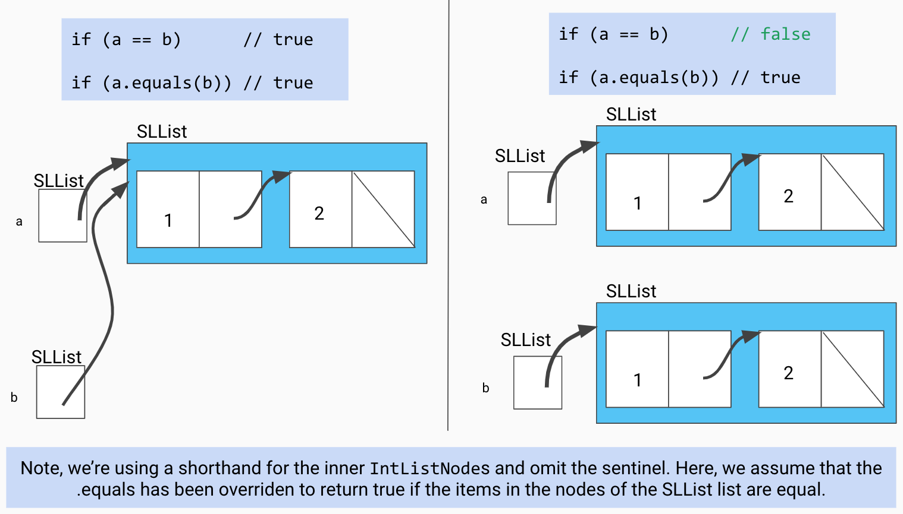

These implementations have been provided for you this time. Take a brief look at them in
your skeleton file to understand their implementations.


### Exercise: `add`

As a bit of practice working with these improved lists, implement the `add` method in
`SLList.java`, which adds the `int x` to the list at the specified `int index`. Be
sure to look at and utilize the given completed methods.

In the case that `index` is greater than or equal to the current size of the list,
`x` should just be added to the end of the list. For example, inserting into index
10 of an empty list should result in a list of size 1 with the inserted item in position 0.

```java
public void add(int index, int x) {
    // TODO
}
```

Check your solution with the tests provided in `SLListTest.java`.

### Exercise: `reverse`

Over the next few steps, we're going to be completing the method `reverse` in
`SLList` using our current `SLList` implementation.

```java
/* Reverses a linked list destructively and assigns sentinel.next to the head of the reversed
linked list.*/
public void reverse() {
    // TODO
}
```

We will assume the restriction that the reversal is to be done in place,
*destructively*, without creating any new nodes.

**However, don't implement the method just yet!**

#### Testing `reverse`

> Make sure that you're familiar with how to test with JUnit from the section
> on **[Testing][]** in the last lab.

[Testing]: {{ site.baseurl }}/labs/lab04/#testing-your-code-with-junit

Once again, we're going to write the test *before* we write `reverse`, as part of our ongoing crusade of **test-driven development** (TDD).

Especially for tricky problems like this, thinking about test cases before writing code can help us write better code
more quickly. This foresight hopefully will lead to a better outcome when compared to rushing ahead and trying to solve the problem without
first having considered all the different scenarios.

Add JUnit tests in `SLListTest.java` to cover at least the following three situations:

- General case: That the function returns a reversed list (for lists of size $$\ge 2$$).
- Base case: That the function "reverses" a list of size 1 by completing without erroring.
- Base case: That the function "reverses" a list of size 0 by completing without erroring.

#### Implementing `reverse`

```java
public void reverse() {
    // TODO
}
```

Try running the test you just wrote; it should fail. *This is a good sign
because it means our tests are working as expected.*

Implement `reverse` *recursively*, and rerun the tests until all of them pass. A
helper method that accepts an `IntListNode` will be helpful.

*Hint*: This is a challenging problem. The following diagrams show the progression
of reversing a linked list recursively using a helper method called `reverseHelper`.

Initial call to helper function
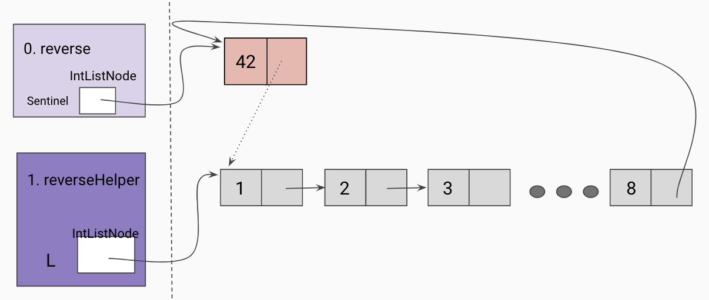

Given a reference to the true first node in our linked list, we will take the
recursive leap of faith on the rest of the linked list as shown below.
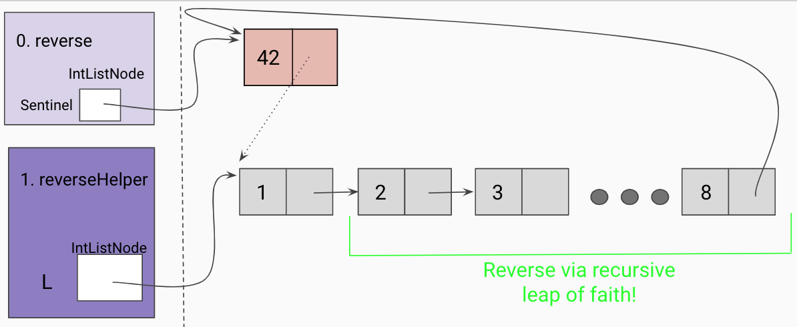

Hit a base case(the end of the list)
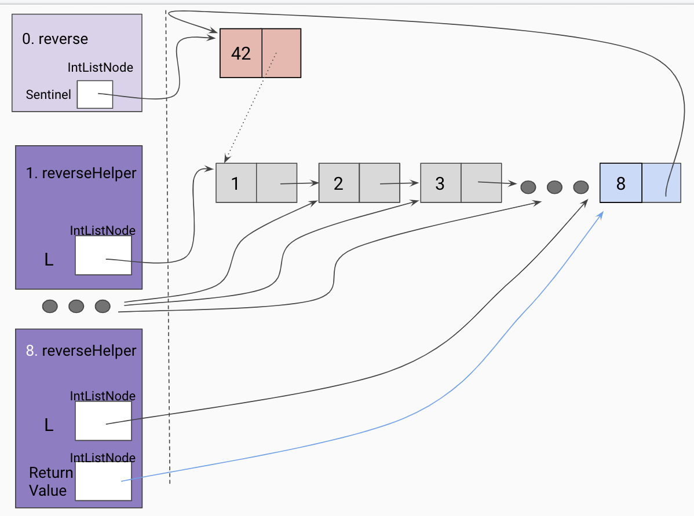

Trusting our recursive leap of faith, we assign a `temp` variable to the returned
value of our recursive call, which should have reversed the current frame's L tail.
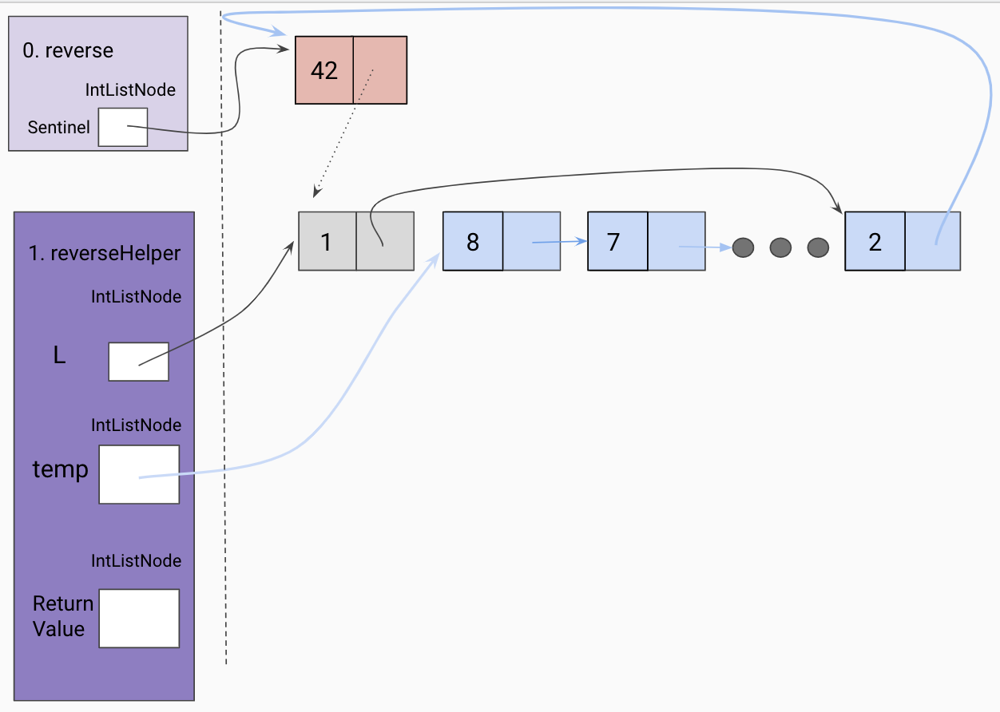

Set the end of the returned list to the current frame's L.
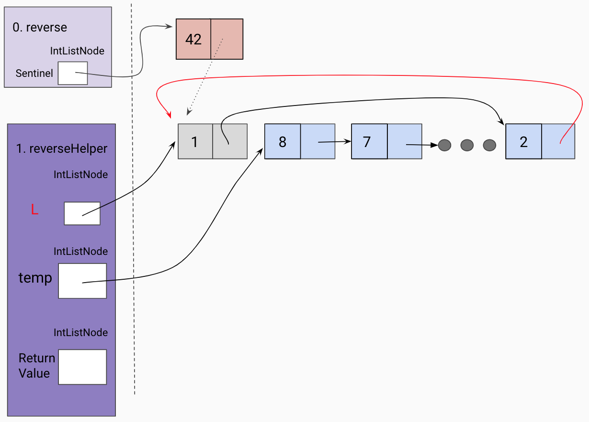

Since the current frame is the "end" of our the reversed linked list so far, we set
the current frame's L tail to be the sentinel.


Return the front of the reversed list.
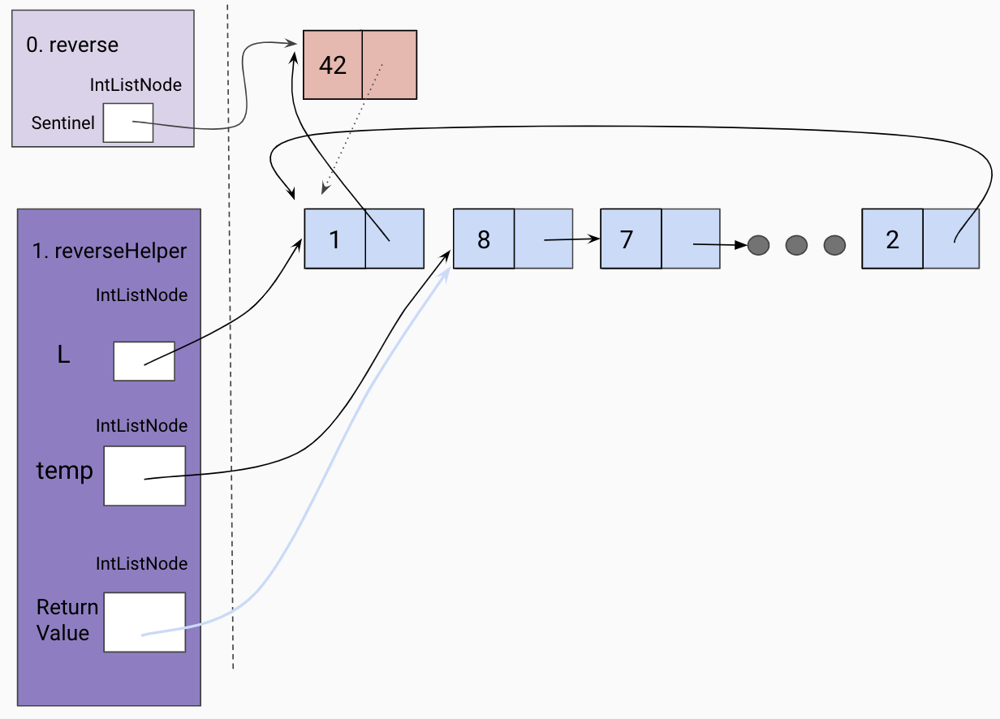

Update sentinel to point to the front of the reversed linked list.
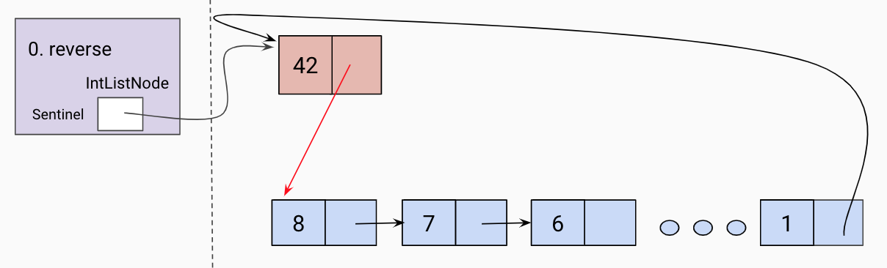

Now you hopefully are feeling more comfortable writing your own JUnit code! How are you liking it?
Does it build more confidence than just writing code and not testing it?
Some people find the rush of TDD addictive. You basically set up a little game
for yourself to solve. Some people hate it. Your mileage may vary. Whether you
personally enjoy the TDD flow or not, writing tests will be one of the most
important skills you learn here at Berkeley, and getting *[test-infected][]*
will save you and your future colleagues an enormous amount of time and misery.

[test-infected]: http://c2.com/cgi/wiki?TestInfected

> If you find the concept of test-driven development interesting, or just want
> to learn more about testing philosophy and the conversation around TDD, here
> are a couple interesting leisure readings:
>
> - [TDD is dead. Long live testing.](http://david.heinemeierhansson.com/2014/tdd-is-dead-long-live-testing.html)
> - [Why Most Unit Testing is Waste](https://rbcs-us.com/documents/Why-Most-Unit-Testing-is-Waste.pdf)
> - [A Response to "Why Most Unit Testing is Waste"](https://henrikwarne.com/2014/09/04/a-response-to-why-most-unit-testing-is-waste/)

## Enhancement 3: Doubly-Linked

There are some major issues, both efficiency-wise and code-simplicity-wise with
the linked list implementations we've been working with so far:

- It's easy to insert into the front of the list, but requires a lot more work
  to insert into the back of the list.
- If we want to remove a node in our linked list, even if we have a reference
  to the node we want to remove, we have to traverse until we find the node
before it in order to remove it.

The solution to these problems is to use a **doubly-linked list**. Each node keeps track of the node after and before itself. If we aren't using a sentinel, then instead of just a `head` pointer, the list object maintains both a `head` and `tail` pointer, to the front and back of the list respectively. It looks like this:

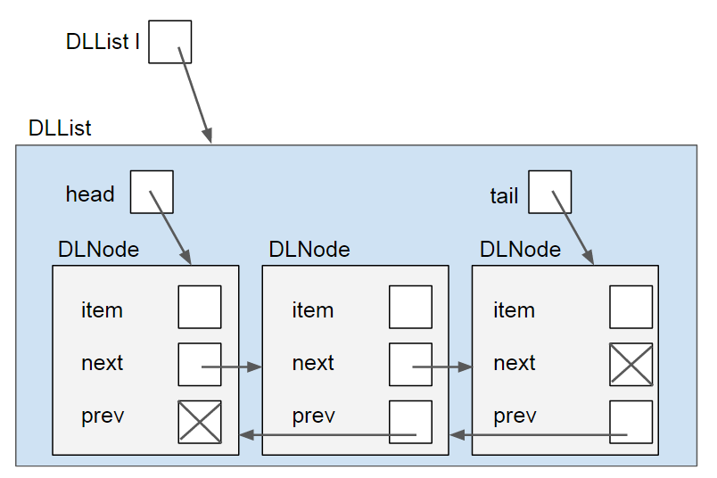

This adds a bit of complexity to the operations, but allows for constant time insertion to the front and back, and allows the user to traverse the list either forwards or backwards. Additionally, this allows the list to delete any nodes, even in the middle of the list, in constant time without traversing to the middle **as long as it has a reference to the node that needs to be deleted**.

If we are using a sentinel, then it will look like this:

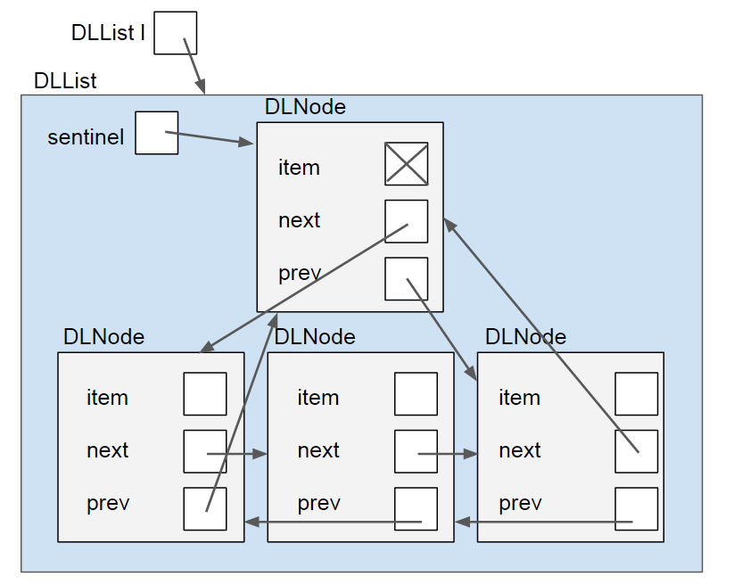

Note that the sentinel's item is marked with an "X", again because that value is irrelevant.
If our list is of non-primitive items, then we can make it null. If it is of primitive items (like the `int`s we've been using, then it can just be any arbitrary value (since primitives cannot be null)).

With all of these enhancements, the encapsulated doubly-linked list with a sentinel node is typically used in practice as the linked list representation, like in Java's own standard library class, java.util.LinkedList.

### Invariants
An invariant is a fact about a data structure that is guaranteed to be true
(assuming there are no bugs in your code). This gives us a convenient checklist
every time we add a feature to our data structure. Users are also guaranteed
certain properties that they trust will be maintained. For example, an `SLList`
with a sentinel node has at least the following invariants:

- The sentinel reference always points to a sentinel node.
- The front item (if it exists), is always at sentinel.next.item.
- The size variable is always the total number of items in the list.
- The last node's item always points back at the sentinel node.

Be sure that any invariant broken while performing an operation on a data structure
is restored by the end of the function, so that subsequent function calls can rest
assured that they are acting on a valid data structure and that all of the instance
variables hold the proper values.

## Enhancement 4: Generic Lists

Our final alteration will be somewhat more minor than the other structural changes, but this will have a powerful impact on how generalizable our code is. So far we have considered our lists to be of some fixed type (`SLList`s contained `int`s). What if we want to use a list to store `double`s instead? What if we then want to extend it further to be a list of `String` objects. Up until now we would have had to create a new copy of the class for each of these data types. 

The solution to this is to use something called generics. The basic principle is that instead of writing many classes which are specific to one type of data (e.g. `int`s, `double`s, `Strings`, etc.), we will write one class which has a _generic_ type. This generic type can be thought of as a placeholder type that will be filled in by a real type when we go to use the class. This is illustrated further with the example of how to generalize a `DLList` (doubly-linked list) by rewriting it with generics.

Generic DLList
: How can we modify our `DLList` so that it can be a list of whatever objects
we choose? Recall that our class definition looks like this:

  ```java
  public class DLList { ... }
  ```

  We will change this to:

  ```java
  public class DLList<T> { ... }
  ```

  where `T` is a placeholder object type. Notice the angle bracket syntax. Also
note that we don't have to use `T`; any variable name is fine. In our `DLList`,
our item is now of type `T`, and our methods now take `T` instances as
parameters. We can also rename our `IntNode` class to `TNode` for accuracy.

Using Generic DLList
: Recall that to create a `DLList`, we typed:

  ```java
  DLList list = new DLList(10);
  ```

  If we now want to create a `DLList` holding `String` objects, then we must
say:

  ```java
  DLList<String> list = new DLList<>("bone");
  ```

  On list creation, the compiler replaces all instances of `T` with `String`!
Through the rest of the labs in the course we will continue to work with generics, as for most 
data structures, they will be more useful if we can use them with many types of data!

## Recap

Yesterday, we worked with a "naked" `IntList`, which was difficult to use because
knowledge of implementation details were necessary in order for its use.

Today, we solved this problem through **encapsulation**. By nesting our node class inside
another class, we can setup an abstraction barrier to shield our users from the details,
and we can provide utility functions to allow users to operate naively upon our data structure.

To eliminate the need to have if statements that protect us from `NullPointerExceptions`,
we can use a **sentinel**.

For efficiency purposes, we can introduce backwards `prev` links as well to make it **doubly-linked**.

Finally, we generalized the code to work with any type of data through the use of generics.

### Deliverables

- `SLList.java`
- `SLListTest.java`

> If you have any time remaining after you submit this lab, spend some time implementing your
`LinkedListDeque` for [Project 1](../../projects/deques) with your
partner while you're still in lab! You should now have all of the necessary skills to tackle the project.
In tomorrows lecture we will review and connect some of these ideas, but the core skills have been covered in this 
and the other proceeding labs.
