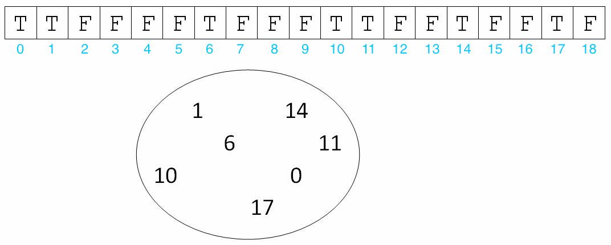

## Before You Begin

Pull the code for Lab 8 and import it into IntelliJ.

## Learning Goals

Today we're going to learn about the more advanced features of Java's
inheritance system, namely *Abstract Classes* and *Interfaces*. These two
constructs allow us to make a more complicated system of class interrelations
than we have seen previously, and the correct utilization of both concepts is
key to being able to write generalizable and neat code.

Once introduced, we will use these two concepts to explain the workings of the
Java *Collections* Framework, to which many of the data structures you have
encountered belong. Finally, we'll get a chance to work with some of these
data structures to solve practical problems.

These ideas come together to allow us to write *easily generalizable* code. This means
we can quickly update and reuse code we have already written to perform new tasks.

## Introduction

> Read Chapter **[4.1][]**, **[4.4][]**, and **[5.2][]** of the online
> textbook. The textbook provides motivation for learning **interfaces** and
> **abstract classes**, though we'll first jump back and gets some hands-on
> experience defining classes with interfaces and abstract classes before
> jumping deeper into solving problems with **abstract data types**.

[4.1]: https://joshhug.gitbooks.io/hug61b/content/chap4/chap41.html
[4.4]: https://joshhug.gitbooks.io/hug61b/content/chap4/chap44.html
[5.2]: https://joshhug.gitbooks.io/hug61b/content/chap5/chap52.html

In the first weeks of CS 61BL, we've implemented the *list* **abstract data
type** using two, different underlying **data structures**: linked lists and
resizing arrays. We've seen that `SLList`/`DLList` and `AList` share quite a
few of the same methods. While we didn't implement all of the methods for all
classes, we should now have a good idea of how we might go about it on our own.

```java
public void add(int index, Item item);
public void addFirst(Item item);
public void addLast(Item item);
public Item get(int index);
public Item getFirst();
public Item getLast();
public void remove(Item item);
public Item removeFirst();
public Item removeLast();
public int size();
```

## Exercise: `GregorianDate`

Let's start with an example of an abstract class. `Date.java` is an abstract
class used to represent calendar dates (we will **ignore** leap years). In addition,
we have included two classes that extend `Date` that are shown below.

```java
/**
 * In a nonleap year in the French Revolutionary Calendar, the first twelve
 * months have 30 days and month 13 has five days.
 */
public class FrenchRevolutionaryDate extends Date {

    public FrenchRevolutionaryDate(int year, int month, int dayOfMonth) {
        super(year, month, dayOfMonth);
    }

    @Override
    public int dayOfYear() {
        return (month - 1) * 30 + dayOfMonth;
    }

    ...
}

public class GregorianDate extends Date {

    private static final int[] MONTH_LENGTHS = {
        31, 28, 31, 30, 31, 30, 31, 31, 30, 31, 30, 31
    };

    public GregorianDate(int year, int month, int dayOfMonth) {
        super(year, month, dayOfMonth);
    }

    @Override
    public int dayOfYear() {
        int precedingMonthDays = 0;
        for (int m = 1; m < month; m += 1) {
            precedingMonthDays += getMonthLength(m);
        }
        return precedingMonthDays + dayOfMonth();
    }

    private static int getMonthLength(int m) {
        return MONTH_LENGTHS[m - 1];
    }
}
```

Read through the definition of the abstract class `Date`.
There is an abstract method named `nextDate` in the `Date` class. `nextDate` returns
the new date that is the result of advancing this date by one day. It should
not change `this`. Modify `GregorianDate` accordingly so that it follows
the correct convention for dates. Make sure to test out your methods to be sure
that they behave as you expect them to!

## Interfaces
Interfaces are classes that define a specific set of behavior. Specifically, 
they provide the method signatures for all the required methods, specifying the
intended result. Interfaces are not implemented; in general they offer a framework only,
not the behavior itself. This means that interfaces also cannot be instantiated.

What is their use then? Interfaces allow us to use code we have not written by relying
on the framework defined by the interface. This is the idea of **abstraction**
barriers, as we need not know how the methods have been implemented-- only that
they exist and should function based on the specification. 

## Implementing Interfaces

When a class **implements** an interface, it is giving a guarantee that it can
perform a certain functionality defined by its interface.
You'll find that the idea of an interface is actually very central to software
engineering in general. When you're asked to implement a set of methods to
perform some specific task, that's implementing an interface. Often when
working on a group project, a good approach is to split the work into parts
that will be integrated together at the end. In order to allow work to be done
in parallel, it is important to establish what each part will accomplish and
how it will interact with other parts so that they can be merged together
without issue. Establishing what each of these parts will do and how they
interact with other parts is essentially treating each part as an interface.
Using interfaces is all about *not knowing the actual implementation*, but
instead utilizing the input-to-output, defined behavior given by the interface;
implementing an interface to specification like you are asked for assignments
and projects is about making sure the program you write under some interface
gives the correct output for all inputs.

## Collections

**Collection classes** represent collections of data. Most of the data
structures we will study the rest of this class are used to implement
collections. At the most general level, pretty much anything you use to store
multiple items at once is going to fulfill the requirements to be a
*collection*. The most commonly used collections are **lists**, **sets**, and
**maps**, but there are many others. Throughout this course, we will continue to
see implementations of these collections.

All collections are organized into an inheritance hierarchy. At the root is the
top-level `Collection` interface. This interface specifies methods like
`isEmpty()`, or `add(T o)` (generic type `T`), among many others

All collection classes implement `Collection` in one way or another. Each of
`List`, `Set`, and `Map` support their own set of key operations. In this lab,
we'll take a closer look at the Java `Set`, `Map`, and `List` collection
interfaces.

## The `List` Interface

A **list** is an ordered collection, or *sequence*, so the elements in a list
have *positions*. An element can appear as many times as desired as duplicates
are allowed. Thus, they must support the following operations:

- Adding an element at a given position or at the end of the list.
- Removing an element at a given position or at the end of the list.
- Checking whether a given item is in the list.
- Returning the value at a given position in the list.

Implementation of a list normally involves storing the elements of the list
explicitly, like we implemented in our linked lists and resizing array lists.

It's important to realize that `List`, although a sub-interface of
`Collection`, is itself an interface, and might be defined like this:

```java
public interface List<Item> extends Collection<Item> {
    ...
}
```

## The `Set` Interface

A **set** is a group of items with no duplicates. The `Set` interface does not
require ordering (Java's `HashSet`), but some set implementations can be
ordered (Java's `TreeSet`). Sets must support following operations at a minimum:

- Adding an element to the set if it's not already there.
- Removing an element from the set.
- Checking whether a given item is in the set.

Without the additional requirement of maintaining order, sets can often be more
efficient than lists, and we'll implement one example that demonstrates the
difference later in this lab.

The `Set` interface might be declared like this,

```java
public interface Set<Item> extends Collection<Item> {
    ...
}
```

## The `Map` Interface

A **map** is a collection of key-value mappings, like a dictionary from
Python. Like a set, the **keys** in a map are unique, but the values need not be. Maps also do not need to
maintain order (Java's `HashMap`), but some map implementations can be ordered
(`TreeMap`, for example). Maps must support at least the following operations:

- Adding a key-value pair to the map, **or** updating the value if the key already
  exists.
- Removing a key-value pair from the map.
- Checking whether a given key is in the map.
- Returning the value associated with a given key.

The same reason that sets can be implemented more efficiently than lists also
applies to maps. A map can also be thought of as a set whose item, instead of
just being a single object like `Item`, is instead a pair of items.

```java
public interface Map<Key, Value> {
    ...
}
```

Unlike **set** and **list**, `Map` is not a direct sub-interface of the Java
`Collection` interface. This is because `Collection` specifies collections of
a single element type, but `Map` operates on key-value pairs. Instead, "The Map
interface provides three *collection views*, which allow a map's contents to be
viewed as a set of keys, collection of values, or set of key-value mappings."

- `keySet()`, which returns a `Set` of all the keys. The keys are unique, so a
  set is an appropriate choice here.
- `values()`, which returns a `Collection` of all the values. The values are
  not necessarily unique, which is why we prefer a more general `Collection`
rather than a `Set`.
- `entrySet()`, which returns a `Set` of key-value pairs with a wrapper type
  called `Entry`. The entry class's job is just to hold the key and the value
together in a single class, so you can imagine that it might look something
like this.

    ```java
    public static class Entry<Key, Value> {
        private Key key;
        private Value value;

        ...
    }
    ```

These methods are vital when iterating over anything which implements the
`Map` interface.

## Exercise: `CodingChallenges`

Knowing when, where, and how to use abstract data types is an important skill.

For this part, we'll be using abstract data types to help us solve small
programming challenges. These questions are similar to the kinds of questions
you might get asked to solve in a technical interview for a software
engineering position. Complete the methods outlined in `CodingChallenges.java`.

Since all of the abstract data types in Java are interfaces, we'll need a few
concrete implementations to actually instantiate and use them. For this lab, it's fine to use
the following initializations. We'll be learning more about each of these
concrete classes in future labs.

For these problems you might notice that there isn't necessarily just one way
to solve the problem. This is often true of programming questions.
Try to reason through the runtime for each approach and
choose the one which gives the best possible runtime. We list the runtime for
common operations in each class below, where $$N$$ is the asymptotic variable
representing the size of the collection.

List
: For lists, use [`ArrayList`][]. This is our resizing array list except with a
couple of additional enhancements that we'll be learning more about.

    ```java
    List<String> list = new ArrayList<>();
    ```

    - `add(int index, E element)`: $$O(N)$$.
    - `add(E e)`: $$O(N)$$, but usually $$\Theta(1)$$.
    - `contains(Object o)`: $$O(N)$$.
    - `remove(int index)`: $$O(N)$$.
    - `remove(Object o)`: $$O(N)$$.

[`ArrayList`]: https://docs.oracle.com/javase/10/docs/api/java/util/ArrayList.html

Set
: For sets, use [`HashSet`][]. `HashSet` has the unique advantage over
`ArrayList` of having *usually* constant-time operations, for reasons we'll
explore later in this lab with `BooleanSet` and in depth in a few weeks when we
learn about hashing.

    ```java
    Set<String> set = new HashSet<>();
    ```

    - `add(E e)`: $$O(N)$$, but usually $$\Theta(1)$$.
    - `contains(Object o)`: $$O(N)$$, but usually $$\Theta(1)$$.
    - `remove(Object o)`: $$O(N)$$, but usually $$\Theta(1)$$.

[`HashSet`]: https://docs.oracle.com/javase/10/docs/api/java/util/HashSet.html

Map
: For maps, use [`HashMap`][]. Like a `HashSet`, most operations are usually
constant time, but it has the advantage of supporting the `Map` interface.

    ```java
    Map<String, Integer> map = new HashMap<>();
    ```

    - `containsKey(Object key)`: $$O(N)$$, but usually $$\Theta(1)$$.
    - `containsValue(Object value)`: $$O(N)$$ and not much better than that due
      to linear search through the data structure.
    - `get(Object key)`: $$O(N)$$, but usually $$\Theta(1)$$.
    - `put(K key, V value)`: $$O(N)$$, but usually $$\Theta(1)$$.
    - `remove(Object key)`: $$O(N)$$, but usually $$\Theta(1)$$.

[`HashMap`]: https://docs.oracle.com/javase/10/docs/api/java/util/HashSet.html

For more information on what methods are available in each class, search online
for the Java documentation. Use IntelliJ to help you import classes as you need
them.

If you'd like extra practice, there are a few optional problems in
`ExtraCodingChallenges.java`.

## Exercise: `BooleanSet`

The file `SimpleCollection.java` contains a simplified version of the
`Collection` interface which only accepts integers as members. The files
`SimpleSet.java` and `SimpleList.java` contain simplified versions of the `Set`
and `List` collection interfaces. Read all three files so you can understand
how interfaces and inheritance are being used here, as well as to understand
what each of the interfaces require.

Earlier, we implemented an array-based list which supported automatic
resizing and generics. For this lab, we'll be using the same underlying array
data structure except now we'll be using it to implement the new **set**
abstract data type.

The file `BooleanSet.java` is an incomplete implementation of the `SimpleSet`
interface. It maintains uniqueness of elements in the set by storing a boolean
array `contains`. This version of the `SimpleSet` interface only deals with
positive integers and uses a boolean array to keep track of what values are
currently in the `Set`. Check the example below:



Implement the methods of the `BooleanSet.java` class, and use the
`BooleanSetTest.java` file to test your methods. We only provide a basic test,
so feel free to add more comprehensive tests to this file.

## Generics and Autoboxing
As you should remember from lab06, generics allow us to define data structures
without relying on the specific type of objects it holds. This allows us 
to even further generalize our code, creating reusable data structures.

Autoboxing is an automatic conversion that Java performs when presented a **wrapper class**.
A wrapper class is a class that has been "wrapped" around a primitive data type so that
the programmer can rely on object oriented interactions. You may have seen some examples already,
such as `Integer.java` and `Double.java`. Automatic conversion 
is performed between wrapper classes and the primitives they represent.

> Read Chapter **[5.1][]** and **[5.3][]** which we skipped earlier, covering
> **generics** and **autoboxing** in Java. These two topics will be helpful for
> implementing data structures moving forward, though they aren't emphasized in this lab.

[5.1]: https://joshhug.gitbooks.io/hug61b/content/chap5/chap51.html
[5.3]: https://joshhug.gitbooks.io/hug61b/content/chap5/chap53.html

## Recap

We introduced a few key topics in this lab: collections, inheritance, abstract classes, and
interfaces, and we saw how each of these Java features could be used to help us
implement **abstract data types**.

Abstract Data Types
: Previously, we went over interfaces which, in a traditional sense
(disregarding default methods which will be defined a bit lower), requires
certain methods to be implemented in a class if it is said a type of that
interface. Abstract Data Types follow this philosophy, and are defined to be
some sort of Object that is defined by some set of operations rather than the
**implementation** of these operations.

Interfaces
: There are 2 types of inheritance:

    - Interface inheritance: What (the class can do).
    - Implementation inheritance: How (the class does it).

Default Methods
: The way we have dealt with interfaces, there is no content in them. We only
define a certain set of operations that need to be fulfilled by anything that
implements the interface. However, we can create `default` methods that take
the following form:

    ```java
    default void methodName(){...}
    ```

    Normal interface methods have no body and only state what needs to be
defined. Default methods on the other hand provide how a method by providing a
method body.

    - Variables can exist in interfaces but they are `public static final`.
    - Classes can implement more than 1 interface.
    - Methods are public unless stated otherwise
    - Interfaces cannot be instantiated.
Some programmers feel this goes against the goal of interfaces: to provide
a guaranteed framework for interaction while not providing any implementation.
Discuss this with your partner; what is your opinion?


Abstract Classes
: Abstract classes can be thought of as a hybrid of a normal class and an
interface. Abstract classes are like interfaces in that they **cannot** be
instantiated. All methods in an Abstract class are like normal methods in
classes unless they have word `abstract` in front of them. If that is the case
then they are treated like normal methods in interfaces and do not need to have
a body and can instead have an implementation in whatever class **extends** them.
A very important difference between abstract classes and interfaces is that a
class can only extend **one** abstract class but can implement more than one
interface.

Immutability
: Immutable data types are types that cannot change. To make sure that a
variable does not change, use the `final` keyword. Once a variable is declared
final, it can never change after initial assignment. An important note is that
if an address is declared final it means that the address can't change: it says
nothing about its contents. For example the below syntax is valid.

    ```java
    final int[] arr = new int[1];
    arr[0] = 1;
    arr[0] = 3
    ```

    But this one is not:

    ```java
    final int[] arr = new int[3];
    arr = new int[4];
    ```

    Because you are changing the address of the actual array the variable is
pointing to.

## Deliverables

For full credit, submit:

- Add an abstract method `nextDate` to the `Date` class and implement
  `GregorianDate.nextDate`.
- Solve the programming puzzles in `CodingChallenges.java`.
- Implement and test each method in `BooleanSet.java`.