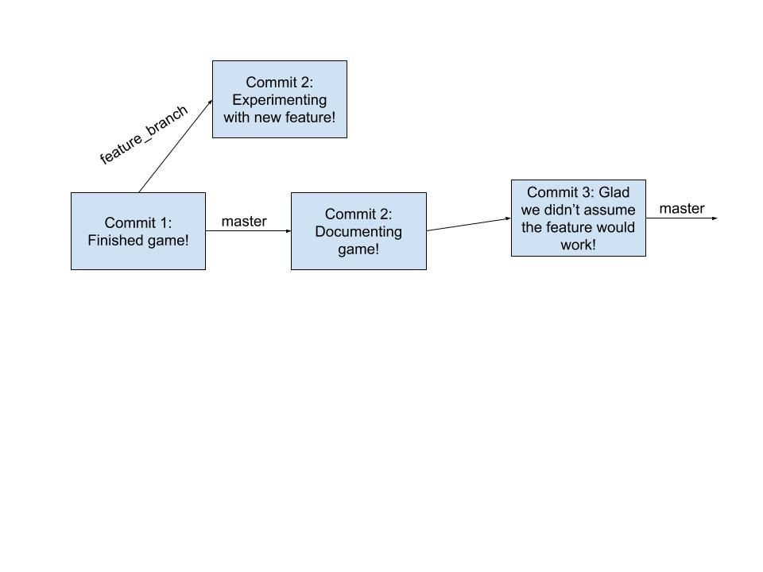

## Intro

*Here's an optional [intro video](https://youtu.be/XE5IFn721n8) for the lab with some explanations of concepts, examples of usage of methods mentioned in the spec, and an intro to the coding portion of the lab. It is a very useful video, but was recorded last semester. Note that the first segment discusses projects that are not in this course. You can thus skip the introduction if you want. All the information in the video is covered in the spec and timestamps for topics are in the video description. *

So far in this class, you have exclusively made programs whose state only persists while the program is running, and all traces of the program disappear once the program exits. For example, in Project 1, you created two data structures but there was no way to save the deque, quit java, turn off your computer, eat a sandwich, and then reload your deque. In this lab, we will go over two methods to make the state of your program <a href="https://en.wikipedia.org/wiki/Persistence_(computer_science)">persist</a> past the execution of your program: one through writing plain text to a file, and the other through serializing objects to a file. This will be directly applicable Project 2 Gitlet as well as any future projects you want to do where you want to be able to save state between programs.

As always, you can get the skeleton files with the following command:

     git pull skeleton master

## Files and Directories in Java

Before we jump into manipulating files and directories in Java, let's go through some file system basics.

### Current Working Directory
The [current working directory](https://en.wikipedia.org/wiki/Working_directory) (CWD) of a Java program is the directory from where you execute that Java program. Examples follow for Windows & Mac/Linux users - they are very similar, just different stylistically.

**Windows**
For example, let's say we have this small Java program located in the folder `C:/Users/Zoe/example` (or `~/example`) named `Example.java`:

    // file C:/Users/Zoe/example/Example.java
    class Example {
      public static void main(String[] args) {
         System.out.println(System.getProperty("user.dir"));
      }
    }
This is a program that prints out the CWD of that Java program.

If I ran:

    cd C:/Users/Zoe/example/
    javac Example.java
    java Example

the output should read:

    C:\Users\Zoe\example

**Mac & Linux**
For example, for Mac & Linux users, let's say we have this small Java program located in the folder `/home/Zoe/example` (or `~/example`) named `Example.java`:

    // file /home/Zoe/example/Example.java
    class Example {
      public static void main(String[] args) {
         System.out.println(System.getProperty("user.dir"));
      }
    }
This is a program that prints out the CWD of that Java program.

If I ran:

    cd /home/Zoe/Example
    javac Example.java
    java Example

the output should read:

    /home/Zoe/example

**IntelliJ**
In IntelliJ, you can view the CWD of your program under Run > Edit Configurations > Working Directory.

.

**Terminal**
In terminal / Git Bash, the command `pwd` will give you the CWD.

### Absolute and Relative Paths
A <a href="https://en.wikipedia.org/wiki/Path_(computing)">path</a> is the location of a file or directory. There are two kinds of paths: absolute paths and relative paths. An **absolute path** is the location of a file or directory relative to the **root** of the file system. In the example above, the absolute path of `Example.java` was `C:/Users/Zoe/example/Example.java` (Windows) or `/home/Zoe/example/Example.java` (Mac/Linux). Notice that these paths start with the root which is `C:/` for Windows and `/` for Mac/Linux. A **relative path** is the location of a file or directory relative to the CWD of your program. In the example above, if I was in the `C:/Users/Zoe/example/` (Windows) or `/home/Zoe/example/` (Mac/Linux) folders, then the relative path to `Example.java` would just be `Example.java`. If I were in `C:/Users/Zoe/` or `/home/Zoe/`, then the relative path to `Example.java` would be `example/Example.java`.

*Note: the root of your file system is different from your home directory. Your home directory is usually located at `C:/Users/<your username>` (Windows) or `/home/<your username>` (Mac/Linux). We use `~` as a shorthand to refer to your home directory, so when you are at `~/repo`, you are actually at `C:/Users/<your username>/repo` (Windows) or `/home/<your username>/repo` (Mac/Linux).*

When using paths, `.` refers to the CWD. Therefore, the relative path `./example/Example.java` is the same as `example/Example.java`.

### File & Directory Manipulation in Java
The Java [File](https://docs.oracle.com/javase/7/docs/api/java/io/File.html) class represents a file or directory in your operating system and allows you to do operations on those files and directories. In this class, you usually will want to be doing operations on files and directories by referring to them to their relative paths. You'll want any new files or directories you create to be in the same directory as where you run your program (in this lab, the ~/su20-su\*\*\*/lab09 folder) and not some random place on your computer.

#### Files
You can make a File object in Java with the File constructor and passing in the path to the file:

     File f = new File("dummy.txt");

The above path is a relative path where we are referring to the file `dummy.txt` in our Java program's CWD. You can think of this File object as a reference to the actual file `dummy.txt` - when we create the new File object, we aren't actually creating the `dummy.txt` file itself, we are just saying, "in the future, when I do operations with `f`, I want to do these operations on `dummy.txt`". To actually create this `dummy.txt` file, we could call

     f.createNewFile();

and then the file `dummy.txt` will actually now exist (and you could see it in File Explorer / Finder).

You can check if the file "dummy.txt" already exists or not with the `exists` method of the File class:

     f.exists()

We can also write to the file with the following:

     Utils.writeContents(f, "Hello World");

Now `dummy.txt` would now have the text "Hello World" in it. Note that Utils is a helper class provided in this lab and project 2 and is not a part of standard Java.

#### Directories
Directories in Java are also represented with File objects. For example, you can make a File object that represents a directory:

    File d = new File("dummy");

Similar to files, this directory might not actually exist in your file system. To actually create the folder in your file system, you can run:

    d.mkdir();

and now there should be a folder called `dummy` in your CWD.

#### Summary
There are many more ways to manipulate files in Java, and you can explore more by looking at the [File javadocs](https://docs.oracle.com/javase/7/docs/api/java/io/File.html) and Googling. There are a ton of resources online and, if you Google it, doing more extensive file operations in Java can get a bit complicated. I'd recommend understanding the basics by doing this lab, and in the future if you come across a use case you don't know how to handle, then start searching or asking on Ed. For this lab and Gitlet, we provide you with a `Utils.java` class that has many useful helper functions for file operations.

##Serializable

Writing text to files is great and all, but what if we want to save some more complex state in our program? For example, what if we want to be able to save our Deques so we can come back to them later? We could somehow write a toString method to convert a Deque to a String and then write that String to a file. If we do that though, we would also need to figure out how to load the Deque by parsing that file, which can get complicated. 

Luckily, we have an alternative called [serialization](https://en.wikipedia.org/wiki/Serialization) which Java has already implemented for us. Serialization is the process of translating an object to a series of bytes that can then be stored in the file. We can then deserialize those bytes and get the original object back.

To enable this feature for a given class in Java, this simply involves implementing the `java.io.Serializable` interface:

    import java.io.Serializable;

    class Deque implements Serializable {
        ...
    }

This interface has no methods; it simply marks its subtypes for the benefit of some special Java classes for performing I/O on objects. For example,

        Deque d = ....;
        File outFile = new File(saveFileName);
        try {
            ObjectOutputStream out =
                new ObjectOutputStream(new FileOutputStream(outFile));
            out.writeObject(d);
            out.close();
        } catch (IOException excp) {
            ...
        }

will convert `d` to a stream of bytes and store it in the file whose name is stored in `saveFileName`. The object may then be reconstructed with a code sequence such as

        Deque d;
        File inFile = new File(saveFileName);
        try {
            ObjectInputStream inp =
                new ObjectInputStream(new FileInputStream(inFile));
            d = (Deque) inp.readObject();
            inp.close();
        } catch (IOException | ClassNotFoundException excp) {
            ...
            d = null;
        }

The Java runtime does all the work of figuring out what fields need to be converted to bytes and how to do so. We have provided helper function in `Utils.java` that does the above two for you.

*Note: There are some limitations to Serializable that are noted in the Project 2 spec. You will not encounter them in this lab.*

## Exercise: Canine Capers

For this lab, you will be writing a program that will be taking advantage of file operations and serialization. We have provided you with three files:

* `Main.java`: The main method of your program. Run it with `java capers.Main [args]` to do the operations specified below. The majority of the FIXMEs in this program are in here.
* `Dog.java`: Represents a dog that has a name, breed, and age. Contains a few FIXMEs.
* `Utils.java`: Utility functions for file operations and serialization. These are a subset of those provided with Gitlet, so not all will be used.

You can change the skeleton files in any way you want as long as the spec and comment above the `main` method in `Main.java` is satisfied. You do not need to worry about error cases or invalid input. You should be able to complete this lab with just the methods provided in `Utils.java` and other `File` class methods mentioned in this spec, but feel free to experiment with other methods.

### Main
You should allow Main to run with the following three commands:

* `story [text]`: Appends "text" + a newline to a story file in the .capers directory. Additionally, prints out the current story.
* `dog [name] [breed] [age]`: Persistently creates a dog with the specified parameters; should also print the dog's toString(). Assume dog names are unique.
* `birthday [name]`: Advances a dog's age persistently and prints out a celebratory message.

All persistent data should be stored in a ".capers" directory in the current working directory.

Recommended file structure (you do not have to follow this):

    .capers/ -- top level folder for all persistent data
        - dogs/ -- folder containing all of the persistent data for dogs
        - story -- file containing the current story

You should not create these manually, your program should create these folders and files.

Note: Naming a folder or file with a period in the front makes it hidden - to be able to see it in terminal, run `ls -a` instead of just `ls`. If you want to remove all saved data from your program, just remove the `.capers` directory (NOT the `capers` directory) with `rm -rf .capers`. Be **very** careful with this command-- it will delete **anything** you tell it to!

### Suggested Order of Completion

Please be sure to read the comments above each method in the skeleton for a description of what they do. 

1. Fill out the `main` method in Main.java. This should consist mostly of calling other methods.
2. Fill out `CAPERS_FOLDER` in Main.java, then `DOG_FOLDER` in Dog.java, and then `setUpPersistence` in Main.java.
3. Fill out `writeStory` in Main.java. The story command should now work. 
4. Fill out `saveDog` and then `fromFile` in Dog.java. You will also need to address the FIXME at the top of Dog.java. Remember dog names are unique!
5. Fill out `makeDog` and `celebrateBirthday` in Main.java using methods in Dog.java. You will find the `haveBirthday` method in the Dog class useful. The dog and birthday commands should now work.

Each FIXME should take at most around 8 lines, but many are fewer.

### Usage
The easiest way to run and test your program is to compile it in terminal with javac and then run it from there. E.g.

     cd ~/repo/lab09              # Make sure you are in your lab09 folder (NOT the lab09/capers folder)
     javac capers/*.java          # Make sure to recompile your program each time you make changes!
     java capers.Main [args]      # Run the commands you want! e.g., java story hello

For the `story` command, if you want to pass in a long string that includes spaces as the argument, you will want to put it in quotes, e.g.

     java capers.Main story "hello world"

If running in IntelliJ, you will need to use Run > Edit Configurations > Program Arguments to add the command line arguments.

### Useful Util Functions
Useful Util functions (as a start, may need more and you may not need all of them):
* `writeContents` - writes out strings/byte arrays to a file
* `readContentsAsString` - reads in a file as a string
* `readContents` - reads in a file as a byte array
* `writeObject` - writes a serializable object to a file
* `readObject` - reads in a serializable object from a file. You can get a Class object by using <Class name>.class, e.g. Dog.class. 
* `join` - joins together strings or files into a path. E.g. Utils.join(".capers", "dogs") would give you a File object with the path of ".capers/dogs"

### Testing
You should test your program yourself by running it in the command line. The Gradescope autograder will also run a small set of tests. The AG tests are a combination of running these commands in order:

    $ java capers.Main story Hello
    Hello

    $ java capers.Main story World
    Hello
    World

    $ java capers.Main dog Sammie Samoyed 5
    Woof! My name is Sammie and I am a Samoyed! I am 5 years old! Woof!
    $ java capers.Main birthday Sammie
    Woof! My name is Sammie and I am a Samoyed! I am 6 years old! Woof!
    Happy birthday! Woof! Woof!
    $ java capers.Main dog Larry Lab 11
    Woof! My name is Larry and I am a Lab! I am 11 years old! Woof!
    $ java capers.Main birthday Sammie
    Woof! My name is Sammie and I am a Samoyed! I am 7 years old! Woof!
    Happy birthday! Woof! Woof!
    $ java capers.Main birthday Larry
    Woof! My name is Larry and I am a Lab! I am 12 years old! Woof!
    Happy birthday! Woof! Woof!

It also ignores whitespace at the beginning and end of the output so don't worry too much about that.

## Git Branches (Optional)

Branching is a very powerful git operation that lets you try out new features or implementations without muddying your working solution. A branch represents an independent line of development and thus when you want to add a new feature, or fix a big, you can create a new branch to encapsulate your changes. This makes it unlikely that non functional code will end up in your project!

Branching can save a lot of time and tears when managing large, shared repos, such as the repository you will be working in to code Gitlet.

The default branch is `master`. So far, all of your work has gone on this branch.

### Branch Example: Building a Game

Let's say we are building a fun game. We have just finished the base implementation and can't wait to show our family tomorrow. However, there is one new feature we are **dying** to add. What should we do? 

If we just start working from where we are, we would have to do a lot of work tomorrow to ensure that the version of code running is the code that works as expected.

Branching gives us the freedom to try implementing this new feature while not breaking our working game. 

Let's say we make a new branch called `feature_branch`. 

We could do this with the command `git branch <branch name>`, so for us `git branch feature_branch`. This will create a new branch (starting from where we are) but will *not* do anything else. If we ran `git branch`, which displays all the current branches in our repo, we would see that we are still on the `master` branch, denoted with a `*` next to the name. 
We want all our new changes to go here, so we have to move onto the new branch before we can make any new changes. 
You can swap to a new branch by doing `git checkout <branch name>`, so for us `git checkout feature_branch`. Once we execute this command if we run `git branch` again we will see that the `*` has moved from `master` to `feature_branch`. We have successfully swapped branches!! Now new commits will be on the `feature_branch` rather than our `master` branch.

### Branching to Avoid Bugs
Sometimes the changes we make don't turn out as we want them to. When we implement these changes on branches, we can ignore them or delete the entire branch-- easy peasy. We don't have to worry about removing all the changes we made as the clean code is still on our `master` branch!

### Branching to Merge New Features.
Sometimes however we are able to complete the new feature before our family comes over to play the game! In this case, we can use `git merge <branch name>` to merge the code in our branch with the clean code on `master`!

 

To do this, we have to go back to master, as we want our resulting functioning code to remain on `master`. We do this with the same command as before, but swap `feature_branch` with `master`: `git checkout master`. Now if we run `git branch` we will see that the `*` is back next to `master`!

Now we can merge in the changes we made in `feature_branch` by executing `git merge feature_branch`. This creates our merge commit, commit number 4. It will have all the new code for our feature mixed with our functioning game code!

### Branch Usage
Branching can be very useful to maintain order in shared repos. Ultimately, however, the way you organize your repository is entirely up to you. As a final reminder, if throughout this process you get a `detached HEAD state`, check out the git WTFs guide.

## Submission

You should have made changes in capers/Main.java and capers/Dog.java. **You should not be submitting a .capers data folder. Do not use `git add .` or `git add -A` to add your files, and git add your files one by one**. Submit the lab as always, through the Gradescope interface or by tagging, such as:

     git commit -m "submitting lab09. So ready for Gitlet!!"
     git tag lab09-x  # x is the next highest submission number
     git push
     git push --tags

There is no style check for this lab.

## Tips, FAQs, Misconceptions

#### Tips
These are tips if you're stuck!
* `setUpPersistence`: In `setUpPersistence`, you should make sure that if the files and folders you need for the program to work don't exist yet that they are made.
* `writeStory`: You should be using `readContentsAsString` and `writeContents`. Since the story is just plain text (i.e. it's just a string), you do not need to serialize anything. 
* `saveDog`: You should be using `writeObject`, since Dogs aren't Strings so we want to be able to serialize them. Make sure you're writing your dog to a File object that represents a file and not a folder!
* `fromFile`: You should be using `readObject`. This should be similar to `saveDog` except you're loading a Dog from your filesystem instead of writing it!

#### FAQs & Misconceptions
* `writeObject`: `writeObject` takes in (1) the File object that represents the *file* you want to write the object to and (2) the object you want to serialize and write into the file. The first argument should be a File object that represents a *file* on your filesystem, not a directory.
* File objects can represent both *files* and *directories* in your filesystem. The only way to differentiate between them is the methods you use with the File object. You can check if a File object represents a directory with `.isDir()`, which you shouldn't need for the lab since you should already know which File objects represent files and which represent directories.
* Creating a new File object in Java *does not create the corresponding file or directory on your computer.* The file is only created when you call `.createNewFile()` or `mkdir()` on that File object. You can think of File objects as pointers to files or directories - you can have multiple of them, and whenever you want to actually change the corresponding file or directory, you will need to call specific methods (usually the ones in Utils with "read" and "write" in the name).
* `Utils.join(File d, String s)` is shorthand for `new File(File d, String s)` (and `Utils.join(String d, String s)` is shorthand for `new File(new File(d), String s)`), both of which will create a new File object that represents the file or folder called `s` in the `d` directory. Again, this doesn't make the actual file/folder in your filesystem until you call appropriate methods.
* When we say "make changes persistently", that means you should make the changes in Java and then also make sure that those changes are reflected on your filesystem by writing those changes back into the appropriate files.

## Credits

Capers was originally written by Sean Dooher in Fa19. Spec was written by Michelle Hwang in Sp20 and adapted for Su20 by Zoe Plaxco.