## Before You Begin

As usual, pull the skeleton code.

## Learning Goals

In this lab, you'll learn about building data strucutres
that rely on comparisons. This
technique will be widely used in the remainder of the class.

## Comparison Reminder

Here are a few key details from `compareTo`, slightly adapted:

> Compares this object with the specified object for order. Returns a negative
> integer, or a positive integer if this object is less than
> or greater than the specified object, respectively.

There are other requirements that usually just happen naturally with a
reasonable implementation, but are still important to specify:

> The implementor must also ensure that the relation is transitive:
> `(x.compareTo(y) > 0 && y.compareTo(z) > 0)` implies `x.compareTo(z) > 0`.
>
> It is strongly recommended, but not strictly required that `x.compareTo(y) ==
> 0` is equivalent to `x.equals(y)`. Generally speaking, any class that
> implements the `Comparable` interface and violates this condition should
> clearly indicate this fact. The recommended language is "Note: this class has
> a natural ordering that is inconsistent with equals."

Typically, a class will compare to objects of the same type as itself (although
it does not strictly have to). Doing so means data structures that require
ordering (like sorted lists, and in the future, search trees) can contain the
class.

## Binary Search

How can we use `compareTo()` to achieve an improved runtime? By employing the well
known divide-and-conquer algorithm known as **binary search**. Used with an
array where `low`, `mid`, and `high` are array indices, binary search assumes that the
elements of the array are in increasing order, and executes the following:

1. Set `low` to 0 and `high` to the length of the array minus 1. The value
   we're looking for — we'll call it `k`— will be somewhere between position
   `low` and position `high` if it's in the array.
2. While `low` $$\leq$$ `high`, do one of the following:
    - Compute `mid`, the *middle* of the range `[low, high]`, and see if that's
      `k`. If so, return `mid`.
    - Otherwise, we can cut the range of possible positions for `k` in half, by
      setting `high` to `mid - 1` or by setting `low` to `mid + 1`, depending on
      the result of the comparison.
3. If the loop terminates with `low > high`, we know that `k` is not in the
   array, so we return some indication of failure.

The diagrams below portray a search if `k` was equal to 25. Elements removed
from consideration at each iteration are greyed out.

`low = 0`, `high = 14`, `mid = 7`
: 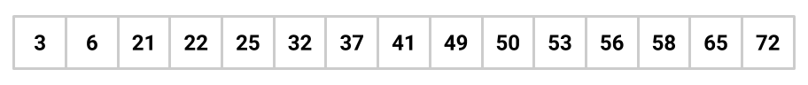

`low = 0`, `high = 6`, `mid = 3`
: 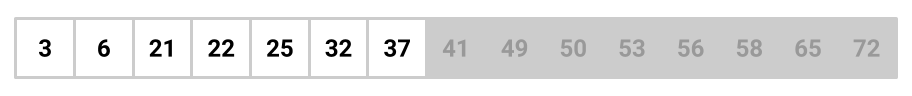

`low = 4`, `high = 6`, `mid = 5`
: 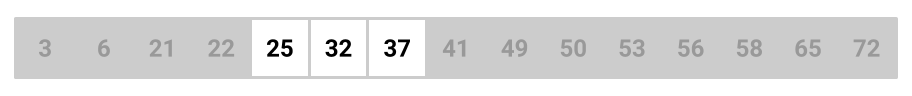

`low = 4`, `high = 4`, `mid = 4`
: 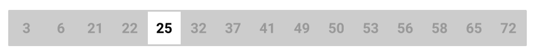

What would be the worst case running time of a search for `k`?
Highlight the next line for the answer *after* discussing with your partner:

<whiteout>Since (roughly) half the elements are removed from consideration at each step,
the worst-case running time is proportional to $$\log_2 N$$, where $$N$$ is the
number of elements in the array. </whiteout>

## Binary Search Trees

The binary search algorithm suggests a way to organize keys in an explicitly
linked tree, as indicated in the diagram below.

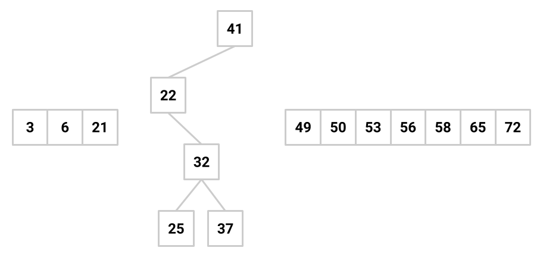

The data structure that results is called a **binary search tree** (BST). Given
that the root value (one of the keys to be stored) is $$k$$, a binary search
tree is organized as follows:

- Put all the keys that are smaller than $$k$$ into a binary search tree, and
  let that tree be $$k$$'s left subtree.
- Put all the keys that are larger than $$k$$ into a binary search tree, and let
  that tree be $$k$$'s right subtree.

This organization assumes that there are no duplicate keys among those to be
stored.

### `contains`

It's important to note that in a binary search tree, each subtree is also a
binary search tree. This suggests a recursive or iterative approach for
implementing many methods, and the `contains` method is no different. In
pseudocode, here is an outline of the helper method of the `contains` method,
`containsHelper(TreeNode t, T key)`:

1. An empty tree cannot contain anything, so if `t` is `null` return `false`.
2. If `key` is equal to `t.item`, return `true`.
3. If `key < t.item`, `key` must be in the left subtree if it's in the
   structure at all, so return the result of searching for it in the left
   subtree.
4. Otherwise it must be in the right subtree, so return the result of searching
   for `key` in the right subtree.

Note: that the type of `key` is `T`, which is the generic type of the
`BinaryTree` class.

This algorithm can go all the way down to a leaf to determine its answer. Thus
in the worst case, the number of comparisons is proportional to $$d$$, the depth
of the tree. In a balanced tree (more on that next lab), you can expect the
depth of the tree to be proportional to $$\log N$$ in the worst case, where
$$N$$ is the number of nodes in the tree.

### Use of `Comparable` objects

Finding a value in the tree will require "less than", "greater than", and
"equals" comparisons. Since the operators < and > don't work with
objects, we have to use method calls for comparisons.

The Java convention for this situation is to have the values stored in the tree
be objects that implement the `Comparable` interface, which you learned about
in lab10.

### Balance and Imbalance

Unfortunately, use of a binary search tree does not guarantee efficient search.

What would be the worst case runtime possible for a single call to `contains()`
on a valid BST? Discuss with your partner and highlight the next line for the answer.
<whiteout> $$\Theta(n)$$ </whiteout>

For example, the tree

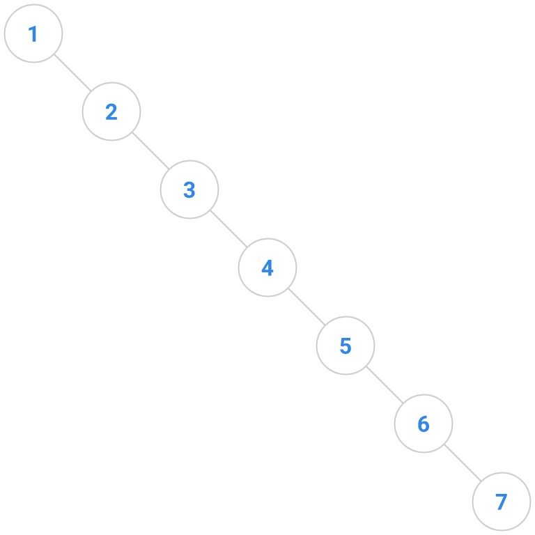

is a binary search tree in which search proceeds in the same runtime as a linked
list. We thus are forced to consider the *balance* of a binary search tree.
Informally, a balanced tree has subtrees that are roughly equal in size and
depth. Next lab, we will encounter specific algorithms for maintaining balance
in a binary search tree. Until then, we will work under the possibly unwarranted
assumption that we don't need to worry much about balance.

One can [prove (optional to read, but an important fact to know)][prove],
incidentally, that search in a BST of $$N$$ keys will
require only about $$2 \ln N$$ comparisons (where $$\ln$$ is the "natural log"
of $$N$$) if the keys are inserted in **random** order. Well-balanced trees are
common, and degenerate trees are rare.

[prove]: http://opendatastructures.org/versions/edition-0.1d/ods-java/node40.html

### Insertion into a BST

If we have 4 nodes in our binary search tree, there are actually 14 different
BST's you could make. Correspondingly, there are typically a bunch of places in
a BST that a key to be inserted might go, anywhere from the root down to a leaf.
Given below are two trees; the tree on the right shows one possible way to
insert the key 41 into the tree on the left.

| 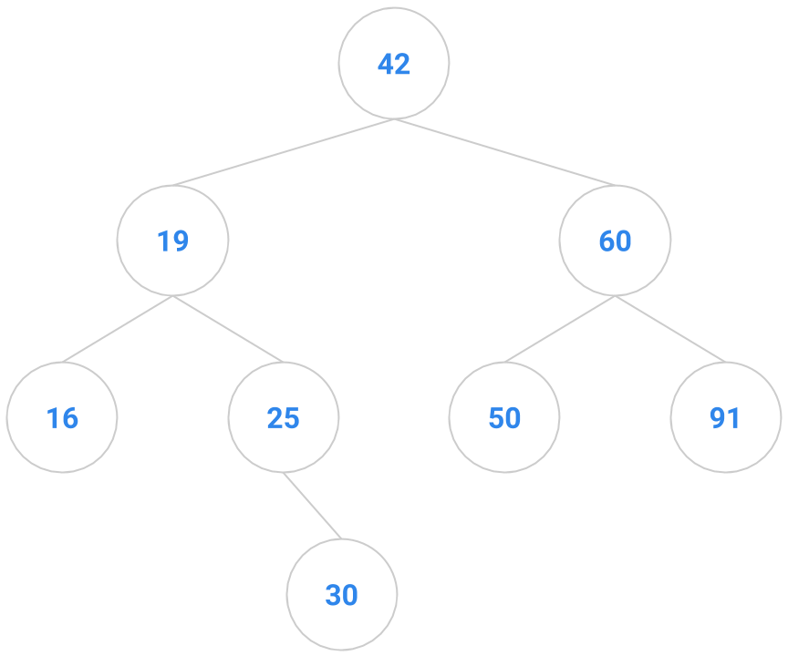 |  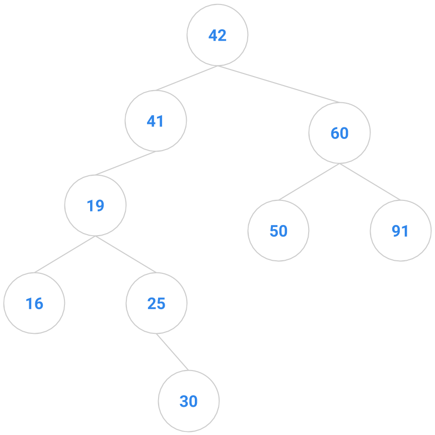  |

However, to minimize restructuring of the tree and the creation of internal
nodes, we choose in the following exercise to insert a new key only as a new
*leaf*.

[USFCA put together a BST visualization][USFCA] interactive animation to help
you visualize the BST insertion and deletion algorithms. Try inserting a key
that ends up as a right child and another key that ends up as a left child. Add
some more nodes to the tree, then delete some of them: a node with no children,
a node with one child, and a node with two children.

[USFCA]: https://www.cs.usfca.edu/~galles/visualization/BST.html

Note that this animation removes from the BST by swapping with the inorder
*predecessor* rather than the inorder successor. Convince your partner that this is
essentially equivalent.

## Exercises: BST Implementation

Now it's time to start writing code! As you go, don't forget to write JUnit
tests.

Since binary search trees share many of the characteristics of regular binary
trees, we can define the `BinarySearchTree` class using inheritance from a
provided `BinaryTree` class.

### Exercise 1: Testing Utilities

As always, we will start by ensuring our ability to test our code. In BinaryTree.java, 
you can find a `print()` method that serves as the foundation for BinaryTreeTest.java. Any test run
right now will fail, because `printInorder()` has not been implemented.

Implement both:
``` java 
/* Print the values in the tree in inorder. */
public void printInorder() {
```
in `BinaryTree` and
```java
/* Prints the nodes of the BinaryTree in inorder. Used for your testing. */
private void printInorder() {
```
in `BinaryTree.TreeNode` to allow for our tests to function. 

### Exercise 2: Implement Constructors

The `BinarySearchTree` class is defined as follows:

```java
public class BinarySearchTree<T extends Comparable<T>> extends BinaryTree<T>
```

This class definition is a slightly more complicated use of generic types than
you have seen before in lab. Previously, you saw things like `BinaryTree<T>`,
which meant that the `BinaryTree` class had a generic type `T` that could be any
class, interface, or abstract class that extends `Object`. In this case,
`BinarySearchTree<T extends Comparable<T>>` means that the `BinarySearchTree`
class has a generic type `T` that can be any class, interface, or abstract class
that implements the `Comparable<T>` interface. In this case, `Comparable<T>` is
used because the `Comparable` interface itself uses generic types (much like the
`Iterable` and `Iterator` interfaces).

Take a look through the `BinarySearchTree` and `BinaryTree` classes, and
familiarize yourself with the methods that are available to you. Then, implement
the two constructors for the `BinarySearchTree` class, using only method calls
to `super`.

### Exercise 3: `contains`

Now, we will implement the `contains` method. We will use the following method
signature:

```java
public boolean contains(T key)
```

which takes a `Comparable` object `T` as an argument and checks whether the tree
contains it.

Recall that `Comparable` objects provide an `int compareTo` method that returns:

- a negative integer if this object is less than the argument,
- a positive integer if this object is greater than the argument, and
- 0 if the two objects have equal values.

Depending on whether you take a recursive or iterative approach, you may need to
define a helper method. If you're stuck, take a look at the pseudocode that we
described above!

### Exercise 4: `add`

We will now define an `add` method. We will use the following method signature:

```java
public void add(T key)
```

which takes a `Comparable` object as an argument and adds it to the tree *if and
only if it isn't already there*.  The trees you create with the `add` method
will thus not contain any duplicate elements.

*Hint*: You should be able to do this in a similar way to the `contains` method.
When you're done with both, you can write a JUnit test suite to test your code.
Don't forget edge cases!

## Discussion: BST Deletion

We've covered `add`ing to a BST and `contains` in a BST. But how about deletion?

When inserting a key, we were allowed to choose where in the tree it should go.
The deletion operation doesn't appear to allow us that flexibility; deletion of
some keys will be easy (leaves or keys with only one child), but our deletion
method has to be able to delete *any* key from the tree.

Here are a bunch of binary search trees that might result from deleting the root
of the tree

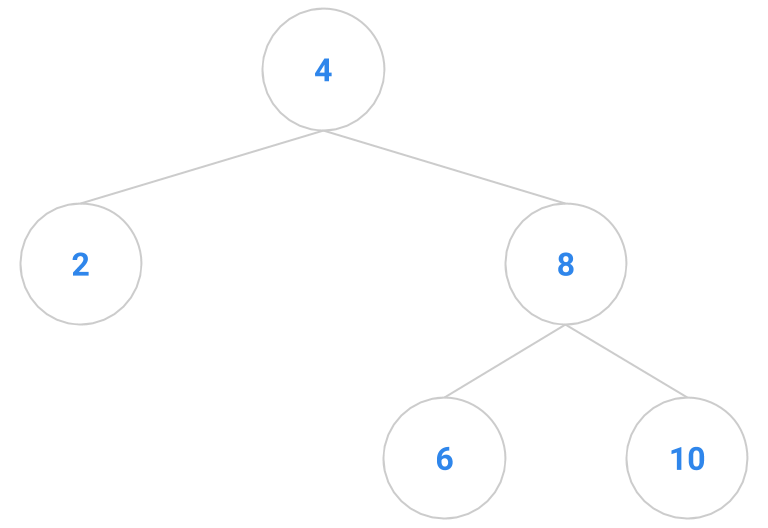

Which ones do you think are reasonable?

| 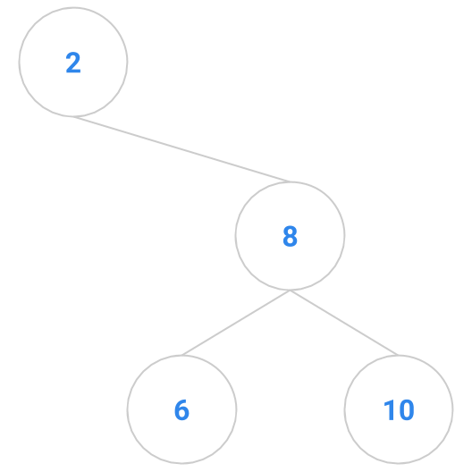 | 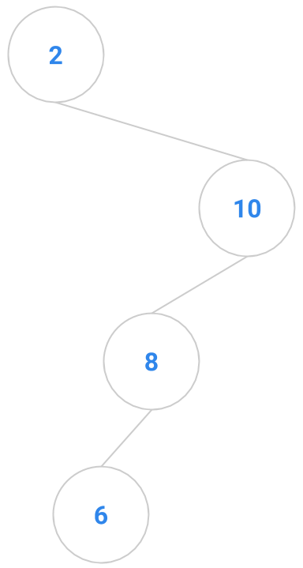 | 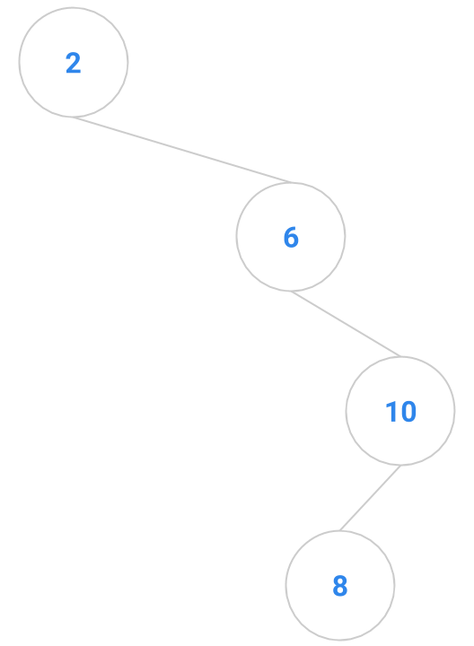 | 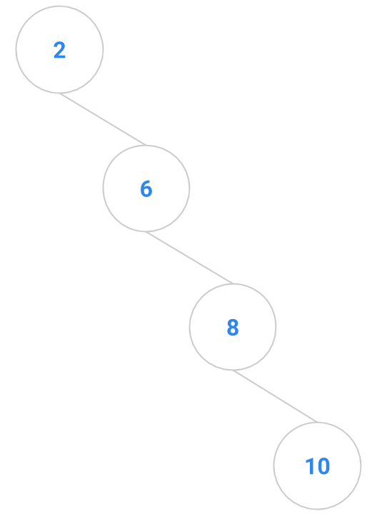 |
| 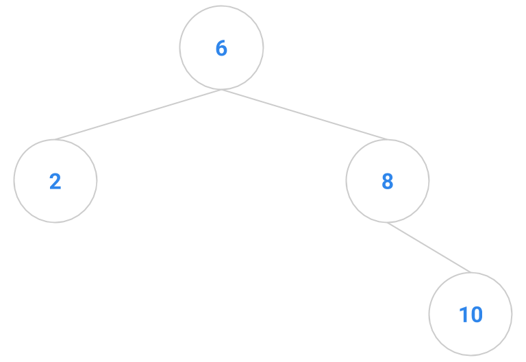 | 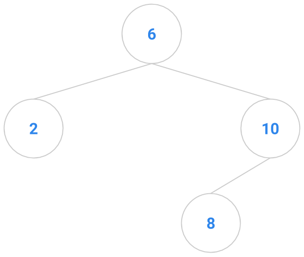 | 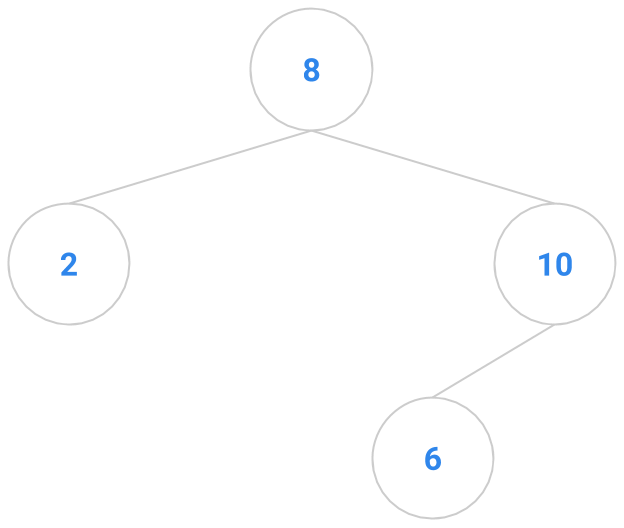 | 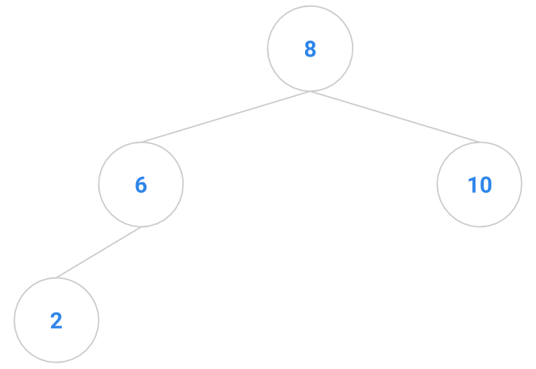 |
| 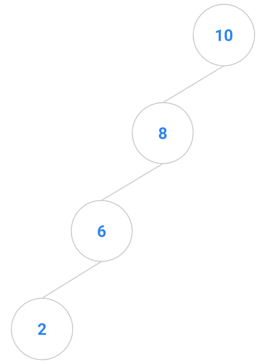 | 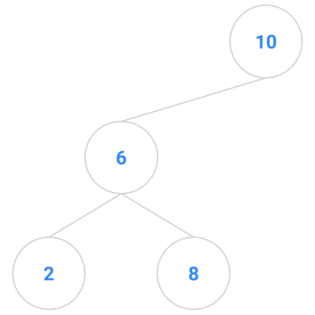 | 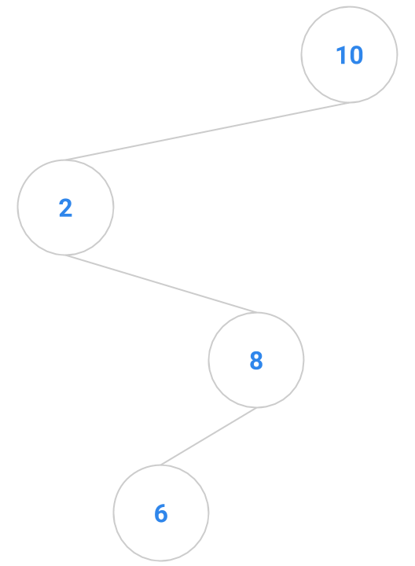 | 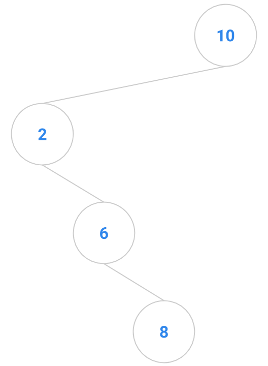 |

### A Good Way to Delete a Key

The following algorithm for deletion has the advantage of minimizing
restructuring and unbalancing of the tree. The method returns the tree that
results from the removal.

1. Find the node to be removed. We'll call it `remNode`. If it's a leaf, remove
   it immediately by returning `null`. If it has only one child, remove it by
   returning the other child node.
2. Otherwise, remove the *inorder successor* of `remNode`, copy its `item` into
   `remNode`, and return `remNode`.

What is an *inorder successor*?  It is the node that would appear **AFTER** the
`remNode` if you were to do an inorder traversal of the tree.

An example is diagrammed below. The node to remove is the node containing 4. It
has two children, so it's not an easy node to remove. We locate the node with
4's inorder successor, namely 5. The node containing 5 has no children, so it's
easy to delete. We copy the 5 into the node that formerly contained 4, and
delete the node that originally contained 5.

| Before                              | After                                 |
|-------------------------------------|---------------------------------------|
| 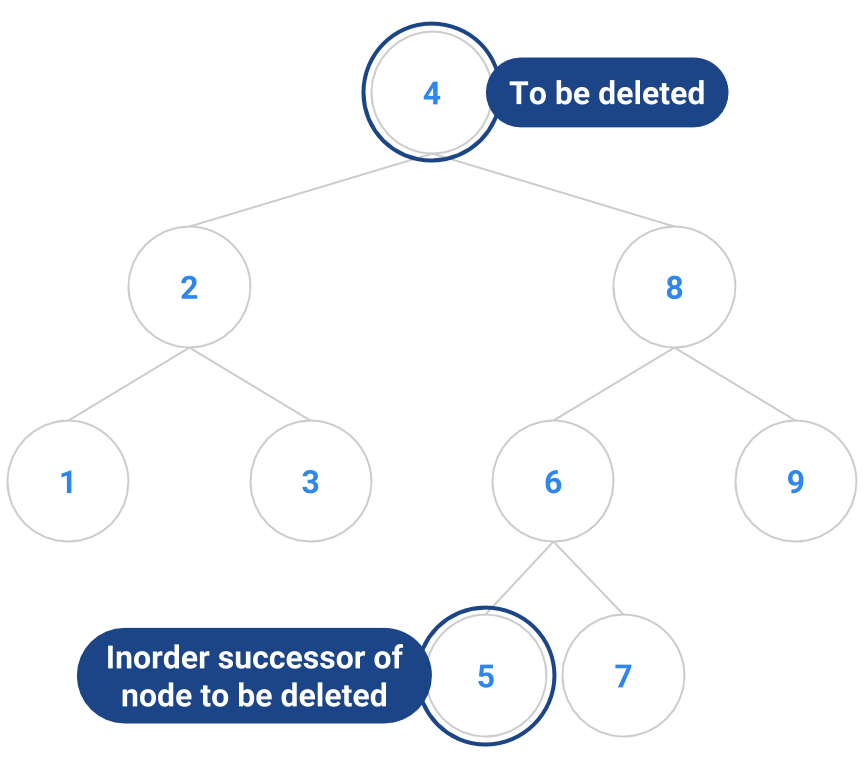 | 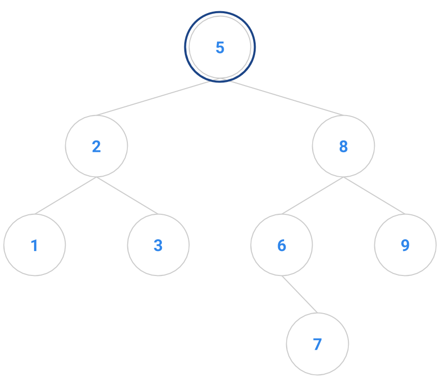 |

### Inorder Successor

Suppose `node` is the root node in a BST with both a left child and a right
child. Will `sucNode`, the inorder successor of `node`, ALWAYS have a null
left child? Discuss this with your partner.

We've implemented a `delete` method for you already. Take a look at it and
**understand how it works**.

## The Engineer's Tradeoff

Consider the problem of finding the `k`th largest key in a binary search tree.
An obvious way of doing this is to use the inorder enumeration from this week's
lab; we could call `nextElement` until we get the desired key. If `k` is near
the number of keys `N` in the tree, however, that algorithm's running time is
proportional to `N`. We'd like to do better. But how?

If you haven't yet noticed, this class is all about tradeoffs---finding the
delicate balance between two conflicting factors to perfectly suit a certain
task. Choosing an appropriate data structure is one tradeoff: an algorithm that
requires quick access to a certain piece of information would perform better on
an array, but an algorithm that uses many insert and delete operations would
probably do better in a linked list. Sacrificing a shorter running time in
exchange for more memory space, or vice versa, is another.

For this problem, we can reduce the runtime of the `k`th largest key by storing
in each node the size of the tree rooted at that node. Can you design an
algorithm using this idea that runs in time proportional to `d`, where `d` is
the depth of the tree?


### Deliverables

Here's a quick recap of what you need to do to complete this lab!

- Complete the following methods in `BinarySearchTree.java`:
    - `printInorder()`
    - `BinarySearchTree()`
    - `BinarySearchTree(TreeNode root)`
    - `contains(T key)`
    - `add(T key)`
- Understand the `delete` method of the `BinarySearchTree`.

