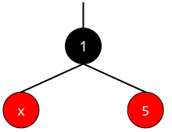

## Introduction

As usual, pull the files from the skeleton and make a new IntelliJ project.

Over the past few labs, we have analyzed the performance of algorithms for
access and insertion into binary search trees under the assumption that the
trees were *balanced*. Informally, that means that the paths from root to leaves
are all roughly the same length, resulting in a runtime logarithmic to the
number of items. Otherwise, we would have to worry about lopsided, unbalanced
trees in which search is linear rather than logarithmic.

Unfortunately, this balancing doesn't happen automatically, and we have seen 
how to insert items into a binary search tree to produce worst-case search 
behavior. In this lab we will be exploring different techniques which will 
actually allow us to claim that the height of the tree is indeed logarithmic 
to the number of items contained in the tree. There are two approaches we 
can take to make tree balancing happen:

Incremental balancing
: At each insertion or deletion we do a bit of work to keep the tree balance

All-at-once balancing
: We don't do anything to keep the tree balanced until it gets too lopsided,
then we completely rebalance the tree.

In the activities of this segment, we will start by analyzing some tree
balancing code. Then, we will explore how much work is involved in maintaining
complete balance. Finally, we'll move on to explore three kinds of balanced
search trees: B-trees, red-black trees, and left-leaning red-black trees.

## Exercise: `sortedIterToTree`

### Implementation

In `BST.java`, complete the `sortedIterToTree` method which should build a
*balanced* binary search tree out of an `Iterator` that returns the items in
**sorted order**.

> **Warning**: This problem is challenging. Don't spend too much time on it and
> come back to it at the end of the lab. Talk to your lab partner and let the
> ideas mingle in the back of your mind as you work through the rest of lab.
>
> *Hint*: Recursion! Think about the parameters and the order of recursive
> calls. The very first item in the iterator is also the first item in the
> inorder traversal of the tree and, therefore, the leftmost child of the
> balanced binary search tree.
>
> Draw out a couple of cases by hand and break down what needs to be done.
> There is only one `Iterator` object (it will be passed through recursive
> calls), so make sure you think about the order things are being returned from
> the `Iterator` and how to construct a tree from it!

You may notice that in our BST, the items are of type `Object`. However, in
previous labs we have seen that the items must be `Comparable`. Why is this the
case? It's because you shouldn't need to ever do any comparisons yourself. Just
trust that the order of the items returned from the `Iterator` is correct.

### Runtime

Spend some time to discuss what the runtime is for `sortedIterToTree`, where
$$N$$ is the length of the iterator. Do you think there is a faster way to do?
What is the fastest runtime you think it could be done in? Discuss with your 
partner, and ask an academic intern or your TA if you want to discuss more!

## 2-3-4 Trees

The first balanced search tree we'll examine is the 2-3-4 tree. 2-3-4 trees
guarantee $$O(\log N)$$ height in any case. That is, the tree is always balanced
by height.

2-3-4 trees are named that way because each non-leaf node can have either 2, 3,
or 4 children. Additionally, any non-leaf node **must** have one more child than
it does keys. That means that a node with 1 key must have 2 children, 2 keys
with 3 children, and 3 keys with 4 children.

Here's an example of a 2-3-4 tree:

Notice that it looks like a binary search tree, except each node can contain 1,
2, or 3 items rather than just 1. In addition, the tree also follows the
ordering invariants of the binary search tree. For example, take the [2, 4]
node. Each key in the subtree rooted at the first child has items less than 2.
Each key in the second subtree has items between 2 and 4. Each key in the third
subtree has items greater than 4. This extends to nodes with more or less keys
as well. We can take advantage of this to construct a search algorithm similar
to the search algorithm for binary search trees.

## Discussion: 2-3-4 Tree Height

What does the invariant that a 2-3-4 tree has one more child than keys tell you
about the length of the paths from the root to leaf nodes? How does that keep
the 2-3-4 tree balanced? Discuss this with your partner.

### Insertion into a 2-3-4 Tree

Although searching in a 2-3-4 tree is like searching in a BST, inserting a new
item is a little different.

Like a BST, we *always* insert the new key at a leaf node. We must find the
correct place for the key that we insert to go by traversing down the tree,
and then insert the new key into the appropriate place in the existing leaf.
However, unlike in a BST, nodes themselves in a 2-3-4 tree can be modified as a
result of insertion if a leaf node is able to accept more keys.

Suppose we have the following 2-3-4 tree:

If we were to insert `10` into the tree, we first traverse down the tree until
we find the proper leaf node to insert it into. We subsequently find the leaf
node that contains `8` and `11`. That node still has room (because a node can
contain up to 3 keys), and we can insert `10` between `8` and `11`, leaving us
with a three key node, as shown below.

However, what if the leaf node we choose to insert into already has 3 keys? Even
though we'd like to put the new item there, it won't fit because nodes can have
no more than 3 keys. What should we do?

The solution is to push up the middle key in the node to the parent, which will
split up the node into two single nodes. Then, we will add the key that we are
trying to insert into the correct place.

It is possible that this will cause the parent or the parent's parent to have
too many keys. In cases like this, we will repeat this process until our tree
has no more nodes with 4 keys in it.

Let's try to insert 9 into the 2-3-4 tree above.

We must first find which leaf to insert into. 9 is smaller than 20, so we go
down to the left. Then we find the leaf that we would like to insert into.
Because this node has 3 keys, [8, 10, 11], we push up the middle key (10), then
split the 8 and the 11 into separate nodes. We insert 9 into the node with 8 in
it, as seen below.

There is one little special case we have to worry about when it comes to
inserting, and that's if the root is a 3-key node. Roots don't have a parent to
push the middle key to. In that case, we still push up the middle key and
instead of giving it to the parent, we make it the new root. Only when this
happens does the height of the 2-3-4 tree increase.

## Exercise: Growing a 2-3-4 Tree

### Exercise 1

Insert 5, 7, and 12 into the 2-3-4 tree above. Then, compare your answer with
your partner's.

### Exercise 2

Suppose the keys 1, 2, 3, 4, 5, 6, 7, 8, 9, and 10 are inserted sequentially
into an initially empty 2-3-4 tree. Which insertion causes the second split to
take place?

Try to add these keys to an empty tree, and discuss with your partner your
output.

> If you want to check your work, consider using [this visualization tool][] from 
> the University of San Francisco. Make sure to set the degree of the tree
> appropriately. They have a few more interesting visualizations on their site
> if you want to use as a resource at a later point.

[this visualization tool]: https://www.cs.usfca.edu/~galles/visualization/BTree.html

### Removal from a 2-3-4 Tree

We will not be covering how to remove from a 2-3-4 tree in this course, but
notes on how to do so are in [Shewchuk's notes][]. The idea behind removal is
similar to removal from a BST. Like in insertion, we modify nodes as we find
what to delete. Instead of getting rid of 3-key nodes, remove will create 3-key
nodes. Again, you will not be responsible on understanding the exact mechanics
of the removal algorithm.

[Shewchuk's notes]: https://people.eecs.berkeley.edu/~jrs/61b/lec/27

### B-trees

A 2-3-4 tree is a special case of a structure called a *B-tree* and its name is
sometimes abbreviated as 2-4 tree (captures the minimum and maximum number of 
children that a node can have rather than all values of children that a node can 
have). Other types of B-trees include 2-3 trees, 2-3-4-5 trees (often called 2-5 
trees), etc. As you can see, what varies among B-trees is the number of keys / 
subtrees per node. 

The [USF visualization][] from above is for B-trees of max degree 3 to 7, 
which means you can visualize 2-3 trees, 2-4 trees, 2-5, trees, 2-6 trees, and
2-7 trees. If you have not already check the visualization out and see how 
changing the degree changes what happens when you insert values into the tree. 
The pattern should be much the same as what we have discussed above for 2-3-4 
trees with the main difference being how stuffed we let nodes get before we 
split them.

[USF visualization]: https://www.cs.usfca.edu/~galles/visualization/BTree.html

B-trees with lots of keys per node (on the order of thousands) are especially
useful for organizing storage of disk files, for example, in an operating system
or database system. Since retrieval from a hard disk is quite slow compared to
computation operations involving main memory, we generally try to process
information in large chunks in such a situation, in order to minimize the number
of disk accesses. The directory structure of a file system could be organized as
a B-tree so that a single disk access would read an entire node of the tree.
This would consist of, say, the text of a file or the contents of a directory of
files.

> If you would like a deeper explanation into 2-3 trees / 2-3-4 trees / B-trees
> then some of the following resources provide other explanations and some of
> them are a bit more involved than the brief explanation presented here. Note
> we will also be covering them in lecture this week, and these resources are 
> just meant for extra review later. 
>
> - Josh Hug's textbook Sections [11.1][], [11.2][], and [11.3][].
> - Professor Hilfinger's [balanced search slides][] (contains more than just a
> discussion about B-trees).

[11.1]: https://joshhug.gitbooks.io/hug61b/content/chap11/chap111.html
[11.2]: https://joshhug.gitbooks.io/hug61b/content/chap11/chap112.html
[11.3]: https://joshhug.gitbooks.io/hug61b/content/chap11/chap113.html
[balanced search slides]: https://inst.eecs.berkeley.edu/~cs61b/sp20/materials/lectures/lect30.pdf

## Red-Black Trees

We saw that 2-3-4 trees are balanced, guaranteeing that a path from the root to
any leaf is $$O(\log N)$$. However, 2-3-4 trees are notoriously difficult and
cumbersome to code, with numerous corner cases for common operations. They are
still used, but for our purposes you can imagine that you must represent nodes
which contain different numbers of items and have different numbers of children.
There turns out to be a related balanced search tree with a one to one correspondence
to B-tree which many agree to be slightly simpler to implement.

What's used in practice is a red-black tree (in fact, it is the tree behind
Java's `TreeSet` and `TreeMap`). A **red-black tree** at its core is just a 
binary search tree like we saw from yesterdays lab, but there are a few additional
invariants related to "coloring" each node red or black. As mentioned above this in 
fact creates a bijection or mapping between 2-3-4 trees and red-black trees!

The consequence is quite astounding: red-black trees maintain the balance of
B-trees while inheriting all normal binary search tree operations (a red-black
tree *is* a binary search tree after all) with additional housekeeping. This
self-balancing quality is why Java's `TreeMap` and `TreeSet` are implemented as
red-black trees!

### 2-3-4 Tree &harr; Red-Black Tree

Notice that a 2-3-4 tree can have 1, 2, or 3 elements per node, and 2, 3, or 4
pointers to its children. Consider the following B-tree node:

`a`, `b`, `c`, and `d` are pointers to its children nodes/subtrees. `a` will
have elements less than 4, `b` will have elements between 4 and 7, `c` will have
elements between 7 and 10, and `d` will have elements greater than 10.

Let us transform this into a "section" in red-black tree that represents above node:

For each node in the 2-3-4 tree, we have a group of red-black tree nodes (or
colored binary search tree nodes) that correspond to it. Each element in a node
of a 2-3-4 tree will correspond to the following in a red-black tree:

- Middle element &harr; a black node that is reachable from parent.
- Left element &harr; a red node on the left of the middle element's black node.
- Right element &harr; a red node on the right of the middle element's black
  node.

As a general rule, any red node in a red-black tree will be in the same node as
its parent in a B-tree.

Notice that `a`, `b`, `c`, and `d` are also "sections" that corresponds to a
2-3-4 tree node. Thus, the subtrees will have black root nodes and other colored
nodes that follow the above correspondence.

How about a 2-3-4 node with two elements?

This node can be transformed as:

or

Both are valid.

For 2-3-4 node with only one element, it will translate into a single
black node in red-black tree.

## Discussion: Correspondence

It may be hard to see at first that the balancedness of 2-3-4 tree still holds
on red-black tree, and that a red-black tree is still a binary search tree.

Given a 2-3-4 tree, how can we apply the correspondence rule above to determine
the maximum height of the corresponding red-black tree? If each 4-child node in
the 2-3-4 tree is equivalent to two red nodes and one black node in a red-black
tree, what can we say about the height of the red-black tree?

Then, discuss with your partner about which of the following binary search tree
operations we can use on red-black trees without any modification.

1. Insertion
2. Deletion
3. Search (is `k` in the tree?)
4. Range Queries (return all items between `a` and `b`)

## Exercise: Constructor

Read the code in `RedBlackTree.java` and `BTree.java`.

Then, in `RedBlackTree.java`, implement `buildRedBlackTree` which returns the
root node of the red-black tree which has a one-to-one mapping to the given
2-3-4 tree. **For a 2-3-4 tree node with 2 elements in a node, you must use the
"larger" element as the black node to pass the autograder tests.** This means that
a node with two elements should correspond to a black node with a left red child.
For the example above, you must use the second representation of red-black tree 
where 5 is the black node.

If you're stuck, refer to the example conversions shown above to help you write
this method!

Some further tips for writing this method if you are stuck:
- You should be filling in the three cases which correspond to a 2-node, a 3-node,
and a 4-node (these number correspond to the number of children each node in the 
2-3-4 tree has). For a 2-node, you should need to make one new `RBTreeNode` object. 
For a 3-node, you should need to make two new `RBTreeNode` objects. Finally for a 
4-node, you should need to make three new `RBTreeNode` objects.
- You should rely on the `getItemAt` and `getChildAt` methods from the `Node` class
which will return the appropriate items and children `Node`s. 
- Your code should involve the same number of recursive calls to `buildRedBlackTree`
as the number of children in the `Node` you are translating, e.g. two recursive
calls for a 2-node, three recursive nodes for a 3-node, and four recursive calls 
for a 4-node.
- For all three cases you should only make one of the `RBTreeNode`s be a black
node. For the cases where you have more than one `RBTreeNode` make sure that you are
returning the black node.

## Left-Leaning Red-Black Trees

In the last section, we examined 2-3-4 trees their relationship to red-black
trees. Here, we want to extend our discussion a little bit more and examine 2-3
trees and _left-leaning red-black trees_.

2-3 trees are B-trees, just like 2-3-4 trees. However, they can have up to 2
elements and 3 children, whereas 2-3-4 trees could have one more of each.
Naturally, we can come up with a red-black tree counterpart. However, since we
can only have nodes with 1 or 2 elements, we can either have a single black node
(for a one-element 2-3 node) or a "section" with a black node and a red node
(for a two-element 2-3 node). As seen in the previous section, we can either let
the red node be a left child or a right child. For these trees, we will choose
to *always* let the red node be the *left* child of the black node. This leads
to the name, "left-leaning" red-black tree. An example of a node containing 5
and 9 is shown below:

The advantages of LLRB tree over the usual red-black tree is the relative ease of
implementation. Since there are fewer special cases for each "section" that
represents a 2-3 node, the implementation is comparatively simpler when compared
to that of a red-black tree which corresponds to a 2-3-4 tree.

> We should briefly note that vocabulary that we have been using here might
> begin to get a bit confusing. In the previous section we were dealing with 
> red-black trees which correspond to 2-3-4 trees, and now we are talking about
> left-leaning red-black trees which correspond to 2-3 trees. 
>
> This becomes more even more confusing when we note that we have forced you to
> make your red-black tree from above have a certain structure which you should 
> now be able to see makes it left leaning. For our class, we will still reserve
> the usage of left-leaning red-black tree to refer to the 2-3 tree equivalent.
>
> TLDR: Unless otherwise specified assume that when we say left-leaning red
> black tree we are referring to the 2-3 tree equivalent and when we say 
> red-black tree we are referring to the more general 2-3-4 tree equivalent.
> In any instances where this discrepancy is important we will clarify and
> feel free to ask which we are referring to if you think it matters.

Normal binary search tree insertions and deletions can break the red-black tree
invariants, so we need additional operations that can "restore" the red-black
tree properties. In LLRB trees, there are two key operations that we use to
restore the properties: rotations and color flips.

### Rotations

Consider the following tree:

`a` is a subtree with all elements less than 1, `b` is a subtree with elements
between 1 and 7, and `c` is a subtree with all elements greater than 7. Now,
let's take a look at another tree:

There are few key things to notice:

1. The root of the tree has changed from 7 to 1.
2. `a`, `b`, and `c` are still correctly placed. That is, their items do not
   violate the binary search tree invariants.
3. The height of the tree can change by 1.

*Here, we call this transition from the first tree to the second a "right
rotation on 7"*.

Now, convince yourself that if we start on the second tree and perform a 
"left rotation on 1", the resulting tree will be the first tree. The two
operations are symmetric, and both maintain the binary search tree property!

## Discussion: Rotation by Hand

Let's say we are given an extremely unbalanced binary search tree:

Write down a series of rotations (i.e. rotate right/left on ...) that will make
tree balanced and have height of 2.

*Hint*: Two rotations are sufficient.

> The following discussion and exercises will rely heavily on performing rotations,
> so if you need more help understanding what happens in a rotation we strongly 
> recommend discussing with either your partner, an academic intern or your TA.

## Exercise: Rotations

Now we have seen that we can rotate the tree to balance it without violating the
binary search tree invariants. Now, we will implement it ourselves!

In `RedBlackTree.java`, implement `rotateRight` and `rotateLeft`. For your
implementation, make the new root have the color of the old root, and color the
old root red.

*Hint*: The two operations are symmetric. Should the code significantly differ?
If you find yourself stuck, take a look at the examples that are shown above!

### Color Flip

Now we consider the color flip operation that is essential to LLRB tree
implementation. Given a node, this operation simply flips the color of itself,
and the left and right children. However simple it may look now, we will examine
its consequences later on.

For now, take a look at the implementation provided in `RedBlackTree.java`.

### Insertion

Finally, we are ready to put the puzzles together and see how insertion works on
LLRB trees!

Say we are inserting `x`.

1. If the tree is empty, let `x` be the root with black color.
2. Otherwise, do the normal binary search tree insertion, and color `x` **red**.
   Then, restore LLRB tree properties.

But, how do we "restore LLRB tree properties"? Let's list out all the cases that
can occur, and how we will deal with each of them.

#### Case 1

Let's assume that our new node `x` is the only child of a black node. That is:

or

Since we decided to make our tree left leaning, we know that the first tree is
the valid form. If we end up with the second tree (`x` > `parent`) we can apply
`rotateLeft` on `parent` to get the first tree.

#### Case 2

Now, let's consider the case when our new node `x` becomes a child of a black
node which already has a left child, or a child of a red node. This is like
trying to insert `x` into a 2-3 tree node that already has 2 items and 3
children!

Here, we have to deal with 3 different cases, and we will label them case A, B,
C.

Case 2.A
: `x` ends up as the right child of the black node.

  Notice that for case 2.A, the resulting section is the same as a 2-3 tree
node with one extra element:

  To fix it, we "split" the 2-3 node into two halves, "pushing" up the middle
element to its parent:

  Analogously, for our LLRB section, we can apply `flipColor` on `5`. This
results in:

  Notice that this exactly models the 2-3 node we desired. 5 is now a red node,
which means that is is now part of the "parent 2-3 node section." Now, if 5 as a
new red node becomes a problem, we can *recursively* deal with it as we are
dealing with `x` now. Also, note that the root of the whole tree should *always*
be black, and it is perfectly fine for the root to have two black children. It
is simply a root 2-3 node with single element and two children, each with single
element.

Case 2.B
: `x` ends up as the left child of the red node.

  In this case, we can apply `rotateRight` on `5`, which will result in:

  This should look familiar, since it is *exactly* case 2.A that we just
examined before! After a rotation, our problem reduces to solving case 2.A.
Convince yourself that rotation performed here correctly handles the color
changes and maintains the binary search tree properties.

Case 2.C
: `x` ends up as the right child of the red node.

  In this case, we can apply `rotateLeft` on `1`, which will result in:

This also should look familiar, since it is *exactly* case 2.B that we just
examined. We just need one more rotation and color flip to restore LLRB
properties.

### Deletion

Deletion deals with many more corner cases and is generally more difficult to
implement. For time's sake, deletion is left out for this lab.

> If you would like a deeper explanation into red-black trees then some of the 
> following resources provide other explanations and some of them are a bit more
> involved than the explanation presented here. Note we will also be covering them
> in lecture this week, and these resources are just meant for extra review later. 
>
> - Josh Hug's textbook Sections [11.4][] and [11.5][].
> - Josh Hug's red-black tree lecture videos. (I personally found this lecture 
> really illuminating especially how he compares B-trees to their red-black
> tree counterparts -Matt)
> - Professor Hilfinger's [balanced search slides][] (contains more than just a
> discussion about B-trees).

[11.4]: https://joshhug.gitbooks.io/hug61b/content/chap11/chap114.html
[11.5]: https://joshhug.gitbooks.io/hug61b/content/chap11/chap115.html
[lecture videos]: https://www.youtube.com/watch?v=kkd8d0QhiQ0&list=PL8FaHk7qbOD6aKgTz2W-foDiTeBEaBoS3&index=2&t=0s
[balanced search slides]: https://inst.eecs.berkeley.edu/~cs61b/sp20/materials/lectures/lect30.pdf

## Exercise: `insert`

Now, we will implement `insert` in `RedBlackTree.java`. We have provided you
with most of the logic structure, so all you need to do is deal with normal
binary search tree insertion and handle case A, B, and C. **Make sure you follow
the steps from all the cases very carefully!** The root of the `RedBlackTree`
should always be black.

Use the helper methods that have already been provided for you in the skeleton
files (`flipColors` and `isRed`) and your `rotateRight` and `rotateLeft`
methods to simplify the code writing!

If you're stuck, write a recursive helper method similar to how we've seen
`insert` implemented in previous labs!

- What should the return value be? (*Hint*: It's not `void`.)
- What should the arguments be?

In addition, think about the similarities between cases 2.A, 2.B, and 2.C, and
think about how you can integrate those similarities to simplify your code.
Feel free to discuss all these points with your lab partner and the lab staff.

## Discussion: `insert` Runtime

We have seen that even though LLRB trees guarantee that the tree will be almost
balanced, the LLRB tree `insert` operation requires many rotations and color
flips. Examine the procedure for `insert` and convince yourself and your partner
that `insert` still takes $$O(\log N)$$ as in balanced binary search trees.

*Hint:* How long is the path from root to the new leaf? For each node along the
path, are additional operations limited to some constant number? What does that
mean?

## Other Balanced Trees

Balanced search is a very important problem in computer science which has garnered
many unique and diverse solutions. We have chose two common solutions to the
problem to explore in depth. It is also useful to know about other alternatives
but we will not expect you to fully understand how they work. Two other interesting
solutions to this problem are presented below. 

### AVL Trees

**AVL trees** (named after their Russian inventors, Adel'son-Vel'skii and
Landis) are height-balanced binary search trees, in which information about tree
height is stored in each node along with the item. Restructuring of an AVL tree
after insertion is done via a familiar process of *rotation*, but without color
changes.

### Splay Trees

Another type of self-balancing BST is called the **splay tree**. Like other
self-balancing trees (AVL, red-black), a splay tree uses rotations to keep
itself balanced. However, for a splay tree, the notion of what it means to be
balanced is different. A splay tree doesn't care about differing heights of
subtrees, so its shape is less constrained. All a splay tree cares about is that
*recently accessed* nodes are near the top. Upon insertion or access of an item,
the tree is adjusted so that item is at the top. Upon deletion, the item is
first brought to the top and then deleted.

> If you would like to do some more reading about either of these trees, their
> Wikipedia articles are a great place to start. 
> 
> - [AVL Trees](https://en.wikipedia.org/wiki/AVL_tree)
> - [Splay Trees](https://en.wikipedia.org/wiki/Splay_tree)

## Deliverables

- Complete the `sortedIterToTree` method from `BST.java`.
- Complete the following methods in `RedBlackTree.java`:
    - `buildRedBlackTree`
    - `rotateRight` and `rotateLeft`
    - `insert`
