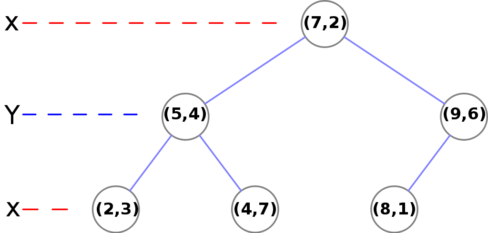
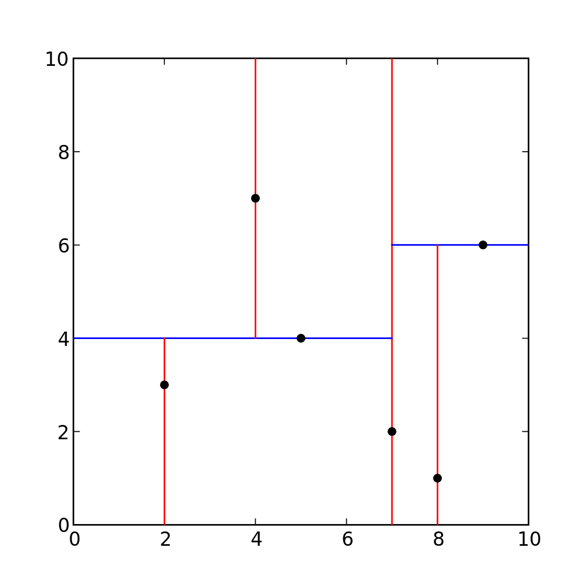
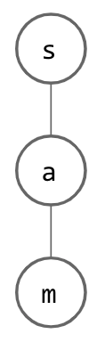
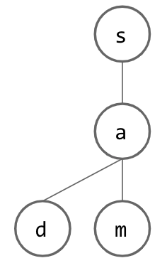
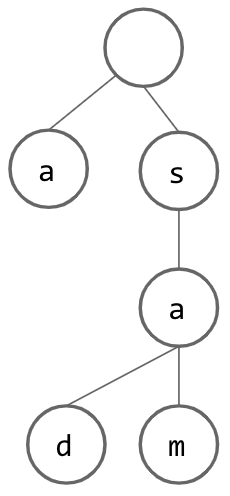
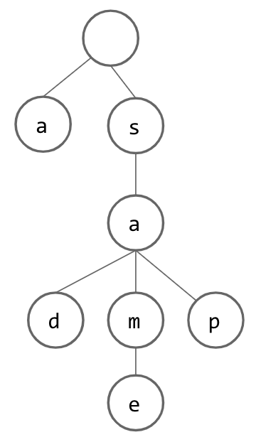
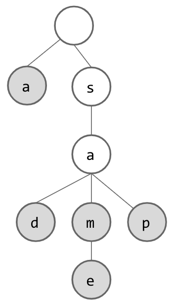

## Introduction

As usual, pull the files from the skeleton and make a new IntelliJ project.

This lab will deal with two new tree data structures, $$k$$-d trees and tries. Each of
these data structures stores information in a different way than a traditional tree
and as such they can be leveraged to solve certain problems even faster than their 
more general counterparts. In particular we will be using them for various parts of 
Project 3: Bearmaps. For now we will just examine the data structures in a more
general form. Later we will explain why they are useful for our mapping application.

## $$k$$-d Trees: Introduction

> If you have not already watched lecture, it might be helpful to first watch
> lecture and then return to this part of the lab. This section of the lab is somewhat
> redundant with the lecture, but we expect you will both watch the lecture and 
> complete this section of the lab. You will not need to code any $$k$$-d tree code
> but there will be a few exercises to test your knowledge on.
> 
> For the most part we want you to be conceptually familiar with $$k$$-d trees before
> you start Project 3 because one of the major components is writing a $$k$$-d tree
> from scratch.

### Multidimensional Data
Up until now the data that we have stored in trees has strictly been 
one-dimensional. The simplest example to see this would be if we consider a tree
which stores numbers (could be `int`s, `double`s, etc.). All integers lie on a single
dimensional number line. We can ask questions like "which of 4 and 7 is bigger?" and
the interpretation is clear. 

The ability to compare one-dimensional data is what we leverage to create binary
search trees. At each node we split the range of possible values into those that are
smaller (to the left) and those that are larger (to the right). What we have seen is
that this can lead to logarithmic operations for checking if an item exists in the
tree or adding an element to the tree (to guarantee this we need some form of 
balancing).

This is great for one-dimensional data, but what if each item to be stored in our tree does not have only one-dimension. The simplest example here might be if we want to 
store points in two-dimensional Cartesian plane (e.g. points of the form $$(x,y)$$).
We would like to apply the same ideas we used in binary search trees to these
two-dimensional items, but the interpretation becomes less clear. Questions like
"which of (1,2) and (0,4) is bigger?" no longer makes as much sense. For the first
dimension 1 is bigger than 0, but for the second dimension 2 is smaller than 4.

It is possible that we could impose some kinda of relative ordering on these points,
but inherently by saying one point is larger than the other we are compressing the
data into one-dimension. For some problems that will be a fine thing to do, but for
others this will not suffice. As such, for multidimensional data we turn to new
data structures like $$k$$-d trees which allow us to properly organize multidimensional
data. 

> Note for all examples in this class we will limit the data that we look at to be
> at most two-dimensional. $$k$$-d trees generalize to $$k$$-dimensional data, but we 
> will not deal with such higher dimensional examples.

### Handling Multidimensional Data
As you have probably guessed by now, the solution to our multidimensional problems is 
the $$k$$-d tree. This data structure is the generalization of the binary search tree
to $$k$$ dimensions and allow us (with some assumptions) to once again achieve 
logarithmic performance for several key operations.

The core structure of a $$k$$-d tree will be a binary tree (e.g. even though we have
higher dimensional data, each node will still just have a right and left child). The key idea which allows a $$k$$-d tree to handle multidimensional data, is that as we
descend through the tree, we will cycle between which dimension we compare our data on.
This means that at each level we will only be comparing on one dimension, so our
comparisons once again will make sense, but the overall structure of the tree will 
store our data in two dimensions. 

Consider the following example in two dimensions. If we have the points $$(2,3)$$, $$(5,4)$$, $$(9,6)$$, $$(4,7)$$, $$(8,1)$$, $$(7,2)$$, then they will be organized
as follows.



A few things to note about this:
- The dimension we compare on switches at each level in a cyclic fashion. At the top
level we compare based on $$x$$, on the second level we compare based on $$y$$, on
the third level we compare based on $$x$$. If we had more levels in our tree we would
continue like this.
- At each level we apply the same binary search tree principal for the dimension we
are comparing on. At the top level we are comparing on $$x$$ and the $$x$$ value is 
7, so all points with $$x$$ values less than 7 go to the left of the root and all
points with $$x$$ values greater than 7 go to the right of the root. The same holds
for all other such nodes.

In our binary search trees each node partitioned a one-dimensional space into two 
different spaces. Here we are splitting a two-dimensional space (or $$k$$-dimensional more generally) into two pieces. It may also be helpful to visualize the points in a more spatially. The following image corresponds to the same $$k$$-tree just visualized
differently.



A few things to note about this:
- The red lines correspond to when we split the space into two spaces by $$x$$ and the
blue lines correspond to when we split the space into two spaces by $$y$$. 
- As we proceed further down the tree spaces get even further divided into pieces. 

## $$k$$-d Trees: Operations
> There are several core operations which we will briefly describe here. For a slightly 
> more in-depth explanation 
> [wikipedia's $$k$$-d tree article](https://en.wikipedia.org/wiki/K-d_tree) is a great
> resource.
>
> Additionally in the next section / exercise each of the operations is explained in
> great detail. Think of this section as an introduction to what each of the operations
> is and what it does. The worksheet should serve as a more complete look at this and 
> will allow you attempt some problems on your own. Afterwards, the solutions should 
> serve as a comprehensive explanation and reference for later when you have to write
> your code for the project. 

### Construction
One use of a $$k$$-d tree will be when you start with a known set of points and you want
to later conduct a number of queries on those such points (this is what you will do in 
Project 3). If this is the case then we will want to build a tree from these points.
There are two main approaches to this.

#### Perfectly Balanced Construction
Given a full set of points we should be able to create a tree which is perfectly 
balanced, if we are careful how we construct it. What we want to have is that each node 
should partition the remaining points into two equal halves which will be passed down to
the node’s left and right children. To create the two equal halves, we will need to find the median point for the correct dimension.

At each node we should sort the points based off of their $$x$$ or $$y$$ coordinates
depending on if we are splitting on $$x$$ or $$y$$. After we have done this we will
select the median point to be the root point and then we will create left and right subtrees based off of the sublists of points split by the median.

For example if we are splitting on $$x$$ the points passed into the left child should
have $$x$$-values less than the median point’s $$x$$-value and the points passed into
the right child should have the $$x$$-values greater than the median point’s 
$$x$$-value. As we have already sorted the list we can take the sublist of the points
before the median and pass them along to the left subtree and then take the points after the median and pass them along to the right subtree.

#### Construction by Insertion
The secondary approach to constructing a $$k$$-d tree is to simply add the points one
at a time. The trade off here is that the code for this method will likely be simpler,
but now we are not guaranteed to have a perfectly balanced tree. Thinking back to
BSTs there were cases where if you inserted elements in a certain order the resulting
BST would end up being spindly and the same thing can happen for $$k$$-d trees. 

If we want to achieve logarithmic runtimes, this relies on the assumption that we have at
least a roughly balanced tree. One thing that we can do to increase the likelihood
of creating a roughly balanced tree is to randomize the order of insertion. This
again will not create a perfectly balanced tree as before, but in expectation the tree
should be roughly balanced. In doing this we expect to come close to a perfectly
balanced tree, but with much simpler code.

### Adding elements
Addition to a $$k$$-d tree should be very reminiscent of insertion into a binary search
tree. To insert a new element, you should traverse through the tree until you reach
a null leaf where a new node should be created to correspond to the point you are adding.
The only difference comes from how we traverse the tree. Now as you might expect we
should move through the tree splitting based off of $$x$$ or $$y$$ depending on which 
level we are on. 

### Nearest Query
The newest operation and perhaps the most interesting is that of nearest neighbor search (we will often shorten to just nearest). This operation addresses the following question.
If I have a $$k$$-d tree with many points in it, which point is nearest to some new point
$$P$$ potentially (and often) not already contained in the tree?

This operation is the main reason which we will use a $$k$$-d tree for Project 3 as we
will need to answer this nearest query, and $$k$$-d trees allow us to do this much more 
efficiently than the naive solution. Naively we can just check the distance between $$P$$
and all the other points, but this will be a $$\Theta(N)$$ operation where $$N$$ is the
number of existing points. The analysis is tricky and slightly beyond the scope of this
class, but with a $$k$$-d finding a nearest point is an $$O(\log(N))$$ operation on 
average assuming we have randomly distributed points.

We will not describe the full algorithm in the lab spec. Instead refer to the lecture 5 
slides. Wikipedia once again does a decent job explaining the algorithm, so feel free to
read [the relevant section](https://en.wikipedia.org/wiki/K-d_tree#Nearest_neighbour_search) 
there as well. Finally, in the next section, the nearest example is explained in detail.

## $$k$$-d Trees: Worksheet
Now it is time to try to put your knowledge to the test! Try to solve questions 3.1, 3.2, and 3.3 on [Spring 2019's Discussion 9](https://sp19.datastructur.es/materials/discussion/disc09.pdf).
It is ok if these exercises are tough! This is a relatively difficult concept and it is 
totally fine if you cannot solve them all on your first go. Try to work with your partner
and solve them to the best of your abilities.

Once you have made a solid effort check out [the solutions](https://sp19.datastructur.es/materials/discussion/disc09sol.pdf). 
Again these solutions are fairly in depth and should serve as a reference for you to use 
later. Read over the solutions and make sure they make sense. If you have any questions, 
discuss them with your partner! If you have questions past that feel free to ask for 
help from lab staff. 

> These concepts are relatively dense and might take some time to digest. This portion
> of the lab will not be graded and is meant as preparation for the project. The next 
> section contains a coding exercise, so it might be better to move on past $$k$$-d
> trees for now and return to this part of the lab before the project. 

## Tries

For the second part of this lab, you'll create `TrieSet`, a Trie-based
implementation of the `TrieSet61BL` interface, which represents a basic
Trie.

Up to this point in the course, we have learned about a number of
Abstract Data Types, such as Lists, Sets, Maps, and others. Today, we
will be exploring another way to implement the Set and Map ADTs,
specific to storing `Strings`.

Suppose you were tasked with creating a Set which is only going to be
used to store Strings. In the beginning of the class, we might have
tried to just put each String into a link of a `LinkedList`. If this
were the representation we used, how would we implement `add()`,
`remove()`, and `contains()`? Even if we took the time to order our
`LinkedList`, we would still have a linear runtime for each of these
operations.

Now we should be wondering how we can speed up these runtimes.
Recently, we have learned about structures which might help us in
our quest for efficiency. Perhaps we could store our Strings in a
BST, where each node contains a single `String` and uses the `String`
`compareTo()` method when determining which direction to go. This will
offer an improvement, since a well-balanced BST will make `add()` and
`contains()` considerably faster, but repeatedly using `add()` and
`remove()` might end up causing the BST to lose its balance. Next, we
might consider the use of a `HashSet` to store our `String`s. This method
should work reasonably well, under the assumption that String's
`hashcode()` method causes them to be distributed in a relatively
uniform manner (which _should_ occur, given [how it is defined](https://docs.oracle.com/javase/7/docs/api/java/lang/String.html#hashCode())).
However, there is still a chance that the Strings we are storing will
not distribute themselves well throughout our `HashSet` and our runtime
might suffer.

> We have not learned how a `HashSet` works and what the purpose of the
> `.hashcode()` function is. For now, we can just assume that it is 
> another way of implementing a set and that the aforementioned assumption
> is necessary to achieve good performance. Soon we will learn how a `HashSet`
> works and this explanation might make more sense.

Let us now consider another way to implement this Set of Strings, the
[trie](https://en.wikipedia.org/wiki/Trie). This structure, whose name
is short for Re**trie**val Tree, is designed to give a runtime that is
$$\Theta(k)$$ in the worst case where $$k$$ is the number of characters
in the `String`, not the number of `String`s contained in our set.
This will end up being even better than our HashSet, since we will not 
need to worry about a good `.hashcode()` function or resizing!). 
This may seem difficult to believe at first, but as we explore the
structure of this data structure, we will see that we are simply 
shifting the runtime dependency to a different aspect of our data,
in order to prevent the number of items contained from affecting our 
runtime.

To create a trie, we must first recognize a few things about the data
type we are working with. Firstly, we know that `String`s are comprised
of individual characters, which can be extracted. Secondly, we know
that there are only so many characters available to choose from (after
all, our alphabet thankfully does not have infinitely many letters). Given these
two facts, we can begin our construction of this data structure.

Suppose we begin with a tree structure where we store a single
character at each node. Think about how a single `String` might be
represented; for every letter in given `String`, we have a node whose
child is a node which represents the next letter. This is depicted
below, where the word "sam" has been inserted:



Now, how do we insert another word? If this new word is similar to our
initial word, this should be easy, since we can just share nodes that
we have in common! Once we reach a letter that is not shared between
the two words, we can just add another child to the last node that
was shared and continue creating nodes for our new word. Below, we
insert "sad" into our tree:



However, if we want to insert a `String` that does not start with the
same letter as our current root, it seems that we are out of luck
and need to create an entire additional tree. However, if we instead
add a dummy node as our root, we can pretend that each `String` inserted
"begins" with this empty node and go from there. This is what our trie
looks like if we use our dummy root idea and insert the `String` "a":



From here, we can continue inserting additional `String`s, building up
our Set. Below, we have inserted the Strings "same" and "sap":



But wait! How do we know which words are _actually_ contained in our
set? After all, if we only think of words as being in the trie if they
end with a node with no children, then we have lost our `String` "sam".
If we solve this issue by considering each node in the trie to
designate a `String`, we suddenly have unexpected Strings in our Set ("s"
and "sa"). To fix this issue, we add another piece of information to
each node: a flag which lets us know whether we have reached the end of
a word. Now, our trie will look something like this:



At this point, if we want to search for `String`s which are contained
within the trie, we can simply look for the appropriate node for each
letter as we trace through the trie. If we ever cannot find the next
node, we know that the word is not contained. We also know that if we
have gone through all of our letters and arrived at a node that exists,
we should still check this "flag" to be sure that the word was actually
stored in the trie.

Now that we have covered the basic idea of a trie used as a Set, think
about how we could turn this Set (of Strings) into a Map (which maps a
`String` to another `Object`) with a simple change.

One question we have not yet answered is how to properly store the
children for each of our nodes. If we know the size of our alphabet,
it seems reasonable that we can just store an array that is as long
as our alphabet in each node, allowing us to enumerate each letter
in our alphabet and store a link to the appropriate child. However,
you might see why this would be inefficient; most of our array will
likely be empty, as most `String`s obey some set of "spelling rules" and
certain combinations of letters are much more likely than others (think
about how many words start with "an" vs how many words start with "qx").
To account for this, we might want to be more clever with our
child-tracking in our nodes. Consider using a BST or `HashMap` as
potential ways of keeping track of a node's children, while considering
the pros and cons for each (compare to each other, as well as to our
initial array idea). 

## _Optional_ Tries: Worksheet
If you would like some additional practice on tries, you can complete questions 2.1 on [Spring 2019's Discussion 9](https://sp19.datastructur.es/materials/discussion/disc09.pdf).

Once you have made finished you can check your work with [the solutions](https://sp19.datastructur.es/materials/discussion/disc09sol.pdf).

### Exercise: `MyTrieSet`

Create a class **MyTrieSet** that implements the **TrieSet61BL** interface using
a trie as its core data structure. You must do this in a file named
`MyTrieSet.java`. Your implementation is required to implement all of the
methods given in **TrieSet61BL** *except* for `longestPrefixOf` and `add`. For
`longestPrefixOf` you should throw an `UnsupportedOperationException`. For `add`
please copy and paste the following code if you choose not to implement it
yourself (note this may not work with all implementations and you might need
to modify either your code or this code to make things work):

<font color="white">
    @Override
    public void add(String key) {
        if (key == null || key.length() < 1) {
            return;
        }
        Node curr = root;
        for (int i = 0, n = key.length(); i < n; i++) {
            char c = key.charAt(i);
            if (!curr.map.containsKey(c)) {
                curr.map.put(c, new Node(c, false));
            }
            curr = curr.map.get(c);
        }
        curr.isKey = true;
    }
</font>


The following resources might prove useful:

* Trie code from [Spring's optional textbook](https://algs4.cs.princeton.edu/52trie/TrieST.java.html).
* Spring Lecture 21 [slides](https://docs.google.com/presentation/d/1yK88MIaVgAf3Pj-CMr_a4J_6KXCIQd-Fv4LvHDAghng/edit?usp=sharing).
* Tries from pages 173 to 180 of [Data Structures Into Java](http://www-inst.eecs.berkeley.edu/~cs61b/fa14/book2/data-structures.pdf), from Spring.

You can test your implementation using the `TestMyTrieSet` class. If you fail tests, we recommend creating a very short main method and using the visualizer, e.g.

```java
public static void main(String[] args) {
        MyTrieSet t = new MyTrieSet();
        t.add("hello");
        t.add("hi");
        t.add("help");
        t.add("zebra");
}
```

## Deliverables
- Complete the `MyTrieSet`.


### Resources
$$k$$-d tree background was inspired by (Josh Hug's lecture](https://docs.google.com/presentation/d/1lsbD88IP3XzrPkWMQ_SfueEgfiUbxdpo-90Xu_mih5U/edit#slide=id.g54b6d82fee_0_195) and Wikipedia's [$$k$$-d tree article](https://en.wikipedia.org/wiki/K-d_tree). Some $$k$$-d tree images are borrowed from Wikipedia.