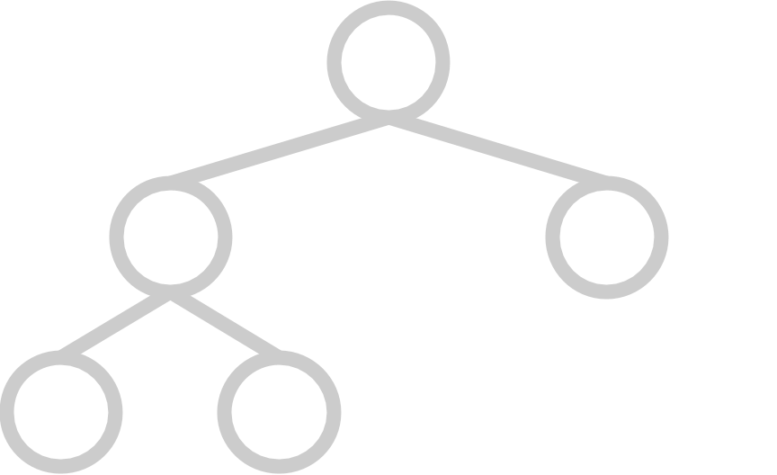
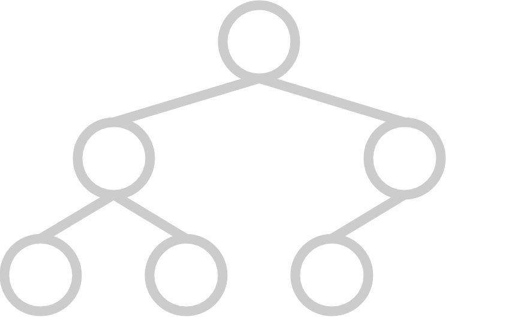
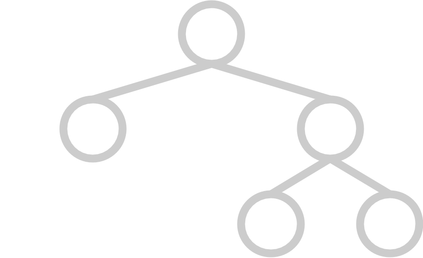
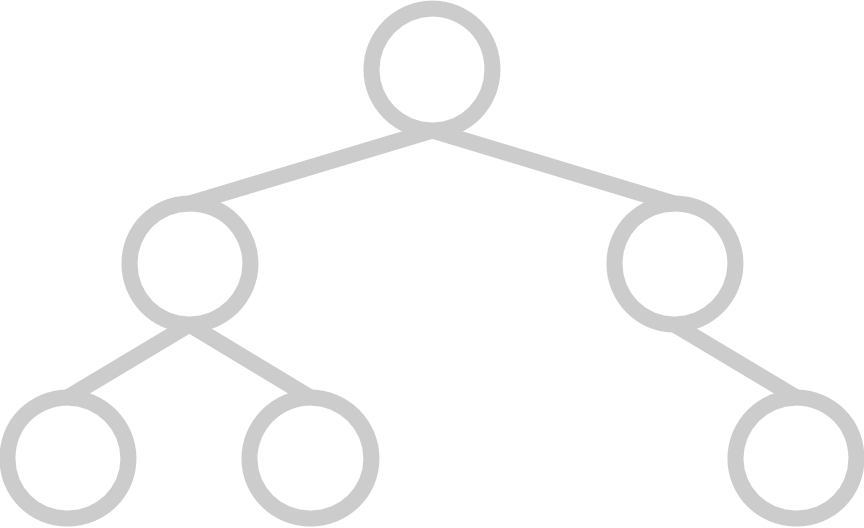
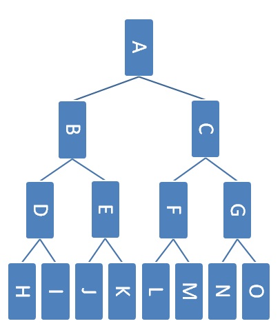

## Introduction

As usual, pull the files from the skeleton and make a new IntelliJ project.

We've learned about a few abstract data types already, including the *stack* and
*queue*. The *stack* is a last-in-first-out (LIFO) abstract data type where,
much like a physical stack, one can only access the top of the stack and must
pop off recently added elements to retrieve previously added elements. The
*queue* is a first-in-first-out (FIFO) abstract data type. When we process items
in a queue, we process the oldest elements first and the most recently added
elements last.

But what if we want to model an emergency room, where people waiting with the
most urgent conditions are helped first? We can't only rely on when the patients
arrive in the emergency room, since those who arrived first or most recently will
not necessarily be the ones who need to be seen first.

As we see with the emergency room, sometimes processing items LIFO or FIFO is
not what we want. We may instead want to process items in order of *importance*
or a *priority value*.

The **priority queue** is an abstract data type that will help us do that. The
priority queue contains the following methods:

`insert(item, priorityValue)`
: Inserts `item` into the priority queue with priority value `priorityValue`.

`peek()`
: *Returns* (but does not remove) the item with highest priority in the priority queue.

`poll()`
: *Removes* and *returns* the item with highest priority in the priority queue.


It is similar to a `Queue`, though the `insert` method will insert an item with
a corresponding `priorityValue` and the `poll` method in the priority queue
will remove the element with the highest priority, rather than the oldest
element in the queue.

### Priority vs. Priority Values

Throughout this lab, we will be making a distinction between the *priority* and
the *priority value*. *Priority* is how important an item is to the priority
queue, while *priority value* is the value associated with each item inserted.
The element with the *highest priority* may not always have the *highest
priority value*.

Let's take a look at two examples.

1. If we were in an emergency room and each patient was assigned a number based
   on how severe their injury was (smaller numbers mean less severe and larger
   numbers mean more severe), patients with higher numbers would have more
   severe injuries and should be helped sooner, and thus have higher priority.
   The numbers the patients are assigned are the *priority values*, so in this
   case *larger priority values mean higher priority*.

2. Alternatively, if we were looking in our refrigerator and assigned each item
   in the fridge a number based on how much time this item has left before its
   expiration date (items with smaller numbers mean that they will expire sooner
   than items with larger numbers), items with smaller numbers would expire
   sooner and should be eaten sooner, and thus have higher priority. The numbers
   each item in the refrigerator are assigned are the *priority values*, so in
   this case *smaller priority values mean higher priority*.

Priority queues come in two different flavors depending on what *priority
values* it gives *higher priority*:
- **maximum priority queues** will prioritize elements with **larger priority
  values** (emergency room), while
- **minimum priority queues** will prioritize elements with **smaller priority
  values** (refrigerator).

## Discussion: PQ Implementations

For the following exercises, we will think about the underlying implementations
for our priority queue. Choose from the following runtimes:

$$\Theta(1), \Theta(\log N), \Theta(N), \Theta(N \log N), \Theta(N^2)$$

Note: For these exercises, each item will be associated with a priority value,
and we will prioritize items with the smallest priority value first (e.g. like 
the refrigerator from above).

### Exercise 1: Unordered Linked List

Considering the implementation of a priority queue with an **unordered linked
list** of $$N$$ elements, determine the runtime for each scenario.

1. In the worst case, describe the runtime to insert an item into the priority
   queue.
2. In the worst case, describe the runtime to remove the element with highest
   priority.

Answer below (highlight to reveal):
<div style="color: white">
1. <script type="math/tex">\Theta(1)</script>
2. <script type="math/tex">\Theta(N)</script>
</div>

### Exercise 2: Ordered Linked List

Considering the implementation of a priority queue with an **ordered linked
list** of $$N$$ elements, determine the runtime for each scenario.

1. In the worst case, describe the runtime to insert an item into the priority
   queue.
2. In the worst case, describe the runtime to remove the element with highest
   priority.

Answer below (highlight to reveal):
<div style="color: white">
1. <script type="math/tex">\Theta(N)</script>
2. <script type="math/tex">\Theta(1)</script>
</div>

### Exercise 3: Balanced Binary Search Tree

Considering the implementation of a priority queue with a **balanced binary
search tree** of $$N$$ elements, determine the runtime for each scenario.

1. In the worst case, describe the runtime to insert an item into the priority
   queue.
2. In the worst case, describe the runtime to remove the element with highest
   priority.

Answer below (highlight to reveal):
<div style="color: white">
1. <script type="math/tex">\Theta(\log(N))</script>
2. <script type="math/tex">\Theta(\log(N))</script>
</div>

## Can We Do Better?

For the remainder of this lab, we will study this heap data structure (this is the 
data structure Java uses to implement its own `PriorityQueue`!) and create our own 
implementation of a priority queue using a binary min heap. 

> Specifically Java's priority queue is implemented with a **binary min heap** that 
> will have runtimes better than any of the data structures that we've discussed
> above. 

## Heaps

A **heap** is a tree-like data structure that will help us implement a
priority queue with fast operations. In general, heaps will organize elements
such that the lowest or highest valued element will be easy to access. To use a
heap as the underlying implementation of a priority queue, we can use the
priority values of each of the priority queue's items as the elements inside our
heap. This way, the lowest or highest priority value object will be at the top
of the heap, and the priority queue's `peek` operation will be very fast.

> This data structure will also be a part of Project 3: Bearmaps. You will implement
> and learn about the data structure in this lab, then in Project 3 you will make 
> your implementation even more efficient for a few operations. More on that later!

There are two flavors of heaps: *min* heaps and *max* heaps. They're very
similar except that min heaps keep smaller elements towards the top of the heap,
and max heaps keep larger elements towards the top. Whichever heap (min or max)
that is used as the underlying data structure of the priority queue will
determine what kind of values inside the heap will correspond to a higher
priority in the priority queue. For example, if one uses a min heap as the
underlying representation of a priority queue, then smaller priority values will
be kept at the top of the heap. This means that priority is given to objects
with smaller priority values (like our refrigerator example!). This is also how
Java's `PriorityQueue` organizes its objects under the hood!

Let's now go into the properties of heaps.

### Heap Properties

Heaps are tree-like structures that follow two additional invariants that will
be discussed more below. Normally, elements in a heap can have any number of
children, but in this lab we will restrict our view to **binary heaps**, where
each element will have at most two children. Thus, binary heaps are essentially
binary trees with two extra invariants. However, it is important to note that
**they are not binary *search* trees.** The invariants are listed below.

#### Invariant 1: Completeness

In order to keep our operations fast, we need to make sure the heap is well
balanced. We will define balance in a binary heap's underlying tree-like
structure as *completeness*.

A **complete tree** has all available positions for elements filled, except for
possibly the last row, which must be filled left-to-right. A heap's underlying
tree structure must be complete.

Here are some examples of trees that are complete:

|  |  |

And here are some examples of trees that are **not** complete:

|  |  |

#### Invariant 2: Heap Property

Here is another property that will allow us to organize the heap in a way that
will result in fast operations.

Every element must follow the **heap property**, which states that each element
$$E$$ must be smaller than all of its children or larger than those of all of
its children. The former is known as the *min-heap property*, while the latter
is known as the *max-heap property*.

If we have a min heap, this guarantees that the element with the lowest value
will always be at the root of the tree. If the elements are our priority values,
then we are guaranteed that the lowest priority valued element is at the root of
the tree. This helps us access that item quickly, which is what we need for a
priority queue!

For the rest of this lab, we will be discussing the representation and
operations of **binary min heaps**. However, this logic can be modified to apply
to max heaps or heaps with any number of children.

### Heap Representation

In project 1, we discovered that deques could be implemented using arrays or
linked nodes. It turns out that this dual representation extends to trees as
well! Trees are generally implemented using nodes with parent and child links,
but they can also be represented using arrays.

Here's how we can represent a binary tree using an array:

- The root of the tree will be in position 1 of the array (nothing is at position 0.
- The left child of a node at position $$N$$ is at position $$2N$$.
- The right child of a node at position $$N$$ is at position $$2N + 1$$.
- The parent of a node at position $$N$$ is at position $$N / 2$$.

Because binary heaps are essentially binary trees, we can use this array
representation to represent our binary heaps!

Note: this representation can be generalized to trees with any variable number
of children, not only binary trees.

> You might have asked why we placed the root at 1 instead of 0. We do this for this
> is to to make indexing more convenient. If we instead placed the root at position 0
> the the following would be our rule:
> - The left child of a node at position $$N$$ is at position $$2N + 1$$.
> - The right child of a node at position $$N$$ is at position $$2N + 2$$.
> - The parent of a node at position $$N$$ is at position $$(N - 1) / 2$$.
> 
> Unless otherwise specified we will place the root at position 1 to make the math
> slightly cleaner.

### Heap Operations

For min heaps, there are three operations that we care about:

`insert`
: Inserting an element to the heap.

`removeMin`
: Removing and returning the item with the lowest value. (If we were using our
min heap to implement a priority queue, this would correspond to removing and
returning the highest priority element.)

`findMin`
: Returning the lowest value without removal. (If we were using our min heap to
implement a priority queue, this would correspond to accessing the highest
priority element.)

When we do these operations, we need to make sure to maintain the invariants
mentioned earlier (completeness and the heap property). Let's walk through how
to do each one.

### `insert`

1. Put the item you're adding in the next available spot in the bottom row of
   the tree. If the row is full, make a new row. This is equivalent to placing
   the element in the next free spot in the array representation of the heap.
   This ensures the completeness of the heap because we're filling in the
   bottom-most row left to right.

2. If the element that has just been inserted is `N`, swap `N` with its parent
   as long as `N` is smaller than its parent or until `N` is the
   new root. If `N` is equal to its parent, you can either swap the items or not.
   
   This process is called **bubbling up** (sometimes referred to as
   **swimming**), and this ensures the min-heap property is satisfied because
   once we finish bubbling `N` up, all elements below `N` must be greater than
   it, and all elements above must be less than it.

### `removeMin`

1. Swap the element at the root with the element in the bottom rightmost
   position of the tree. Then, remove the bottom rightmost element of the tree
   (which should be the previous root and the minimum element of the heap). This
   ensures the completeness of the tree.

2. If the new root `N` is greater than either of its children, swap it with that
   child. If it is greater than both of its children, choose the smaller of the
   two children. Continue swapping `N` with its children in the same manner
   until `N` is smaller than its children or it has no children. If `N` is equal
   to both of its children or is equal to the lesser of the two children, you
   can choose to swap the items or not. Typically we would choose to not, as doing
   so would be unnecessary work and our algorithm might be marginally faster if 
   we skip this work.
   
   This is called **bubbling down** (sometimes referred to as **sinking**), and
   this ensures the min-heap property is satisfied because we stop bubbling down
   only when the element `N` is less than both of its children and also greater
   than its parent.

### `findMin`

The element with the smallest value will always be stored at the root due to the
min-heap property. Thus, we can just return the root node, without changing the
structure of the heap.

## Heaps Visualization

If you want to see an online visualization of heaps, take a look at the [USFCA
interactive animation of a min heap][]. You can type in numbers to insert, or
remove the min element (ignore the `BuildHeap` button for now; we'll talk about
that later this lab) and see how the heap structure changes.

[USFCA interactive animation of a min heap]: http://www.cs.usfca.edu/~galles/JavascriptVisual/Heap.html

## Discussion: Heaps Practice and Runtimes

### Min Heap Operations
Assume that we have a binary min-heap(smallest value on top) data structure called
`Heap` that stores integers and has properly implemented `insert` and `removeMin` 
methods. Draw the heap and its corresponding array representation after all of the
operations below have occurred:

```java
Heap<Character> h = new Heap<>();
h.insert('f');
h.insert('h');
h.insert('d');
h.insert('b');
h.insert('c');
h.removeMin();
h.removeMin();
```

Answer below (highlight to reveal):
<div style="color: white">
Array representation  <script type="math/tex">\texttt{[-,`d',`h',`f']}</script> (- denotes the absence of the first element, typically this will be equivalent to a null element).
<br><br>
Heap representation:
<pre>
   d
  / \
 h   f 
</pre>
</div>

### Runtimes

Now that we've gotten the hang of the methods, let's evaluate the worst case
runtimes for each of them! Consider an array-based min-heap with $$N$$ elements. 
What is the worst case asymptotic runtime of each of the following operations if we ignore resizing of the internal array? You should answer this question for the 
operations `insert`, `removeMin`, and `findMin`.

Answer below (highlight to reveal):
<div style="color: white">
<script type="math/tex">\texttt{insert: }\Theta(\log(N))</script><br>
<script type="math/tex">\texttt{removeMin: }\Theta(\log(N))</script><br>
<script type="math/tex">\texttt{findMin: }\Theta(1)</script><br>
</div>

Now consider those same operations but also include the effects of resizing the
underlying array or `ArrayList`. You should answer this question for the 
operations `insert`, `removeMin`, and `findMin`. Also assume that we will only 
resize up and we will not resize down. 

Answer below (highlight to reveal):
<div style="color: white">
<script type="math/tex">\texttt{insert: }\Theta(N)</script><br>
<script type="math/tex">\texttt{removeMin: }\Theta(\log(N))</script><br>
<script type="math/tex">\texttt{findMin: }\Theta(1)</script><br>
</div>

## `PriorityQueue` Implementation

Now, let's implement what we've just learned about priority queues and heaps!
There are a few files given to you in the skeleton, which will be broken down
here for you:

- `PriorityQueue.java`: This interface represents our priority queue, detailing
  what methods we want to exist in our PQ.
- `MinHeap.java`: This class represents our array-backed binary min heap.
- `MinHeapPQ.java`: This class represents a possible implementation of a
  priority queue, which will use our `MinHeap` to implement the `PriorityQueue`
  interface.

We will start with implementing our `MinHeap` and then move onto `MinHeapPQ`.
You do not have to do anything with `PriorityQueue` (it has been provided for
you).

## Exercise: `MinHeap`

### Representation

In the `MinHeap` class, implement the binary tree representation discussed above
by implementing the following methods:

```java
private int getLeftOf(int index);
private int getRightOf(int index);
private int getParentOf(int index);
private int min(int index1, int index2);
```

Our code will use an `ArrayList` instead of an array so we will not have to
resize our array manually, but the logic is the same. In addition, make sure to
look through and use the methods provided in the skeleton (such as `getElement`)
to help you implement the methods listed above!

### Operations

After you've finished the methods above, fill in the following missing methods
in `MinHeap.java`:

```java
public E findMin();
private void bubbleUp(int index);
private void bubbleDown(int index);
public void insert(E element);
public int size();
public E removeMin();
```

When you implement `insert` and `removeMin`, you should be using `bubbleUp`
and/or `bubbleDown`, and when you implement `bubbleUp` and `bubbleDown`, you
should be using the methods you wrote above (such as `getLeft`, `getRight`,
`getParent`, and `min`) and the ones provided in the skeleton (such as `swap`
and `setElement`).

**It is highly recommended to use the `swap` and `setElement` methods if you
ever need to swap the location of two items or add a new item to your heap.**
This will help keep your code more organized and make the next task of the lab
a bit more straightforward.

Usually `MinHeap`'s should be able to contain duplicates but for the `insert`
method, **assume that our `MinHeap` cannot contain duplicate items**. To do
this, use the `contains` method to check if `element` is in the `MinHeap` before
you insert. If `element` is already in the `MinHeap`, throw an
`IllegalArgumentException`. We'll talk about how to implement `contains` in the
next section.

Before moving on to the next section, we suggest that you test your code! We
have provided a blank `MinHeapTest.java` file for you to put any JUnit tests
you'd like to ensure the correctness of your methods.

## Exercise: `update` and `contains`

We have two more methods that we would like to implement (`contains` and
`update`) whose behaviors are described below:

- `contains(E element)`: Checks if `element` is in our `MinHeap`.
- `update(E element)`: If `element` is in the `MinHeap`, replace the `MinHeap`'s
  version of this element with `element` and update its position in the
  `MinHeap`. (This would be used if our element was somehow mutated since its
  initial insert.)

> These two methods will be very helpful when we use this data structure in Project
> 3! For this lab you will not be required to implement the more efficient versions
> of the methods here, but if you do then you will finish one part of the project!

Let's take a look at the `update` method first.

### `update(E element)`

The `update(E element)` method will consist of the following four steps:

1. Check if `element` is in our `MinHeap`.
1. If so, find the `element` in our `MinHeap` (by finding the index the
   element is at).
2. Replace the element with the new `element`.
2. Bubble `element` up or down depending on how it was changed since its initial
   insertion into the `MinHeap`.

Unfortunately, Steps 1 and 2 (checking if our `element` is present and finding
the `element`) are actually nontrivial linear time operations since heaps are
not optimized for this operation. To check if our heap contains an item, we'll
have to iterate through our entire heap, looking for the item (see "Search"'s
runtime [here](https://en.wikipedia.org/wiki/Binary_heap)). There is a small
optimization that we can make for this part if we know we have a max heap, but
this would in general make our `update` method run in at least linear time.

This is not extremely bad, but applications of our heap (such as route finding
in Project 3, BearMaps, which we'll talk more about once the project is
released) would really benefit from having a fast `update` method.

> We can get around this by introducing another data structure to our heap! Though 
> this would increase the space complexity of the heap and is not how Java implements
> `PriorityQueue`, it will be worth the runtime speedup of our `update` method in our
> applications of our heap in Project 3.
> 
> We would essentially want to use this extra data structure to speed to help us
> make step 1 (checking if our `MinHeap` contains a particular element) and step 2 
> (get the index corresponding to a particular element) fast. 
>
> In order to implement this new optimized version you may need to update some 
> methods in order to ensure that this data structure always has accurate 
> information. There is no need to implement these optimization for this lab, but
> they will be required for Project 3.

Implement `update(E element)` according to the steps listed above. Remember if
`element` is not in the `MinHeap`, you should throw a `NoSuchElementException`. 
**Again, the optimized `update(E element)` operation is not required for this lab.**


### `contains(E element)`

Now, implement `contains(E element)`.

> Note that if you do choose to implement the optimized approach we have hinted at
> above, you can use the same data structure to implement a faster `contains` 
> operation! Again this only will matter for the project so do not worry about this
> if you have chosen to wait to implement the optimized version. 

## Exercise: `MinHeapPQ`

Now let's use the `MinHeap` class to implement our own priority queue! We will
be doing this in our `MinHeapPQ` class.

Take a look at the code provided for `MinHeapPQ`, a class that implements the
`PriorityQueue` interface. In this class, we'll introduce a new wrapper class
called `PriorityItem`, which wraps the `item` and `priorityValue` in a single
object. This way, we can use `PriorityItem`'s as the elements of our underlying
`MinHeap`.

Then, implement the remaining methods of the interface (duplicated below) of the
`MinHeapPQ` class

```java
public T peek();
public void insert(T item, double priority);
public T poll();
public void changePriority(T item, double priority);
public int size();
```

For the `changePriority` method, use the `update` method from the `MinHeap`
class. The `contains` method has already been implemented for you.

Note: you shouldn't have to write too much code in this file. Remember that your
`MinHeap` will do most of the work for you!

After you finish implementing these methods, we recommend that you test your
code! Just like with `MinHeap`, we have provided a blank `MinHeapPQTest.java`
file so you can write JUnit tests to ensure your code is working properly.

### `compareTo()` vs `.equals()`

You may have noticed that the `PriorityItem` has a `compareTo` method that
compares priority values, while the `equals` method compares the items
themselves. Because of this, it's possible that `compareTo` will return 0 (which
usually means the items that we are comparing are equal) while `equals` will
still return false. However, according to the Javadocs for
[Comparable](https://docs.oracle.com/javase/8/docs/api/java/lang/Comparable.html):

> It is strongly recommended, but not strictly required that `(x.compareTo(y) == 0)
> == (x.equals(y))`. Generally speaking, any class that implements the Comparable
> interface and violates this condition should clearly indicate this fact.

Thus, our `PriorityItem` class "has a natural ordering that is inconsistent with
equals". Normally, we would want `x.compareTo(y) == 0` and `x.equals(y)` to both
return true for the same two objects, but this class will be an exception.

## Discussion: Heap Brainteasers

Now, let's get into some deeper questions about heaps.

### Heaps and BSTs
Consider binary trees that are both **max** heaps and binary search trees.

How many nodes can such a tree have? Choose all that apply.

- 1 node
- 2 nodes
- 3 nodes
- 4 nodes
- 5 nodes
- Any number of nodes
- No trees exist

Answer below (highlight to reveal):
<div style="color: white">
Such a tree can either have either 1 node or 2 nodes.
</div>

### Determining Completeness
It's not obvious how to verify that a binary tree is complete (assuming it is
represented using children links rather than an array as we have discussed in this 
lab). A CS 61BL student suggests the following recursive algorithm to determine if a 
tree is complete:

1. A one-node tree is complete.

2. A tree with two or more nodes is complete if its left subtree is complete and
   has depth $$k$$ for some $$k$$, and its right subtree is complete and has
   depth $$k$$ or $$k - 1$$.

Here are some example trees. Think about whether or not the student's proposed
algorithm works correctly on them.


Choose all that apply to test your understanding of the proposed algorithm.

- Tree 1 is complete
- Tree 1 would be identified as complete
- Tree 2 is complete
- Tree 2 would be identified as complete
- Tree 3 is complete
- Tree 3 would be identified as complete
- Tree 4 is complete
- Tree 4 would be identified as complete

Answer below (highlight to reveal):
<div style="color: white">
The correct answers are: "Tree 1 would be identified as complete", "Tree 2 is 
complete", "Tree 2 would be identified as complete", and "Tree 4 would be identified
as complete".
</div>

### Third Biggest Element in a Max Heap
Here's an example **max** heap.



Which nodes could contain the third largest element in the heap **assuming that
the heap does not contain any duplicates**?

Answer below (highlight to reveal):
<div style="color: white">
Nodes: B, C, D, E, F, and G.
</div>

Which nodes could contain the third largest element in the heap **assuming that
the heap can contain duplicates**?

Answer below (highlight to reveal):
<div style="color: white">
Nodes: B, C, D, E, F, G, H, I, J, K, L, M, N, and O.
</div>

## Other Heap Applications

### Heapsort

Now, let's move onto an application of the heap data structure. Suppose you have
an array of $$N$$ numbers that you want to sort smallest-to-largest. One
algorithm for doing this is as follows:

1. Put all of the numbers in a min heap.
2. Repeatedly remove the min element from the heap, and store them in an array
   in that order.

This is called **heapsort**.

Now, what is the runtime of this sort? Since each insertion takes proportional
to $$\log N$$ comparisons once the heap gets large enough and each removal also
takes proportional to $$\log N$$ comparisons, the whole process takes
proportional to $$N \log N$$ comparisons.

It turns out we can actually make step 1 of heapsort run faster---proportional
to $$N$$ comparisons---using a process called *heapify*. (Unfortunately, we
can't make step 2 run any faster than $$N \log N$$, so the overall heapsort
must take $$N \log N$$ time.)

> We will learn more about heapsort and other sorting algorithms later on in 
> the course!

### Heapify

The algorithm for taking an arbitrary array and making it into a min (or max)
heap in time proportional to $$N$$ is called *heapify*. Pseudocode for this
algorithm is below:

    def heapify(array):
        index = N / 2
        while index > 0:
            bubble down item at index
            index -= 1

Conceptually, you can think of this as building a heap from the bottom up. To
get a visualization of this algorithm working, click on the `BuildHeap` button
on [USFCA interactive animation of a min heap][]. This loads a pre-set array
and then runs heapify on it.

Try to describe the approach in your own words. Why does the index start at the
middle of the array rather than the beginning, `0`, or the end, `N`? How does
each bubble down operation maintain heap invariants?

It is probably not immediately clear to you why this heapify runs in $$O(N)$$.
For those who are curious, you can check out [this stack overflow post][] or an [explanation on Wikipedia][].

[explanation on Wikipedia]: https://en.wikipedia.org/wiki/Binary_heap#Building_a_heap

[this stack overflow post]: https://stackoverflow.com/questions/9755721/how-can-building-a-heap-be-on-time-complexity

## Conclusion

In today's lab, we learned about another abstract data type called the
**priority queue**. Priority queues can be implemented in many ways, but it is
often implemented with a binary min heap. It is very easy to conflate the
priority queue abstract data type and the heap data structure, so make sure to
understand the difference between the two!

Additionally, we learned how to represent a heap with an array, as well as some
of its core operations. We then explored a few conceptual questions about heaps
and learned about a new sort that this new data structure provides, heapsort.

All in all, priority queues are an integral component of many algorithms for
graph processing (which we'll cover in a few labs). For example, in the first few weeks of CS 170, Efficient Algorithms and Intractable Problems, you will see
graph algorithms that use priority queues.  Look out for priority queues
in other CS classes as well! You'll find them invaluable in the operating
systems class CS 162, where they're used to schedule which processes in a
computer to run at what times. They'll also be very helpful in Project 3:
BearMaps, when we are dealing with route finding.

### Deliverables

To receive credit for this lab:

- Complete `MinHeap.java`
- Complete `MinHeapPQ.java`
