## Introduction

As usual, pull the files from the skeleton and make a new IntelliJ project.

## Linked lists $$\subseteq$$ Trees $$\subseteq$$ Graphs

One of the first data structures we studied in this course was the linked list,
which consisted of a set of nodes connected in sequence. Then, we looked at
trees, which were a generalized version of linked lists. We can consider a tree
as a linked list if we *relaxed* the constraint that a node could only have one
child. Now, we'll look at a generalization of a tree, called a *graph*. We can
consider a graph as a tree if we *relaxed* the constraint that we can't have
cycles.

In a graph, we still have a collection of nodes, but each node in a graph can be
connected to any other node without limitation. This means there isn't
necessarily a hierarchical structure like we get in a tree. For example, here's
a tree, where every node is descendant from one another:

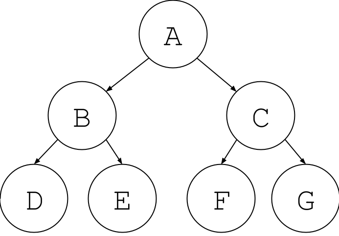

Now suppose we add an edge back up the tree, like this:

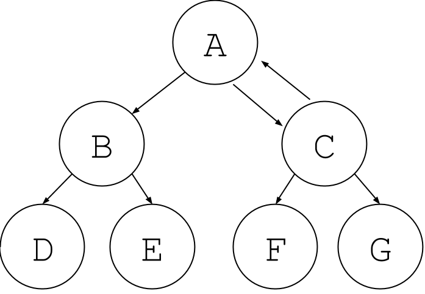

Notice the hierarchical structure is broken. Is $$C$$ descendant from $$A$$ or
is $$A$$ descendant from $$C$$? This is no longer a tree, but it is still a
graph!

There are other edges that are not allowed in a tree, but are allowed in a
graph. Let's take a look at the following:

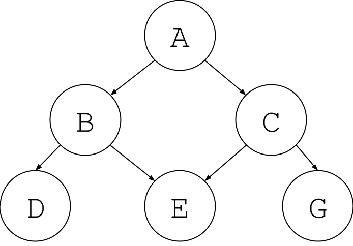

Now, node E looks like it is descendant from two nodes. Again, this is no longer
a tree but it is a graph.

In general, a graph can have any possible connection between nodes, as shown
below:

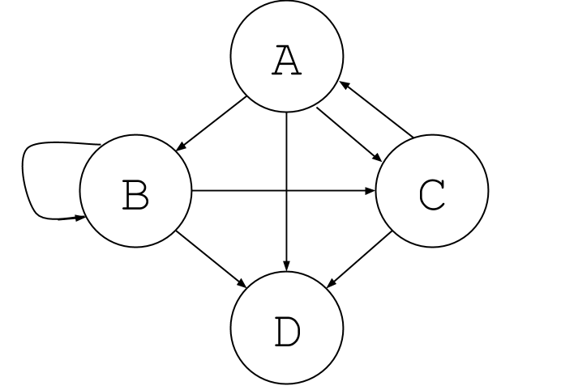

## Graphs

Graphs are a good way to represent relationships between objects. First, let's
go over some terminology. A node in a graph is called a *vertex*. Vertices
usually represent the objects in our graph (the things that have the
relationships such as people, places, or things). A relationship between two
vertices is represented by an *edge*.

Here are a few examples of graphs in the everyday world:

- **Road maps** are a great example of graphs. Each city is a vertex, and the
  edges that connect these vertices are the roads and freeways that connect the
  cities. An abstract example of what such a graph would look like can be found
  [here](http://inst.eecs.berkeley.edu/~cs61b/fa05/diagrams/freeway-graph.png).
  For a more local example, each building on the Berkeley campus can be thought
  of as a vertex, and the paths that connect those buildings would be the edges.

- **Computer networks** are also graphs. In this case, computers and other
  network machinery (like routers and switches) are the vertices, and the edges
  are the network cables. For a wireless network, an edge is an established
  connection between a single computer and a single wireless router.

### Directed vs. Undirected Graphs

If all edges in a graph are showing a relationship between two vertices that
works in both directions, then it is called an *undirected graph*. A picture of
an undirected graph looks like this:

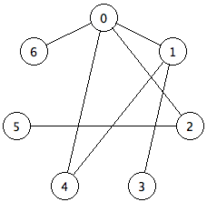

But not all edges in graphs are the same. Sometimes the relationships between
two vertices only go in one direction. Such a relationship can be represented
with a *directed* graph. An example of this could be a city map, where the edges
are sometimes one-way streets between locations. A two-way street would have to
be represented as two edges, one of them going from location $$A$$ to location
$$B$$, and the other from location $$B$$ to location $$A$$.

Visually, an undirected graph will not have arrow heads on its edges because the
edge connects the vertices in both directions. A directed graph will have arrow
heads on its edges that point in the direction the edge is going. An example of
a directed graph appears below.

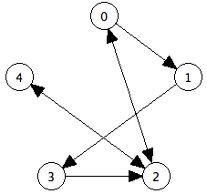

Every undirected graph is a directed graph, but the converse is not true.

### Graph Definitions

Now that we have the basics of what a graph is, here are a few more terms that
might come in handy while discussing graphs.

| Term                | Definition                                                                                      |
|---------------------|-------------------------------------------------------------------------------------------------|
| Adjacent            | A vertex `u` is *adjacent* to a vertex `v` if `u` has an edge connecting to `v`.                |
| Connected           | A graph is *connected* if every vertex has a path to all other vertices.                        |
| Neighbor            | A vertex `u` is a *neighbor* of a vertex `v` if they are adjacent.                              |
| Incident to an edge | A vertex that is an endpoint of an edge is *incident* to it                                     |
| Indegree            | A vertex `v`'s *indegree* is the number of vertices `u` that have an edge `(u, v)`.             |
| Path                | A *path* is a sequence of edges from one vertex to another where no edge or vertex is repeated. |
| Cycle               | A *cycle* is a path that ends at the same vertex where it originally started.                   |

## Exercise: Edge vs. Vertex Count

For the following questions, discuss your solution with your partner and *after* verify
your answer by highlighting the space after the question.

### Exercise 1

Suppose that $$G$$ is a *directed* graph with $$N$$ vertices. What's the
maximum number of edges that $$G$$ can have? Assume that a vertex cannot have
an edge pointing to itself, and that for each vertex $$u$$ and $$v$$, there is
at most one edge $$(u, v)$$.

Options:

$$N, N^2, N(N-1), \frac{N(N-1)}{2}$$

Solution:
<p><span style="color:white"><em> N(N-1)</em></span>.</p>

### Exercise 2

Now suppose the same graph $$G$$ in the above question is an *undirected*
graph.  Again assume that no vertex is adjacent to itself, and at most one edge
connects any pair of vertices. What's the maximum number of edges that $$G$$
can have compared to the directed graph of $$G$$?

Options:

- half as many edges
- the same number of edges
- twice as many edges

Solution:
<p><span style="color:white"><em> half as many edges </em></span>.</p>

### Exercise 3

What's the *minimum* number of edges that a connected undirected graph with N
vertices can have?

Options: 

$$N - 1, N, N^2, N(N-1), \frac{N(N-1)}{2}$$

Solution:
<p><span style="color:white"><em> N-1 </em></span>.</p>

## Graph Representation

Now that we know how to draw a graph on paper and understand the basic concepts
and definitions, we can now consider how a graph should be represented inside of
a computer. We want to be able to get quick answers for the following questions
about a graph:

- Are given vertices `u` and `v` adjacent?
- Is vertex `v` incident to a particular edge `e`?
- What vertices are adjacent to `v`?
- What edges are incident to `v`?

Most of today's lab will involve thinking about how fast and how efficient each
of these operations is using different representations of a graph.

Imagine that we want to represent a graph that looks like this:


One data structure we could use to implement this graph is called an *array of
adjacency lists*. In such a data structure, an array is created that has the
same size as the number of vertices in the graph. Each position in the array
represents one of the vertices in the graph. Each of these positions point to a
list. These lists are called adjacency lists, as each element in the list
represents a neighbor of the vertex.

The array of adjacency lists that represents the above graph looks like this:

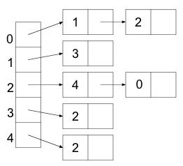

Another data structure we could use to represent the edges in a graph is called
an *adjacency matrix*. In this data structure, we have a two dimensional array
of size $$N \times N$$ (where $$N$$ is the number of vertices) which contains
boolean values. The (*i*, *j*)th entry of this matrix is true when there is an
edge from *i* to *j* and false when no edge exists. Thus, each vertex has a row
and a column in the matrix, and the value in that table says true or false
whether or not that edge exists.

The adjacency matrix that represents the above graph looks like this:

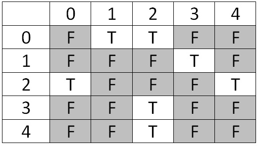

What will this matrix will look like for an *undirected* graph? Discuss with
your partner. Considering drawing out the matrix and trying to notice some
patterns.

## Discussion: Representation

A third data structure we could use to represent a graph is simply an extension
of the linked nodes idea. We can create a `Vertex` object for each vertex in
the graph, and each of `Vertex` will contain pointers to the `Vertex` objects of
their neighbors. This may seem like the most straightforward approach: aren't
the adjacency list and adjacency matrix roundabout in comparison?

Discuss with your partner reasons for why the adjacency list or adjacency matrix
might be preferred for a graph.

Additionally, we could also represent a tree using an adjacency matrix or list.
Discuss with your partner reasons for why an adjacency list or adjacency matrix
might not be preferred for a tree.

Now, which is more efficient: an adjacency matrix or an array of adjacency
lists?

## Exercise: `Graph.java`

We have given you framework code for a class `Graph`. It implements a graph of
integers using adjacency lists.

Fill in the following methods:

```java
public void addEdge(int v1, int v2, int weight);
public void addUndirectedEdge(int v1, int v2, int weight);
public boolean isAdjacent(int from, int to);
public List<Integer> neighbors(int vertex);
public int inDegree(int vertex);
```

## Graph Traversals

Earlier in the course, we used the general traversal algorithm to process all
elements of a tree:

```java
Stack<TreeNode> fringe = new Stack<>();
fringe.push(root);

while (!fringe.isEmpty()) {
    TreeNode node = fringe.pop();
    process(node);
    fringe.push(node.right);
    fringe.push(node.left);
}
```

The code above processes the tree's values in depth-first order. If we wanted a
breadth-first traversal of a tree, we'd replace the `Stack` with a queue such
as a `LinkedList`.

Now, how would we modify this algorithm to traverse a graph?

Analogous code to process every vertex in a connected graph may look something
like:

```java
Stack<Vertex> fringe = new Stack<>();
fringe.push(startVertex);

while (!fringe.isEmpty()) {
    Vertex v = fringe.pop();
    process(v);
    for (Vertex neighbor: v.neighbors) {
        fringe.push(neighbor);
    }
}
```

However, this doesn't quite work. Unlike trees, a graph may contain a *cycle* of
vertices and as a result, the code will loop infinitely.

We don't want to process the same vertex more than once, so the fix is to keep
track of vertices that we've put on our fringe and the vertices that we've
visited already. Here is the correct pseudocode for graph traversal:

```java
Stack<Vertex> fringe = new Stack<>();
HashSet<Vertex> visited = new HashSet<>();
fringe.push(startVertex);

while (!fringe.isEmpty()) {
    Vertex v = fringe.pop();
    if (!visited.contains(v)) {
        process(v);
        for (Vertex neighbor: v.neighbors) {
            fringe.push(neighbor);
        }
        visited.add(v);
    }
}
```

Note that the choice of data structure for the fringe can change. As with tree
traversal, we can visit vertices in depth-first or breadth-first order merely by
choosing a stack or a queue to represent the fringe. Typically though, because
graphs are usually interconnected, the ordering of vertices can be scrambled up
quite a bit. Thus, we don't worry too much about using a depth-first or a
breadth-first traversal. Instead, in the next lab session we will see
applications that use a priority queue to implement something more like
*best-first traversal*.

**Note for the Exercises**: Instead of checking that the popped vertex `v` is
not yet visited, you can do this check before adding some neighbor to the
fringe as well! This would look something like `!visited.contains(neighbor)`.
Although it is convention to check that the popped vertex is not yet visited,
you may find this alternative way easier to code when you do the `DFSIterator`
exercise later in the lab.

## Exercise: Practice Graph Traversal

Use the graph traversal pseudocode from above to answer the following questions.
It might help you to print out copies of the graph
[here](PicturesOfTheGraphs.pdf). Now, figure out the order in which the nodes
are visited if you start at different vertices. You should visit nodes in ascending order
based on their natural ordering. You can check your answers for
starting at vertices 1 - 5 below.

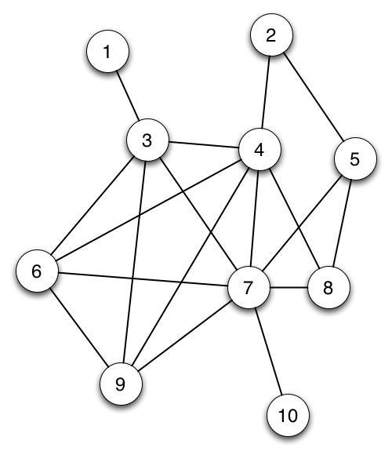

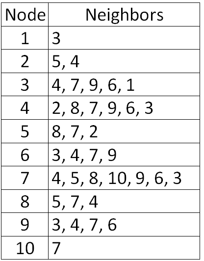

### Answers for Practicing Graph Traversal

Here are the solutions for nodes 1-5 (just practice these until you feel
comfortable).

| Starting vertex | Order of visiting remaining vertices |
|-----------------|--------------------------------------|
| 1               | 3, 4, 2, 5, 7, 6, 9, 8, 10           |
| 2               | 4, 3, 1, 6, 7, 5, 8, 9, 10           |
| 3               | 1, 4, 2, 5, 7, 6, 9, 8, 10           |
| 4               | 2, 5, 7, 3, 1, 6, 9, 8, 10           |
| 5               | 2, 4, 3, 1, 6, 7, 8, 9, 10           |

## Read the code: `DFSIterator`

Read through the `DFSIterator` inner class. As its name suggests, it iterates
through all of the vertices in the graph in DFS order, starting from a vertex
that is passed in as an argument.

Note: This iterator may not print out all the vertices in the graph if they are
unreachable from the starting vertex, and that's okay! 

## Exercise: `pathExists`

Complete the method `pathExists` in `Graph.java`, which returns whether or not
any path exists that goes from `start` to `stop`. Remember that a path is any
set of edges that exists which you can follow that such you travel from one
vertex to another by only using valid edges. Additionally, you may use
the `generateGX` methods to generate some sample `Graph`s to test your
implementation for this method (and the following methods)!

In addition, paths may not visit an edge or a vertex more
than once. You may find it helpful for your method to call the `dfs` method,
which uses the `DFSIterator` class.

## Exercise: `path`

Now you will actually find a path from one vertex to another if it exists. Write
code in the body of the method named `path` that, given a `start` vertex and a
`stop` vertex, returns a list of the vertices that lie on the path from `start`
to `stop`. If no such path exists, you should return an empty list.

*Hint*: Base your method on `dfs`, with the following differences. First, add
code to stop calling `next` when you encounter the finish vertex. Then, trace
back from the finish vertex to the start, by first finding a visited vertex u
for which (u, finish) is an edge, then a vertex v visited earlier than u for
which (v, u) is an edge, and so on, finally finding a vertex w for which (start,
w) is an edge (`isAdjacent` may be useful here!). Collecting all these vertices
in the correct sequence produces the desired path. We recommend that you try
this by hand with a graph or two to see that it works.

## Topological Sort

A *topological* sort (sometimes also called a *linearization*) of a graph is a
ordering of the vertices such that if there was a directed path from vertex `v`
to vertex `w` in the graph, then `v` precedes `w` in the ordering.

This only works on directed, acyclic graphs, and they are commonly referred to
by their acronym: *DAG*.

Here is an example of a DAG:

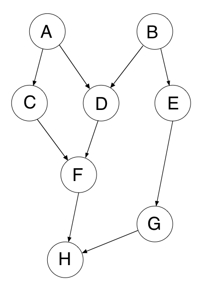

In the above DAG, a few of the possible topological sorts could be:

    A B C D E F G H
    A C B E G D F H
    B E G A D C F H

Notice that the topological sort for the above DAG has to start with either A or
B, and must end with H. (For this reason, A and B are called *sources*, and H is
called a *sink*.)

Another way to think about it is that the vertices in a DAG represent a bunch of
tasks you need to complete on a to-do list. Some of those tasks cannot be
completed until others are done. For example, when getting dressed in the
morning, you may need to put on shoes and socks, but you can't just do them in
any order. The socks must be put on before the shoes. Thus, a topological sort
of your morning routine must have socks appear first before shoes.

The edges in the DAG represent dependencies between the tasks. In this example
above, that would mean that task A must be completed before tasks C and D, task
B must be completed before tasks D and E, E before G, C and D before F, and
finally F and G before H. A topological sort gives you an order in which you can
do the tasks (it puts the tasks in a linear order). Informally, topological sort
returns a sequence of the vertices in the graph that doesn't violate the
dependencies between any two vertices.

### Discussion: Topological Sorts and DAG's

Why can we only perform topological sorts on DAG's? Think about the two
properties of DAG's and how that relates with our "to-do list" analogy. Discuss
your thoughts with your partner.

### The Topological Sort Algorithm

The algorithm for taking a graph and finding a topological sort uses an array
named `currentInDegree` with one element per vertex. `currentInDegree[v]` is
initialized with the in-degree of each vertex `v`.

The algorithm also uses a fringe. The fringe is initialized with all vertices
whose in-degree is 0. When a vertex is popped off the fringe and added to a
results list, the `currentInDegree` value of its neighbors are reduced by 1.
Then the fringe is updated again with vertices whose in-degree is now 0.

## Exercise: `TopologicalIterator`

Implement the `TopologicalIterator` class so that it successively returns
vertices in topological order as described above. The `TopologicalIterator`
class will resemble the `DFSIterator` class, except that it will use a
`currentInDegree` array as described above, and instead of pushing unvisited
vertices on the stack, it will push only vertices whose in-degree is 0. Try to
walk through this algorithm, where you successively process vertices with
in-degrees of 0, on our DAG example above.

**If you're having trouble passing the autograder tests for the topological traversals,
think about the effect of duplicate values in the fringe on your iterator.** Try
constructing a complete graph, and testing your `DFSIterator` on that!

## Conclusion

### Deliverables

- Complete the following methods of the `Graph` class:
  - `addEdge`
  - `addUndirectedEdge`
  - `isAdjacent`
  - `neighbors`
  - `inDegree`
  - `pathExists`
  - `path`
- Complete the implementations of the following nested iterator:
  - `TopologicalIterator`