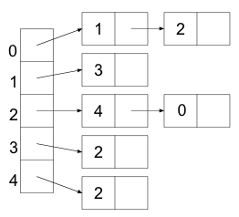

## Exercise: Trade-offs

Deciding how to store data is all about trade-offs. The following exercises
focus on the big picture of which representation is more efficient in a given
situation. The rest of the lab focuses on exactly how efficient things are.

For the following exercises, discuss your solution with your partner and submit
your answers to the Gradescope assessment.

### Exercise 1: Space

#### Exercise 1.1

Which is most **space-efficient** if you have a lot of edges in your graph?

- Adjacency matrix
- Adjacency lists
- It depends
- They are the same

#### Exercise 1.2

Which is most **space-efficient** if you have very few edges in your graph?

- Adjacency matrix
- Adjacency lists
- It depends
- They are the same

#### Exercise 1.3

Which is most **time-efficient** for adding an edge if you have a lot of edges
in your graph?

- Adjacency matrix
- Adjacency lists
- It depends
- They are the same

#### Exercise 1.4

Which is most **time-efficient** for adding an edge if you have very few edges
in your graph?

- Adjacency matrix
- Adjacency lists
- It depends
- They are the same

#### Exercise 1.5

Which is most TIME efficient for returning a list of edges from one node if you
have very few edges in your graph?

- Adjacency matrix
- Adjacency lists
- It depends
- They are the same

#### Exercise 1.6

Which is most **time-efficient** for returning a list of edges from one node if
you have a lot of edges in your graph?

- Adjacency matrix
- Adjacency lists
- It depends
- They are the same

### Exercise 2: Runtime

#### Exercise 2.1

Using an adjacency matrix, how long in the worst case does it take to determine
if vertex `v` is adjacent to vertex `w`? (Assume vertices are represented by
integers.)

- constant time
- time proportional to the number of neighbors of vertex `v`
- time proportional to the number of vertices in the graph
- time proportional to the number of edges in the graph

#### Exercise 2.2

Using an array of adjacency lists, how long in the worst case does it take to
determine if vertex `v` is adjacent to vertex `w`? (Assume vertices are
represented by integers.)

- constant time
- time proportional to the number of neighbors of vertex `v`
- time proportional to the number of vertices in the graph
- time proportional to the number of edges in the graph

## Exercise: Memory Use

Suppose we are representing a graph with $$N$$ vertices and $$E$$ edges.

There are $$N^2$$ booleans stored in an *adjacency matrix*, so the memory
required to store an adjacency matrix is $$N^2$$ times the memory required to
store a `boolean` value. Assume that references and integers each use 1 unit of
memory.

The amount of memory required to represent the graph as an array of *adjacency
lists* is proportional to what? Discuss your solution with your partner and
submit your answer to the Gradescope assessment.

$$NE, E^2, N + E, E$$