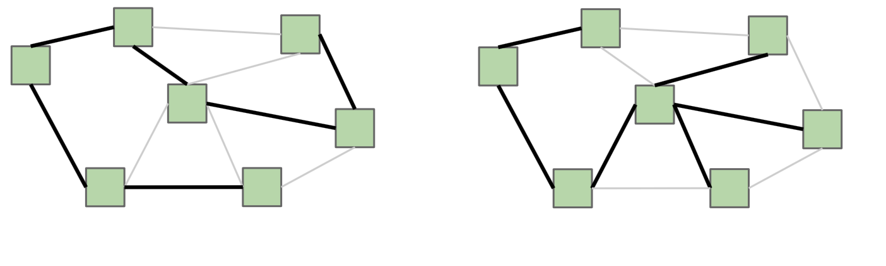
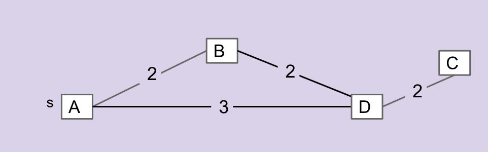
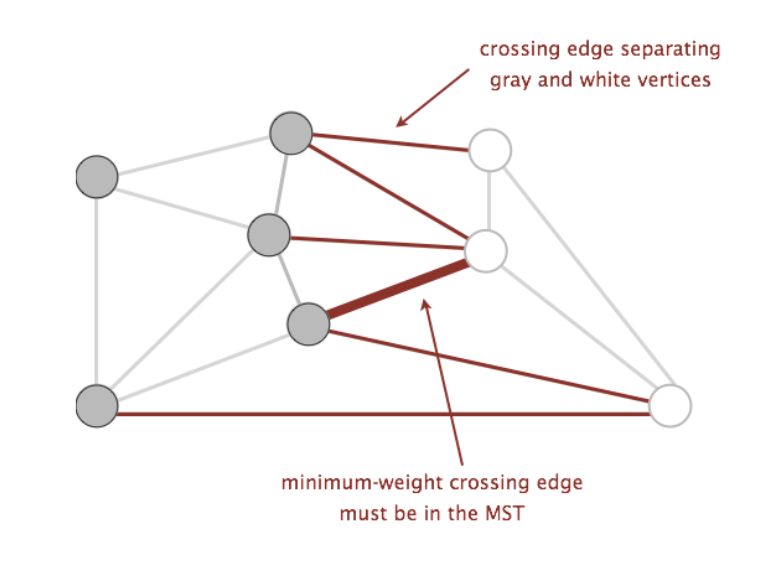

## Introduction

As usual, pull the files from the skeleton and make a new IntelliJ project.

In previous labs, we have seen various types of graphs, including weighted,
undirected graphs, as well as algorithms that can be performed on them. In this
lab, we will be introducing a few algorithms which can be used to find a
*minimum spanning tree*.

## Minimum Spanning Tree

Consider an undirected graph $$G = (V,E)$$ comprising of a set of vertices,
$$V$$, and a set of edges, $$E$$. Let's break down the term, **minimum spanning
tree**.

A **tree** is an acyclic (has no cycles) and connected graph. If it has $$N$$
vertices, then it must have exactly $$N - 1$$ edges in order to satisfy these
properties. A tree can be as small as just a single node in a large graph.

A **spanning tree** further requires not just any small tree in the graph, but
one which spans all the vertices in the graph. Formally, a spanning tree $$T =
(V, F)$$ of $$G$$ is a tree that contains all of the vertices of $$V$$ of the
graph $$G$$, and a subset of its edges: $$F \subseteq E$$, where $$|F| = |V| -
1$$ edges from $$G$$.

Here's an example of two different spanning trees on the same graph. Notice how
each spanning tree consists of all of the vertices $$V$$ in the graph, but
exactly $$|V| - 1$$ edges while still remaining connected. Because the original
graph $$G$$ may have many other edges, it's possible for there to exist multiple
spanning trees.

If $$G$$ is not a fully-connected graph, then a similar idea is one of a
**spanning forest**, which is a collection of trees, each having a connected
component of $$G$$, such that there exists a single path between any two
vertices in the same connected component.

A **minimum spanning tree** (MST for short) $$T$$ of a weighted undirected graph
$$G$$ is a spanning tree where the total weight (the sum of all of the weights
of the edges) is minimal. That is, no other spanning tree of $$G$$ has a smaller
total weight.

Consider the graph below. Which edge is **not** in the MST of this graph?
Discuss with your partner.

$$\overline{AB}, \overline{AD}, \overline{BD}, \overline{DC}$$

## MST Algorithms

Before we go into specific algorithms for finding MST's, let's talk about the
general approach for finding MST's. To talk about this, we will need to define a
few more terms:

- **Cut**: an assignment of a graph’s vertices into two non-empty sets
- **Crossing edge**: an edge which connects a vertex from one set to a vertex
  from the other set

Examples of the above can be found in the following graph below, where the two
sets making up the cut are the set of white vertices and the set of gray
vertices:

Using these two terms, we can define a new property called the cut property. The
**cut property** states that given any cut of a graph, the minimum weight
crossing edge is some valid MST (as there can be multiple). 
Proving that this is true is slightly out of scope
for this course (you will learn more about this in more advanced algorithms
classes, such as CS 170), but we will use this property as a backbone for the
algorithms we will discuss.

The question is now, what cuts of the graph do we use to find the minimum weight
crossing edges to add to our MST? Random cuts may not be the best way to
approach this problem, so we'll go into the following algorithms that each
determine cuts in their own way: **Prim's algorithm** and **Kruskal's
algorithm**.

## Prim's Algorithm

Prim's algorithm is a greedy algorithm that constructs an MST, $$T$$, from some
graph $$G$$ as follows:

1. Create a new graph $$T$$, where $$T$$ will be the resulting MST.
2. Choose an arbitrary starting vertex in $$G$$ and add that vertex to $$T$$.
3. Repeatedly add the smallest edge of $$G$$ that has one vertex inside $$T$$ to
   $$T$$. Let's call this edge $$e$$.
4. Continue until $$T$$ has $$V - 1$$ edges.

Now, what cuts do we use in this algorithm? We know that at any given point, the
two sets of vertices that make up the cut are the following:

- vertices of $$T$$
- vertices of $$G$$ that aren't in $$T$$

Because our algorithm will always add $$e$$, the smallest edge of $$G$$ that has
one vertex inside $$T$$ and the other vertex not in $$T$$, to the MST $$T$$, we
will always be adding the minimum edge that crosses the above cut. If the entire
tree is constructed in this way, we will have created our MST!

Now, how do we implement this algorithm? We will just need a way to keep track
of what $$e$$ is at any given time. Because we always care about the minimum,
we can use a priority queue!

The priority queue will contain all vertices that are not part of $$T$$, and the
priority value of a particular vertex $$v$$ will be the weight of the shortest
edge that connects $$v$$ to $$T$$. At the beginning of every iteration, we will
remove the vertex $$u$$ whose connecting edge to $$T$$ has the smallest weight,
and add the corresponding edge to $$T$$. Adding $$u$$ to $$T$$ will grow our
MST, meaning that there will be more edges to consider that have one vertex in
$$T$$ and the other vertex not in $$T$$. For each of these edges $$(u, w)$$, if
this edge has smaller weight than the current edge that would connect $$w$$ to
$$T$$, then we will update $$w$$'s priority value to be the weight of edge $$(u,
w)$$.

Does this procedure sound familiar? Prim's algorithm actually bears many
similarities to *Dijkstra's algorithm*, except that Dijkstra's uses the distance
from the start vertex rather than the distance from the MST as the priority
values in the priority queue. However, due to Prim's algorithm's similarity to
Dijkstra's algorithm, the runtime of Prim's algorithm will be exactly the same
as Dijkstra's algorithm!

**To see a visual demonstration of Prim's algorithm, see the [Prim's Demo][].**

[Prim's Demo]: https://docs.google.com/presentation/d/1fqqczzaS4iYZ-UDQO533_wdpZJcGiIfdPIfEmdrfG5w/edit?usp=sharing

## Exercise: Prim's Algorithm

Before we implement Prim's algorithm, let's familiarize ourselves with the graph
implementation for this lab.

### Graph Representation

`Graph.java` and `Edge.java` will define the `Graph` API we will use for this
lab.  It's a bit different from previous labs and so we will spend a little time
discussing its implementation. In this lab, our graph will employ vertices
represented by integers, and edges represented as an instance of `Edge.java`.
Vertices are numbered starting from 0, so a `Graph` instance with $$N$$ vertices
will have vertices numbered from 0 to $$N - 1$$. A `Graph` instance maintains
three instance variables:

- `neighbors`: a `HashMap` mapping vertices to a set of its neighboring
  vertices.
- `edges`: a `HashMap` mapping vertices to its adjacent edges.
- `allEdges`: a `TreeSet` of all the edges present in the current graph.

A `Graph` instance also has a number of instance methods that may prove useful.
Read the documentation to get a better understanding of what each does!

### `prims`

Now, fill in the `prims` method of the `Graph` class. You may want to refer back
to your code for Dijkstra's algorithm from lab 19 for inspiration. Keep in mind
the different graph representation that we have for this lab.

You should use your implementation of a WeightedQuickUnion from last lab, but you 
are permitted to rely on Princeton's WeightedQuickUnionUF in your implementation.

*Hint*: Whenever we pop a vertex $$v$$ off the fringe, we want to add the
corresponding `Edge` object that connects $$v$$ to the MST that we are
constructing. This means that we should keep a mapping between vertex number
$$i$$ and the `Edge` object with minimum weight that connects vertex $$i$$ to
the MST. Consider maintaining a map called `distFromTree` that will keep this
mapping between integers (vertex numbers) and `Edge` objects.

### Testing

To test the code that you have just written, we have included a directory named
`inputs` and a few methods that will help generate test graphs. The `inputs`
directory contains text documents which can be read in by `Graph.java` to create
a new graph. The syntax for the input files is as follows:

    # Each line defines a new edge in the graph. The format for each line is
    # fromVertex, toVertex, weight
    0, 1, 3
    1, 2, 2
    0, 2, 1

This document creates a graph with three edges. One from vertex 0 to 1 with
weight 3, one from 1 to 2 with weight 2, and one from 0 to 2 with weight 1. You
may optionally have your text file only add vertices into the graph. This can be
done by having each line contain one number representing the vertex you want to
add.

    # Start of the file.
    0
    4
    2

This creates the graph with vertices 0, 4, and 2. You can define and use your
own test inputs by creating a file, placing it into inputs and then reading it
in using `Graph.loadFromText`!

## Kruskal's Algorithm

Let's discuss the second algorithm, Kruskal's algorithm, another algorithm that
can calculate the MST of $$G$$. It goes as follows:

1. Create a new graph $$T$$ with the same vertices as $$G$$, but no edges (yet).
2. Make a list of all the edges in $$G$$.
3. Sort the edges from smallest weight to largest weight.
4. Iterate through the edges in sorted order. For each edge $$(u, w)$$, if $$u$$
   and $$w$$ are not connected by a path in $$T$$, add $$(u, w)$$ to $$T$$.

Optional Introduction [Video](https://youtu.be/tOmUmfibzGE)

What are the cuts for this algorithm? For Kruskal's algorithm, the cut will be
made by the following sets of vertices:

- vertices of $$T$$ connected by any edge
- vertices of $$T$$ not connected by any edge

Because Kruskal's algorithm never adds an edge that connects vertices $$u$$ and
$$w$$ if there is a path that already connects the two, $$T$$ is going to be a
tree. Additionally, we will be processing the vertices in sorted order, so if we
come across an edge that crosses the cut, then we know that that edge will be
the minimum weight edge that crosses the cut. Continually building our tree in
this way will result in building the MST of the original graph $$G$$.

Both Prim's and Kruskal's are greedy algorithms, but in different ways. Discuss the 
commonalities and important distinctions between the two algorithms with your partner.

## Exercise: Kruskal's Runtime

### Exercise 1: Using a Traversal

How about the runtime of Kruskal's algorithm? As we will see in future labs,
sorting $$|E|$$ edges will take $$O(|E| \lg |E|)$$ time (just accept this fact
for now!). The trickier part of Kruskal's is determining if two vertices $$u$$
and $$w$$ are already connected. We could do a DFS or BFS starting from $$u$$
and seeing if we visit $$w$$, though we'd have to do this for each edge. What
would be the resulting worst case runtime for Kruskal's algorithm if it were
implemented in this way?

Discuss this with your partner and then highlight the next line to verify your work.

<em>Theta(EV)</em>.

### Exercise 2: Using Disjoint Sets

Instead, let's revisit the data structure that specializes in determining if
connections exist, *the disjoint sets data structure*. Each of the vertices of
$$G$$ will be an item in our data structure. Whenever we add an edge $$(u, w)$$
to $$T$$, we can `union` the sets that $$u$$ and $$w$$ belong to. To check if
there is already a path connecting $$u$$ and $$w$$, we can call `find` on both
of them and see if they are part of the same set. Using this data structure,
what is the runtime of Kruskal's algorithm? (Note, this assumes that graph
creation is in constant time. If it is not, then we must take that into
consideration as well.)

Discuss this with your partner and then highlight the next line to verify your work.

<em>Theta(E log(E))</em>.

**To see a visual demonstration of Kruskal's algorithm, see the [Kruskal's
Demo][].**

[Kruskal's Demo]: https://docs.google.com/presentation/d/1RhRSYs9Jbc335P24p7vR-6PLXZUl-1EmeDtqieL9ad8/edit#slide=id.g375bbf9ace_0_645

In addition, the [USFCA][] visualization can also be a helpful resource.

[USFCA]: http://www.cs.usfca.edu/~galles/visualization/Kruskal.html

## Exercise: Kruskal's Algorithm

Now, implement Kruskal's algorithm using disjoint sets by filling out the method
`kruskals`. You may also use techniques discussed in the Testing section above
to test your implementation of Kruskal's algorithm. For the disjoint set data
structure, you may import the `WeightedQuickUnionUF` class but you are **strongly**
encouraged to use your implementation from lab20.

## Conclusion

To wrap up, here are some videos showing both [Prim's algorithm][] and
[Kruskal's algorithm][]. These are two very different algorithms, so make sure
to take note of the visual difference in running these algorithms!

[Prim's algorithm]: https://www.youtube.com/watch?v=6uq0cQZOyoY
[Kruskal's algorithm]: https://www.youtube.com/watch?v=ggLyKfBTABo

### Deliverables

As always, ensure you added, committed, taged, pushed, and push --tag from your partnership repo.

To get credit for this lab:
- Complete the `prims` method.
- Complete the `kruskals` method.