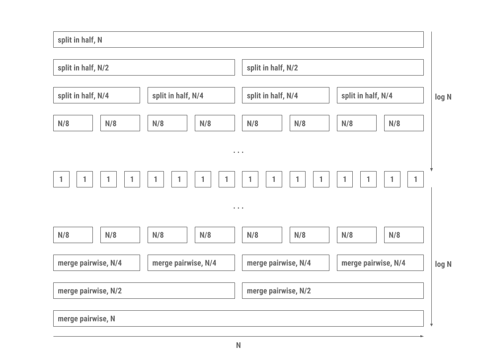
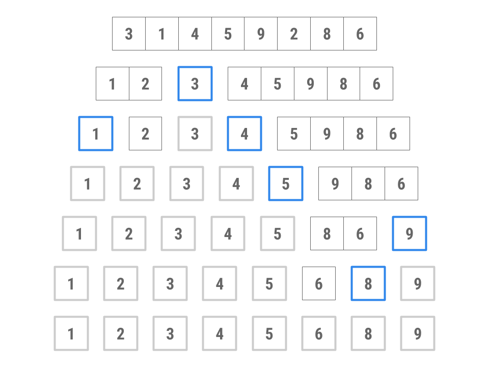

## Introduction

As usual, pull the files from the skeleton and make a new IntelliJ project.

In today's lab, we'll be discussing **sorting**, algorithms for rearranging elements 
in a collection to be in a specific order. A sorted collection provides
several advantages, including performing binary search in $$O(\log N)$$ time,
efficiently identifying adjacent pairs within a list, finding the $$k^{th}$$
largest element, and so forth.

There are several kinds of sorting algorithms, each of which is appropriate for
different situations. At the highest level, we will distinguish between two
types of sorting algorithms:

- **Comparison-based sorts**, which rely on making pairwise comparisons between
  elements.
- **Counting-based sorts**, which group elements based on their individual
  digits before sorting and combining each group. Counting sorts do not need to
  compare individual elements to each other.

In this lab, we will discuss several **comparison-based sorts** including
*insertion sort*, *selection sort*, *merge sort*, and *quicksort*. Why all the
different sorts? Each sort has a different set of advantages and disadvantages:
under certain conditions, one sort may be faster than the other, or one sort may
take less memory than the other, and so forth. When working with large datasets
(or even medium and small datasets), choosing the right sorting algorithm can
make a big difference. Along the way, we'll develop an intuition for how each
sort works by exploring examples and writing our own implementations of each
sort.

[Here](https://www.cs.usfca.edu/~galles/visualization/ComparisonSort.html) is a nice
visualizer for all of the sorts we are going to cover today.

## Order and Stability

To put elements in order implies that we can enforce an ordering between any two
elements. Given any two elements in a list, according to **total order**, we
should be able to decide which of the two elements is *larger* or *smaller* than
the other.

However, it's also possible that neither element is necessarily larger or
smaller than the other. For instance, if we wish to determine the ordering
between two strings, `["sorting", "example"]`, and we want to order by the
*length of the string*, it's not clear which one should come first because both
strings are of the same length 7.

In this case, we can defer to the notion of **stability**: if a sort is stable,
then it will preserve the relative orderings between elements in the list. In
the above example then, the resultant array will be `["sorting", "example"]` in
a *stable sort* rather than `["example", "sorting"]` as is possible in an
*unstable sort*. Remember that, according to our total order by the *length of
the strings*, the second list is still considered correctly sorted even though
the relative order of equivalent elements is not preserved.

What is the benefit of stable sorting? It allows us to **sort values based off
multiple attributes.** For example, we could stable sort a library catalog by
alphabetical order, then by genre, author, etc. Without stable sorting the
catalog, we are not guaranteed that the relative ordering of the previous sorts
would persist so it is possible that the catalog would only be sorted by our
last sort.

Consider the following example where we sort a list of animals by alphabetical
order and then length of string.

Original collection:

    cow
    giraffe
    octopus
    cheetah
    bat
    ant

Sort by alphabetical order:

    ant
    bat
    cheetah
    cow
    giraffe
    octopus

**Stable** sort by length of string:

    ant
    bat
    cow
    cheetah
    giraffe
    octopus

Now the collection is sorted by length and elements with the same length are in
alphabetical order with each other. If our sorting algorithm was not stable,
then we would potentially lose the alphabetical information we achieved in the
previous sort.

## Discussion: Sorting by Hand

With your partner, discuss how you would sort a hand of 13 playing cards if you
are dealt the cards one-by-one. Your hand should end up sorted first by suit,
and then by rank within each suit.

Then discuss how you would sort a pile of 300 CS 61BL exams by student ID. If
it's different than your card-sorting algorithm of the previous step, explain
why.

Afterwards, discuss with your partner and roughly describe an algorithm to formalize your sort. 
Can you tell if one is faster than the other? How so?

## Insertion Sort

The first comparison-based sort we'll learn is called an *insertion sort*. The
basic idea for insertion sort can be formally summed up as follows:

1. Start a loop over all items in your collection.
2. For each item you find, insert it into its correct place among all the items
   you've looked at so far.

You might have intuited insertion sort when we asked you how to sort cards. This
is like when you sort cards by continually putting the next card in the right
spot in a group of sorted cards that you're holding.

Here is code that applies the insertion sort algorithm (to sort from small to
large) to an array named `arr`.

```java
public static void insertionSort(int[] arr) {
    for (int i = 1; i < arr.length; i++) {
        for (int j = i; j > 0 && arr[j] < arr[j - 1]; j--) {
            swap(arr, j, j - 1);
        }
    }
}
```

Note that insertion sort is stable. We never swap elements if they are equal so
the relative order of equal elements is preserved.

## Check your understanding: Insertion Sort

Analyze the `insertionSort` code given above carefully. In particular, consider
the comparison step in the `for` loop condition.

### Practice:

For the following questions, discuss with your partner and verify your 
answers by highlighting the line under the question.

Assume we have an array of $$N$$ integers. What would the array have to look
like before we ran insertion sort that would make insertion sort run the
fastest, i.e. minimizing the number of steps needed?

<p><span style="color:white"><em>Sorted List</em></span>.</p>

What is the runtime of running insertion sort on this array?

<p><span style="color:white">Theta(N)</em></span>.</p>

What ordering would maximize the number of comparisons and result in the slowest
runtime?

<p><span style="color:white">Reverse Sorted Array</em></span>.</p>

What is the runtime of running insertion sort on this array?

<p><span style="color:white">Theta(n^2)</em></span>.</p>

### Exercise: `insertionSort`

Above, we have provided code for insertion sort on an array. Now, let's try
writing insertion sort for linked lists!

The file `DLList.java` contains an implementation of a doubly-linked list along
with method headers for different sorts. Complete the implementation of
`insertionSort` by writing the `insertionSortHelper` method, which will insert a
single element to an already sorted `DLList`.

This method should be non-destructive, so the original `DLList` should not be
modified.

## Variation: Tree Sort

We can generalize insertion sort above with the following pseudocode:

    for each element in the collection:
        insert it into its proper place in another collection.

The insertion sort algorithm we just considered performed insertion into
list-like structure, where elements had to be shifted over one-by-one to make
room for new elements. The choice of a structure that allows faster insertion,
namely, a binary search tree, will produce a faster algorithm.

Recall that insertion into a binary search tree runs in logarithmic time with
respect to the number of items, while insertion into an array is linear.
Thus, an alternative to insertion sort is to first build a binary search tree
through repeated insertions, and then traverse the tree to produce the sorted
sequence. This variant of insertion sort is called **tree sort**.

## Discussion: Tree Sort

Now that we know more about tree sorts, discuss the following questions with your partner.

- What is the traversal of the binary search tree that will traverse the
  elements in sorted order?
- What is the runtime of inserting $$N$$ items and returning the sorted order of
  the items?
- Note that for tree sort to be stable, if we have two equal elements with
  original ordering `e1 e2`, then `e2` must be to the right of `e1` in our
  binary search tree. Why is that the case?

## Selection Sort

Selection sort on a collection of $$N$$ elements can be described by the
following pseudocode:

    for each element in the collection:
        find the smallest remaining element, E, in the unsorted collection
        remove E and add E to the end of the sorted collection
        repeat unsorted collection's original length number of times (or repeat until unsorted collection has no more elements)

Given below is an implementation of the selection sort algorithm for arrays. You
can also see a version for linked lists completed in `DLList.java`.

```java
// At the beginning of every iteration, elements 0 ... k - 1 are in sorted
// order.
for (int k = 0; k < values.length; k++) {

    int min = values[k];
    int minIndex = k;

    // Find the smallest element among elements k ... values.length - 1.
    for (int j = k + 1; j < values.length; j++) {
        if (values[j] < min) {
            min = values[j];
            minIndex = j;
        }
    }

    // Put MIN in its proper place at the end of the sorted collection.
    // Elements 0 ... k are now in sorted order.
    swap(values, minIndex, k);
}
```

In our code for selection sort we swap the minimum element in the unsorted
collection with the element at the beginning of the sorted collection. This can
rearrange the relative ordering of equal elements. Thus, selection sort is
unstable.

### Disussion: Runtime

Now, let's determine the asymptotic runtime of selection sort. One may observe
that, in the first iteration of the loop, we will look through all $$N$$
elements of the array to find the minimum element. On the next iteration, we
will look through $$N - 1$$ elements to find the minimum. On the next, we'll
look through  $$N - 2$$ elements, and so on.  Thus, the total amount of work
will be the $$N + (N - 1) + ... + 1$$, no matter what the ordering of elements
in the array or linked list prior to sorting.

Hence, we have an $$\Theta(N^2)$$ algorithm, equivalent to insertion sort's
normal case. But notice that selection sort *doesn't* have a better case, while
insertion sort does.

Can you come up with any reason we would want to use selection sort over
insertion sort? Discuss with your partner.

## Variation: Heap Sort

For an introduction, watch [this](https://www.youtube.com/watch?v=H5kAcmGOn4Q).

Recall the basic structure for selection sort

    for each element in the collection:
        find the smallest remaining element, E, in the unsorted collection
        remove E and add E to the end of the sorted collection

Adding something to the end of a sorted array or linked list can be done in
constant time. What hurt our runtime was finding the smallest element in the
collection, which always took linear time in an array.

Is there a data structure we can use that allows us to find and remove the
smallest element quickly? A heap will! Removal of the largest element from a
heap of $$N$$ elements can be done in time proportional to $$\log N$$, allowing
us to sort our elements in $$O(N \log N)$$ time. Recall that we can also build a
heap in linear time using the bottom-up *heapify algorithm*. This step is only
done once, so it doesn't make our overall runtime worse than $$O(N \log N)$$
that we previously established. So, once the heap is created, sorting can be
done in $$O(N \log N)$$.

Note, the runtime is not exactly as simple as $$N \log N$$ because later
removals only need to sift through a smaller and smaller heap. (For more
information, see this [Stack Overflow post][].)

[Stack Overflow post]: https://stackoverflow.com/questions/2095395/is-logn-%CE%98n-logn

Heap sort is not stable because the heap operations (recall `bubbleUp` and
`bubbleDown`) can change the relative order of equal elements.

## "Divide and Conquer"

The first two sorting algorithms we've introduced work by iterating through each
item in the collection one-by-one. With insertion sort and selection sort, both
maintain a "sorted section" and an "unsorted section" and gradually sort the
entire collection by moving elements over from the unsorted section into the
sorted section. Another approach to sorting is by way of *divide and conquer*.
Divide and conquer takes advantage of the fact that empty collections or
one-element collections are already sorted. This essentially forms the base case
for a recursive procedure that breaks the collection down to smaller pieces
before merging adjacent pieces together to form the completely sorted
collection.

The idea behind divide and conquer can be broken down into the following 3-step
procedure.

1. Split the elements to be sorted into two collections.
2. Sort each collection recursively.
3. Combine the sorted collections.

Compared to selection sort, which involves comparing every element with *every
other element*, divide and conquer can reduce the number of unnecessary
comparisons between elements by sorting or enforcing order on sub-ranges of the
full collection. The runtime advantage of divide and conquer comes largely from
the fact that merging already-sorted sequences is very fast.

Two algorithms that apply this approach are *merge sort* and *quicksort*.

## Merge Sort

Merge sort works by executing the following procedure until the base case of an
empty or one-element collection is reached.

1. Split the collection to be sorted in half.
2. Recursively call merge sort on each half.
3. Merge the sorted half-lists.

The reason merge sort is fast is because merging two lists that are already
sorted takes linear time proportional to the sum of the lengths of the two
lists. In addition, splitting the collection in half requires a single pass
through the elements. The processing pattern is depicted in the diagram below.



Each level in the diagram is a collection of processes that all together run in
linear time. Since there are $$2 \log N$$ levels with each level doing work
proportional to $$N$$, the total time is proportional to $$N \log N$$.

Merge sort is stable as long as we make sure when merging two halves together
that we favor equal elements in the left half.

## Exercise: `mergeSort`

To test your understanding of merge sort, fill out the `mergeSort` method in
`DLList.java`. Be sure to take advantage of the provided `merge` method!

This method should be non-destructive, so the original `DLList` should not be
modified.

## Quicksort

Another example of dividing and conquering is the *quicksort* algorithm, which
proceeds as follows:

1. Split the collection to be sorted into three collections by *partitioning*
   around a *pivot* (or "divider"). One collection consists of elements smaller
   than the pivot, the second collection consists of elements equal to the
   pivot, and the third consists of elements greater than or equal to the pivot.
2. Recursively call quicksort on the each collection.
3. Merge the sorted collections by concatenation.

Specifically, this version of quicksort is called "three-way partitioning
quicksort" due to the three partitions that the algorithm makes on every call.

Here's an example of how this might work, sorting an array containing 3, 1, 4,
5, 9, 2, 8, 6.



1. Choose 3 as the pivot. (We'll explore how to choose the pivot shortly.)
2. Put 4, 5, 9, 8, and 6 into the "large" collection and 1 and 2 into the
   "small" collection. No elements go in the "equal" collection.
3. Sort the large collection into 4, 5, 6, 8, 9; sort the small collection into
   1, 2; combine the two collections with the pivot to get 1, 2, 3, 4, 5, 6, 8,
   9.

Depending on the implementation, quicksort is not stable because when we move
elements to the left and right of our pivot the relative ordering of equal
elements can change.

## Exercise: `quicksort`

Some of the code is missing from the `quicksort` method in `DLList.java`. Fill
in the function to complete the quicksort implementation.

Be sure to use the supplied helper methods, namely `append` and `addLast`! This
method should be non-destructive, so the original `DLList` should not be
modified.

## Discussion: Quicksort

### Discussion 1: Runtime

First, let's consider the best-case scenario where each partition divides a
range optimally in half. Using some of the strategies picked up from the merge
sort analysis, we can determine that quicksort's best case asymptotic runtime
behavior is $$O(N \log N)$$. Discuss with your partner why this is the case, and
any differences between quicksort's best case runtime and merge sort's runtime.

However, quicksort is faster in practice and tends to have better constant
factors (which aren't included in the big-Oh analysis). To see this, let's
examine exactly how quicksort works.

We know concatenation in a linked list can be done in constant time or linear
time if it's an array. Partitioning can be done in time proportional to the
number of elements $$N$$. If the partitioning is optimal and splits each range
more or less in half, we have a similar logarithmic division of levels downward
like in merge sort. On each division, we still do the same linear amount of work
as we need to decide whether each element is greater or less than the pivot.

However, once we've reached the base case, we don't need as many steps to
reassemble the sorted collection. Remember that with merge sort, while each list
of one element is sorted with respect to itself, the entire set of one-element
lists is not necessarily in order which is why there are $$\log N$$ steps to
merge upwards in merge sort. This isn't the case with quicksort as each element
*is* in order. Thus, merging in quicksort is simply one level of linear-time
concatenation.

Unlike merge sort, quicksort has a worst-case runtime different from its
best-case runtime. Suppose we always choose the first element in a range as our
pivot. Then, which of the following conditions would cause the worst-case
runtime for quicksort? Discuss with your partner, and verify your understanding 
by highlighting the line below for the answer.

<p><span style="color:white"><em>Sorted or Reverse Sorted Array. This is because
  the pivot will always be an extreme value (the largest or smallest unsorted value) 
  and we will thus have N recursive calls, rather than log(n).</em></span>.</p>

What is the runtime of running quicksort on this array?

<p><span style="color:white"><em>Theta(N^2)</em></span>.</p>

Under these conditions, does this special case of quicksort remind you of any
other sorting algorithm we've discussed in this lab? Discuss with your partner.

### Discussion 2: Choosing a Pivot

Given a random collection of integers, what's the best possible choice of pivot
for quicksort that will break the problem down into $$\log N$$ levels? Discuss
with your partner and describe an algorithm to find this pivot element. What is
its runtime? It's okay if you think your solution isn't the most efficient.

## Quicksort in Practice

How fast was the pivot-finding algorithm that you came up with? Finding the
exact median of our elements may take so much time that it may not help the
overall runtime of quicksort at all. It may be worth it to choose an approximate
median, if we can do so really quickly. Options include picking a random
element, or picking the median of the first, middle, and last elements. These
will at least avoid the worst case we discussed above.

In practice, quicksort turns out to be the fastest of the general-purpose
sorting algorithms we have covered so far. For example, it tends to have better
constant factors than that of merge sort. For this reason, Java uses this
algorithm for sorting arrays of **primitive types**, such as `int`s or `float`s.
With some tuning, the most likely worst-case scenarios are avoided, and the
average case performance is excellent.

Here are some improvements to the quicksort algorithm as implemented in the Java
standard library:

- When there are only a few items in a sub-collection (near the base case of the
  recursion), insertion sort is used instead.
- For larger arrays, more effort is expended on finding a good pivot.
- Various machine-dependent methods are used to optimize the partitioning
  algorithm and the `swap` operation.
- [Dual pivots](http://ultrastudio.org/en/Quicksort*algorithm#Dual*pivot)

For **object types**, however, Java uses a hybrid of *merge sort and insertion
sort* called "Timsort" instead of quicksort. Can you come up with an explanation
as to why? *Hint*: Think about stability!

## Conclusion

To put together the pieces we saw earlier, watch this video [Quicksort versus Mergesort](https://www.youtube.com/watch?v=es2T6KY45cA)

### Summary

In this lab, we learned about different comparison-based algorithms for sorting
collections. Within comparison-based algorithms, we examined two different
paradigms for sorting:

1. Simple sorts like **insertion sort** and **selection sort** which
   demonstrated algorithms that maintained a sorted section and moved unsorted
   elements into this sorted section one-by-one. With optimization like heap
   sort or the right conditions (relatively sorted list in the case of insertion
   sort), these simple sorts can be fast!
2. Divide and conquer sorts like **merge sort** and **quicksort**. These
   algorithms take a different approach to sorting: we instead take advantage of
   the fact that collections of one element are sorted with respect to
   themselves.  Using recursive procedures, we can break larger sorting problems
   into smaller subsequences that can be sorted individually and quickly
   recombined to produce a sorting of the original collection.

Here are several online resources for visualizing sorting algorithms. If you're
having trouble understanding these sorts, use these resources as tools to help
build intuition about how each sort works.

- [VisuAlgo][]
- [Sorting.at][]
- [Sorting Algorithms Animations][]
- [USF Comparison of Sorting Algorithms](http://www.cs.usfca.edu/~galles/visualization/ComparisonSort.html)
- [AlgoRhythmics][]: sorting demos through folk dance including
  [insertion sort][], [selection sort][], [merge sort][], and [quicksort][]

[VisuAlgo]: http://visualgo.net/sorting
[Sorting.at]: http://sorting.at/
[Sorting Algorithms Animations]: http://www.sorting-algorithms.com/
[USF Comparison of Sorting Algorithms]: http://www.cs.usfca.edu/~galles/visualization/ComparisonSort.html
[AlgoRhythmics]: https://www.youtube.com/user/AlgoRythmics/videos
[insertion sort]: https://www.youtube.com/watch?v=ROalU379l3U
[selection sort]: https://www.youtube.com/watch?v=Ns4TPTC8whw
[merge sort]: https://www.youtube.com/watch?v=XaqR3G*NVoo
[quicksort]: https://www.youtube.com/watch?v=ywWBy6J5gz8

To summarize the sorts that we've learned, take a look at the following table:

|                | Best Case Runtime    | Worst Case Runtime   | Stable  | Notes |
|----------------|----------------------|----------------------|---------|-------|
| Insertion Sort | $$\Theta(N)$$        | $$\Theta(N^2)$$      | Yes     | |
| Tree Sort      | $$\Theta(N \log N)$$ | $$\Theta(N \log N)$$ | Yes     | If tree is unbalanced, worst-case runtime is $$\Theta(N^2)$$ |
| Selection Sort | $$\Theta(N^2)$$      | $$\Theta(N^2)$$      | No      | Can be made stable under certain conditions. |
| Heap Sort      | $$\Theta(N \log N)$$ | $$\Theta(N \log N)$$ | No      | If all elements are equal then runtime is $$\Theta(N)$$. Hard to make stable. |
| Merge Sort     | $$\Theta(N \log N)$$ | $$\Theta(N \log N)$$ | Yes     | An optimized sort called "Timsort" is used by Java for arrays of reference types. |
| Quicksort      | $$\Theta(N \log N)$$ | $$\Theta(N^2)$$      | Depends | Stability and runtime depends on partitioning strategy; three-way partition quicksort is stable. If all elements are equal, then the runtime using three-way partition quicksort is $$\Theta(N)$$. Used by Java for arrays of primitive types. Fastest in practice. |

### Deliverables

To get credit for this lab:
- Complete the following methods in `DLList.java`:
  - `insertionSortHelper`
  - `mergeSort`
  - `quicksort`