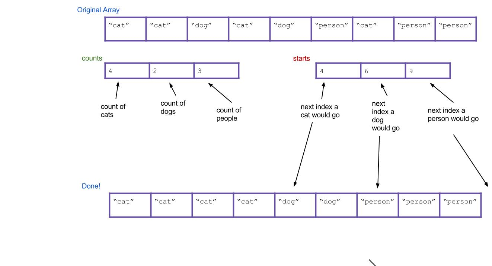

## Introduction

As usual, pull the files from the skeleton and make a new IntelliJ project.

## Average-Case Runtimes

Before we talk about the topics of today's lab, let's talk about insertion sort
and quicksort's runtime in the "average" case.

### Insertion Sort

Let's consider first the case of insertion sort, and define the idea of an
*inversion*. An inversion is a pair of elements $$j$$ and $$k$$ such that $$j$$
is less than $$k$$ but $$j$$ comes after $$k$$ in the input array. That is,
$$j$$ and $$k$$ are out of order.

This means that the maximum number of inversions in an array is bounded by the
number of pairs, and is $$\frac{N(N - 1)}{2}$$.

For every inversion, insertion sort needs to make one swap. Convince yourself
that this is true with an example: in the array `[1, 3, 4, 2]`, there are two
inversions, `(3, 2)` and `(4, 2)`, and the key 2 needs to be swapped backwards
twice to be in place. Thus the runtime of insertion sort is $$\Theta(N + k)$$,
where $$k$$ is the number of inversions. Hence, if $$k$$ is small, linear, or
even linearithmic, insertion sort runs quickly (just as fast as, or even faster
than, merge sort and quicksort).

How many inversions are in an average array? Every pair of numbers has an equal
chance of being either inverted, or not inverted, so the number of inversions is
uniformly distributed between 0 and $$\frac{N(N - 1)}{2}$$; thus the expected
(average) number of inversions is precisely the middle, $$\frac{N(N - 1)}{4}$$.
This value is in $$\Theta(N^2)$$, so insertion sort's average case runtime is
$$\Theta(N^2)$$.

### Quicksort

The average case runtime of quicksort depends on the pivot chosen. Recall that
in the best case, the pivot chosen is the median, meaning 50% of the elements
are on either side of the pivot after partitioning.

The worst possible pivot is the smallest or largest element of the array,
meaning 0% or 100% of the elements are on either side of the pivot after
partitioning.

Assuming the choice of pivot is uniformly random, the split obtained is uniform
random between 50/50 and 0/100. That means in the average case, we expect a
split of 25/75. This gives a recursion tree of height $$\log_\frac{4}{3}(N)$$
where each level does $$N$$ work. Then quicksort still takes $$O(N \log N)$$
time in the average case.

How often does the bad-pivot case come up if we pick pivots uniformly at random?
If we consider half of the array as bad pivots, as the array gets longer, the
probability of picking a bad pivot for every recursive call to quicksort
exponentially decreases.

For an array of length 30, the probability of picking all bad pivots is
$$\frac{1}{2}^{30} = 9.3 \cdot 10^{-10}$$, which is approximately the same as
winning the Powerball: $$3.3 \cdot 10^{-9}$$.

For an array of length 100, the probability of picking all bad pivots,
$$7.8 \cdot 10^{-31}$$, is so low that if we ran quicksort every second for 100
billion years, we'd still have a significantly better chance trying to win the
lottery in one ticket.

Of course, there's the chance you pick something in between, and the analysis
can get far more complicated, especially with variants of quicksort. For
practical purposes, we can treat quicksort like it's in $$O(N \log N)$$.

## A Sorting Lower Bound

Is it possible to do better than $$O(N \log N)$$ in the worst case for these
comparison-based sorts?

Suppose we have a scrambled array of $$N$$ numbers, with each number from $$1$$
to $$N$$ occurring once. How many possible orders can the numbers be in?

The answer is $$N!$$, where $$N! = 1 * 2 * 3 * \dots * (N - 2) * (N - 1) * N$$.
Here's why: the first number in the array can be anything from $$1$$ to $$N$$,
yielding $$N$$ possibilities. Once the first number is chosen, the second number
can be any of the remaining $$N - 1$$ numbers, so there are $$N(N - 1)$$
possible choices of the first two numbers. The third number can be any of the
remaining $$N - 2$$ numbers, yielding $$N * (N - 1) * (N - 2)$$ possibilities
for the first three numbers. We can continue this reasoning to get a total of
$$N!$$ arrangements of the numbers $$1$$ to $$N$$.

Each different order is called a *permutation* of the numbers, and there are
$$N!$$ possible permutations.

Observe that if $$N$$ > 0,

$$N! = 1 * 2 * \dots * (N - 1) * N \leq N * N * N * \dots * N * N * N = N^N$$

and (supposing $$N$$ is even)

$$N! = 1 * 2 * \dots * (N - 1) * N \geq \frac{N}{2} * (\frac{N}{2} + 1) * \dots * (N - 1) * N \geq \frac{N}{2}^{\frac{N}{2}}$$

so

$$\frac{N}{2}^{\frac{N}{2}} \leq N! \leq N^N$$

Now let's look at the logarithms of both these values:

$$\log(\frac{N}{2}^{\frac{N}{2}}) = \frac{N}{2} \log (\frac{N}{2})$$

$$\log (N^N) = N \log N$$

Both of these values are in $$\Theta(N \log N)$$. Hence, $$\log(N!)$$ is also in
$$\Theta(N \log N)$$.

A *comparison-based sort* is one in which all decisions are based on comparing
keys (generally done by "if" statements). All actions taken by the sorting
algorithm are based on the results of a sequence of true/false questions. All
of the sorting algorithms we have studied so far are comparison-based.

Suppose that two computers run the *same* sorting algorithm at the same time on
two *different* inputs. Suppose that every time one computer executes an "if"
statement and finds it true, the other computer executes the same "if"
statement and also finds it true; likewise, when one computer executes an "if"
and finds it false, so does the other. Then both computers perform exactly the
same data movements (e.g. swapping the numbers at indices i and j) in exactly
the same order, so they both permute their inputs in *exactly* the same way.

A correct sorting algorithm must generate a *different* sequence of true/false
answers for each different permutation of $$1$$ to $$N$$, because it takes a
different sequence of data movements to sort each permutation. There are $$N!$$
different permutations, thus $$N!$$ different sequences of true/false answers.

If a sorting algorithm asks $$d$$ true/false questions, it generates less than
or equal to $$2^d$$ different sequences of true/false answers. If it correctly
sorts every permutation of $$1$$ to $$N$$, then $$N! \leq 2^d$$, so $$\log_2
(N!) \leq d$$, and $$d$$ is in $$\Omega(N \log N)$$. The algorithm spends
$$\Omega(d)$$ time asking these $$d$$ questions. Hence,

**EVERY comparison-based sorting algorithm takes $$\Omega(N \log N)$$ worst-case
time.**

This is an amazing claim, because it doesn't just analyze one algorithm. It
says that of the thousands of comparison-based sorting algorithms that haven't
even been invented yet, not one of them has any hope of beating $$O(N \log N)$$
time for all inputs of length $$N$$.

In the worst case, a comparison-based sort (with 2-way decisions) must take at
least $$\Omega(N \log N)$$ time. But what if instead of making a 2-way
true/false decision, we make a k-way decision?

## A Linear Time Sort

Suppose we have an array of a million `String`s, but we happen to know that
there are only three different varieties of `String`s in it: "cat", "dog", and
"person". We want to sort this array to put all the cats first, then all the
dogs, then the people. How would we do it? We could use merge sort or quicksort
and get a runtime proportional to $$N \log N$$, where $$N$$ is roughly one
million, but can we do better?

We can propose an algorithm called **counting sort**. For the above example, it
works like this:

1. First, let's create an integer array of size three called the `counts` array.
   This array will count the total number of each `String`, where "cat" will
   correspond to `counts[0]`, "dog" will correspond to `counts[1]`, and "person"
   will correspond to `counts[2]`.

2. Then, let's iterate through the input array and update the `counts` array.
   Every time you find "cat", "dog", or "person", increment `counts[0]`,
   `counts[1]`, and `counts[2]` by 1 respectively. As an example, the result
   could be this: 

3. Next, let's create a new `String` array called `sorted` that will eventually
   be your sorted array. 

4. Now, based on our `counts` array, can we tell where the first "dog" would
   go in the new array? How about the first "person"? To do this, we should
   create a new array called `starts` that holds this information. We can get
   this by scanning through the counts array and finding the total number of
   items to the left of index `i`. For our example, the result is:
   

5. Now iterate through all of our `String`s, and put them into the right spot.
   When we find the first "cat", it goes in `sorted[starts[0]]`. When we find
   the first "dog", it goes in `sorted[starts[1]]`. What about when we find the
   second "dog"? It should go in `sorted[starts[1]+1]`! Or, an alternative: we
   can just increment `starts[1]` every time we put a "dog". Then, the next
   "dog" will always go in `sorted[starts[1]]`.

Here's what everything would look like after completing the algorithm. Notice
that the values of `starts` have been incremented along the way.



This written explanation of counting sort may seem complicated, so it is highly recommended 
that you take a look
at this [counting sort visualization][] before you proceed, as it might make this algorithm more
intuitive.

[counting sort visualization]: https://www.cs.usfca.edu/~galles/visualization/CountingSort.html

## Exercise: Counting Sort

### Exercise 1: `countingSort`

Implement the `countingSort` method in `DistributionSorts.java`. Assume the only
integers it will receive are 0, 1, 2, 3, 4, 5, 6, 7, 8, and 9.

Refer to the above steps if you're having trouble with this method!

### Exercise 2: Runtime

Inspect the counting sort method you just wrote. What is its runtime? Consider
the following two variables:

- `N`: the number of items in the array
- `K`: the variety of possible items (in the code you wrote, `K` is the constant
  10, but treat it as a variable for this question).

$$N, NK, N^2K, N + K, N^2 + K$$

Discuss with your TA or an AI to assess your understanding before you continue.

### Runtime: Counting Sort

Wow, look at that runtime! Does this mean counting sort is a strict improvement
from quicksort? Not quite, because counting sort has two major weaknesses:

- It can only be used to sort *discrete* values.
- It will fail if $$K$$ is too large, because creating the intermediate `counts`
  array (of size $$K$$) will be too slow.

The latter point turns out to be a fatal weakness for counting sort. The range
of all possible integers in Java is just too large for counting sort to be
practical in general circumstances.

Suddenly, counting sort seems completely useless. However, with some
modifications that we'll see in a little bit, we can come up with a pretty good
sorting algorithm!

## Radix Sort

Aside from counting sort, all the sorting methods we've seen so far are
comparison-based, that is, they use comparisons to determine whether two
elements are out of order. We also saw the proof that any comparison-based sort
needs *at least* $$\Omega(N \log N)$$ comparisons to sort $$N$$ elements in the
worst case. However, there are sorting methods that don't depend on comparisons
that allow sorting of $$N$$ elements in time proportional to $$N$$. Counting
sort was one, but turned out to be impractical.

However, we now have all the ingredients necessary to describe *radix sort*,
another linear-time non-comparison sort that can be practical.

Let's first define the word, radix. The *radix* of a number system is the number
of values a single digit can take on (also called the base of a number). Binary
numbers form a radix-2 system; decimal notation is radix-10. Radix sorts examine
elements in passes, and a radix sort might have one pass for the rightmost
digit, one for the next-to-rightmost digit, and so on.

We'll now describe radix sort in detail. We actually already described a
procedure similar to radix sort when talking about sorting in a library catalog
in the last lab. In radix sort, we will pretend each digit is a separate key,
and then we sort on all the keys at once, with the higher digits taking
precedence over the lower ones.

Here are two good strategies to approach sorting on multiple keys:

- First sort everything on the least important key. Then sort everything on the
  next key. Continue, until you reach the highest key. **Note: This strategy
  requires the sorts to be stable.**
- First sort everything on the high key. Group all the items with the same high
  key into buckets. Recursively radix sort each bucket on the next highest key.
  Concatenate your buckets back together.

Here's an example of using the first strategy. Imagine we have the following
numbers we wish to sort:

356, 112, 904, 294, 209, 820, 394, 810

First we sort them by the first digit:

82**0**, 81**0**, 11**2**, 90**4**, 29**4**, 39**4**, 35**6**, 20**9**

Then we sort them by the second digit, keeping numbers with the same second
digit in their order from the previous step:

9**0**4, 2**0**9, 8**1**0, 1**1**2, 8**2**0, 3**5**6, 2**9**4, 3**9**4

Finally, we sort by the third digit, keeping numbers with the same third digit
in their order from the previous step:

**1**12, **2**09, **2**94, **3**56, **3**94, **8**10, **8**20, **9**04

All done!

Hopefully it's not hard to see how these can be extended to more than three
digits. This strategy is known as *LSD radix sort*. The second strategy is
called *MSD radix sort*. LSD and MSD stand for *least significant digit* and
*most significant digit* respectively, reflecting the order in which the digits
are considered.

Here's some pseudocode for the first strategy:

```java
public static void LSDRadixSort(int[] arr) {
    for (int d = 0; d < numDigitsInAnInteger; d++) {
        stableSortOnDigit(arr, d);
    }
}
```

(the 0th digit is the smallest digit, or the one furthest to the right in the
number)

### Radix Sort's Helper Method

Notice that both LSD and MSD radix sort call another sort as a helper method (in
LSD's case, it must be a stable sort). Which sort should we use for this helper
method? Insertion sort? Merge sort? Those would work. However, notice one key
property of this helper sort: It only sorts based on a single digit. And a
single digit can only take 10 possible values (for radix-10 systems). This means
we're doing a sort where the variety of things to sort is small. Do we know a
sort that's good for this? It's counting sort! Counting sort turns out to be
useful as a helper method to radix sort when it comes to sorting the elements by
a particular digit.

## Exercise: `LSDRadixSort`

Now that you've learned what radix sort is, it's time to try it out yourself.
Complete the `lsdRadixSort` method in `DistributionSorts.java` by implementing
the `countingSortOnDigit` method. You won't be able to reuse your `countingSort`
from before verbatim because you need a method to do counting sort only
considering one digit, but you will be able to use something very similar.

Disclaimer: Radix sort is commonly implemented at a lower level than base-10,
such as with bits (base-2) or bytes (base-16). This is because everything on
your computer is represented with bits. Through bit operations, it is quicker to
isolate a single bit or byte than to get a base-10 digit. However, because we
don't teach you about bits in this course, you should do your LSD radix sort in
base-10 because these types of numbers should be more familiar to you.

If you are up for a challenge, feel free to figure out how to implement radix
sort using bytes and bit-operations (you will want to look up bit masks and bit
shifts).

### Runtime: LSD Radix Sort

To analyze the runtime of radix sort, examine the pseudocode given for LSD radix
sort. From this, we can tell that its runtime is proportional to
`numDigitsInAnInteger` * (the runtime of `stableSortOnDigit`).

Let's call `numDigitsInAnInteger` the variable $$D$$, which is the max number of
digits that an integer in our input array has. Next, remember that we decided
`stableSortOnDigit` is really counting sort, which has runtime proportional to
$$N + K$$, where $$K$$ is the number of possible digits, in this case 10. This
means the total runtime of LSD radix sort is $$O(D(N + K))$$!

## Discussion: MSD Radix Sort

What is the runtime for MSD radix sort? How does it differ from LSD radix sort's
runtime? Discuss with your partner.

Hint: Unlike LSD radix sort, it will be important to distinguish best-case and
worst-case runtimes for MSD.

### Advanced Runtime and Radix Selection

Let's go back and analyze the LSD radix sort runtime (despite the best-case
runtime of MSD radix sort, LSD radix sort is typically better in practice). You
may have noticed that there's a balance between $$K$$, the number of digits
(also known as the radix), and $$D$$, the number of passes needed. In fact,
they're related in this way: let us call $$L$$ the length of the longest number
in digits. Then $$K \cdot D$$ is proportional to $$L$$.

For example, let's say that we have the radix-10 numbers  100, 999, 200, 320. In
radix-10, they are all of length 3, and we would require 3 passes of counting
sort. However, if we took those same numbers and now use radix-1000, then we
examine more of the numbers, all 3 of the base-10 digits, and we only require
one pass of counting sort. In fact, in radix-1000, the numbers we used are only
of length 1.

In fact, in practice we shouldn't be using decimal digits at all - radixes are
typically a power of two. This is because everything is represented as *bits*,
and as mentioned previously, bit operators are significantly faster than modulo
operators, and we can pull out the bits we need if our radix is a power of two.

Without further knowledge of bits, it's difficult to analyze the runtime
further, but we'll proceed anyways - you can read up on bits on your own time.
Suppose our radix is $$K$$. Then each pass of counting sort inspects $$\lg K$$
bits; if the longest number has *b* bits, then the number of passes $$D =
\frac{b}{\lg K}$$. This doesn't change our runtime of LSD radix sort from $$O(D
\cdot (N + K))$$.

Here's the trick: we can choose $$K$$ to be larger than in our exercises (10).
In fact, let's choose $$K$$ to be in $$O(N)$$ (that way each pass counting sort
will run in $$O(N)$$. We want $$K$$ to be large enough to keep the number of
passes small. Thus the number of passes needed becomes $$D \in O(\frac{b}{\lg
(N)})$$.

This means our true runtime must be $$O(N)$$ if $$b$$ is less than $$\lg N$$ or
otherwise $$O(N \cdot \frac{b}{\lg N})$$, (plug our choices for $$D$$ and $$K$$
into the runtime for LSD radix sort above to see why that's the case). For very
typical things we might sort, like `int`s, or `long`s, $$b$$ is a constant, and
thus radix sort is guaranteed linear time. For other types, as long as $$b$$ is
in $$O(\lg N)$$, this remains in guaranteed linear time. It's worth noting that
because it takes $$\lg N$$ bits to represent N items, this is a very reasonable
model of growth for typical things that might be sorted - as long as your input
is not distributed scarcely.

## Conclusion

Linear-time sorts have their advantages and disadvantages. While they have
fantastic speed guarantees theoretically, the overhead associated with a linear
time sort means that for input lists of *shorter length*, low overhead
comparison based sorts like quicksort can perform better in practice. For more
specialized mathematical computations, like in geometry, machine learning, and
graphics, for example, radix sort finds use.

In modern libraries like Java and Python's standard library, a new type of sort,
TimSort, is used. It's a hybrid sort between merge sort and insertion sort that
also has a linear-time guarantee - if the input data is sorted, or almost
sorted, it performs in linear time. In practice, on real-world inputs, it's
shown to be very powerful and has been a staple in standard library comparison
sorts.

### Deliverables

To receive credit for this lab:
- Complete the following methods of `DistributionSorts.java`:
  - `countingSort`
  - `countingSortOnDigit`

### Credit

Credit to Jonathan Shewchuk for his [notes][] on the lower bound of
comparison-based sorting algorithms.

[notes]: https://people.eecs.berkeley.edu/~jrs/61b/lec/34