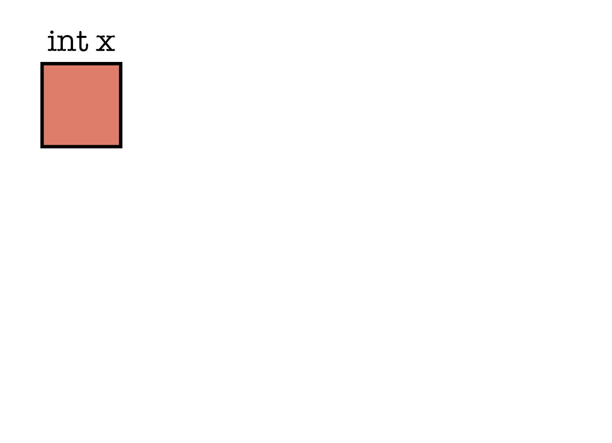
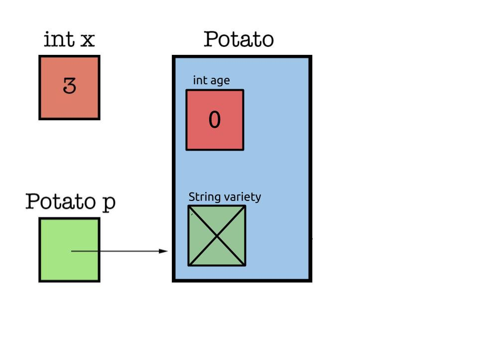
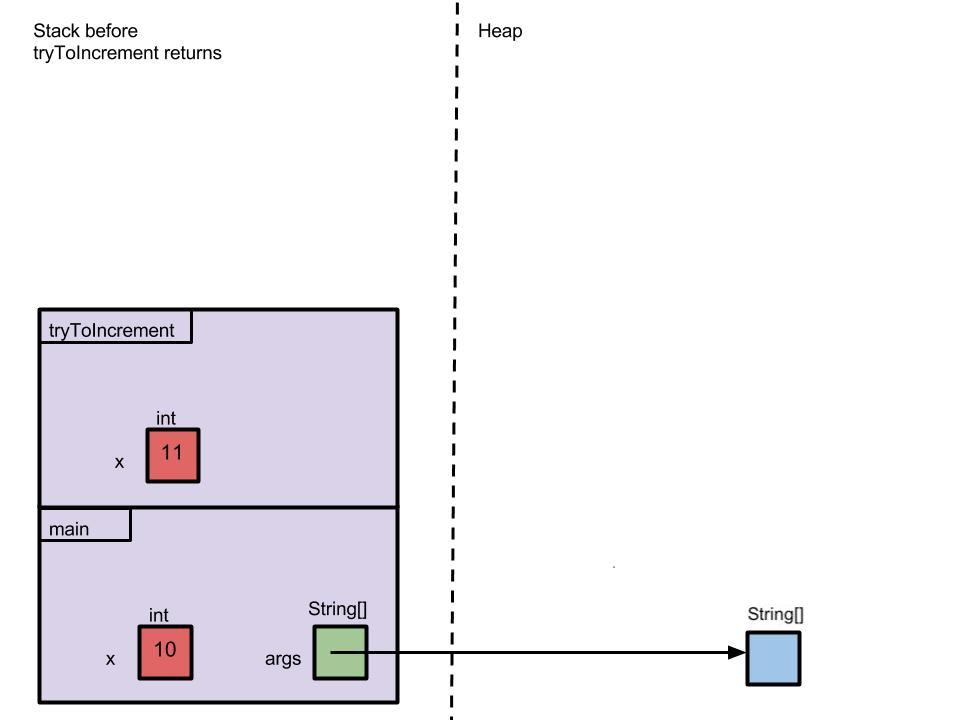
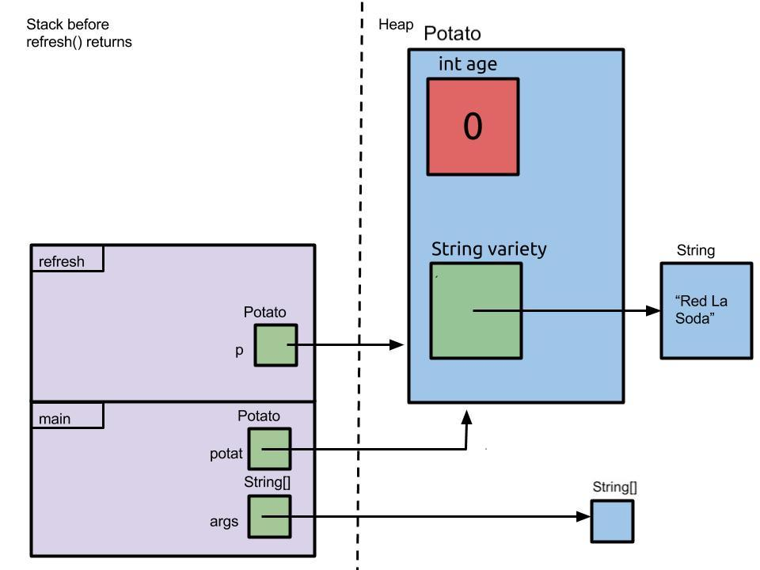

### Getting Started

> Make sure you're familiar with conditionals and loops from the [Java
Crash Course][] optional assignment before beginning this lab!

[Java Crash Course]: {{ site.baseurl }}/java

For this lab, you should use a simple text editor, such as TextEdit, Sublime, Atom, etc.
If you've been working ahead, don't start using IntelliJ just yet.

At the beginning of every lab, we'll ask that you first get the latest starter
code from the skeleton. Run the following command in your terminal from your
`su20-***` Git repository directory.

> The $ below just signifies that we are running this command in our terminal. Don't actually copy and paste the $ as part of the command.

```sh
$ git pull skeleton master
```

This command asks git to pull our code from the remote repository containing the desired code, which
we added yesterday and we called it skeleton. Master indicates that we are accessing the master branch
of that remote repository.

### Learning Goals

This lab will focus on Java _primitives_ and _objects_. Our goals for this lab will
be as follows.

-   Learn the different Java primitives and when to use them.
-   Learn how to define _classes_ and use reference-typed variables.
-   Learn how to work with _box-and-pointer_ diagrams to identify common
    usage errors.

## Primitives

As you may have noticed, when initializing a variable in Java you must put the
type next to it.

    int number = 10;

The above line tells Java that the variable `number` is an integer that
holds the value `10`. Types represent things such as integers and
decimals and are fundamental to the operation of a language. In Java, there are
a predefined set of _primitive types_.

-   **boolean** : a `boolean` represents the two possible values of `true` and `false`

-   **byte** : a `byte` represents an 8-bit signed integer.

-   **short** : a `short` represents a 16-bit signed integer.

-   **int** : an `int` represents a 32-bit signed integer. This is the most commonly
    used integer type and can hold values between -2,147,483,648 to
    2,147,483,647 inclusive.

-   **long** : a `long` represents a 64-bit signed integer. Sometimes when we need to
    express large integral numbers we will use this as it ranges from
    -9,223,372,036,854,775,808 to 9,223,372,036,854,775,807.

-   **float** : a `float` represents a 32-bit single precision floating point
    number. _Floating point numbers_ can approximate a range real numbers
    including integers, decimals, and special values like infinity. Floating point
    numbers can only represent a finite number of the infinitely many numbers in
    existence. Anything that cannot be represented is encoded as "NaN", which stands
    for "Not a Number".

-   **double** : a `double` represents a 64-bit double precision floating point
    number. Most of our decimal numbers will use this type as it provides
    greater precision.

-  **char** : a `char` represents an ascii letter (like the English alphabet).

These words are _reserved_ in Java. That is we cannot use `int` and
`double` in any other context besides declaring a variable of that type. Note that all primitives begin with a lowercase letter.

Declaring a primitive is very simple. For example, if we wanted to declare a
double, we can write the following.

```java
double pi = 3.14;
```

Certain primitives require an extra letter after the initial value. For example,
to declare a `long` or a `float`, we write the following.

```java
long num = 9223372036854775807L;
float num2 = 42.0f;
```

Finally, we can declare a `char` using a **single-quoted literal**. For example, if
we want to initialize variable `a` to the letter "a", we would write the following.

```java
char a = 'a';
```

We need not always initialize the value of a primitive. Sometimes it is useful
to just a declare a variable and allow later blocks of code to determine its
value. We do so by writing the following.

```java
char a;
double d;
```

## Objects

Java is an _object-oriented_ language. This means that everything we want to
represent in Java is defined in terms of _Objects_.

Objects are bundles of code that define the _state_ and _behavior_ of the
construct we wish to represent. Suppose we wish to represent a potato. A potato's
state can be described by its _variety_ and _age_, and it also has behaviors such as
_grow_ and _flower_.

Now suppose Zoe and Matt both have potatoes; Zoe has a Yukon Gold and Matt has
a Red Pontiac. Even though Zoe and Matt have different varieties of potatoes, they are
both still potatoes. They each have an age, color and variety. Critically, we can
describe an entire group of Potatoes with a set of common descriptors.    

In Java we define an Object via its _Class_. Zoe's Yukon Gold and Matt's Red
Pontiac would then be called _instances_ of the `Potato` class. Let us see how we can
implement a `Potato` class in Java.

### Example

For this section, we will be using Potato code found below. This can be found in
`lab02/Potato.java`.

```java
public class Potato {

    /* An instance variable representing the potato's species. */
    private String variety;
    /* An instance variable representing the potato's age. */
    private int age;

    /** A constructor that returns a very young russet burbank potato. */
    public Potato() {
        this.variety = "Russet Burbank";
        this.age = 0;
    }

    /** A constructor that allows you to specify its variety and age. */
    public Potato(String variety, int age) {
        this.variety = variety;
        this.age = age;
    }

    /** A getter method that returns the potato's type. */
    public String getVariety() {
        return this.variety;
    }

    /** A getter method that returns the potato's age. */
    public int getAge() {
        return this.age;
    }

    /** A setter method that sets the potato's age to AGE. */
    public void setAge(int age) {
        this.age = age;
    }

    /** A method that grows the potato. Note it increases its age by 1. */
    public void grow() {
        System.out.println("Photosynthesis!");
        this.age = this.age + 1;
    }

    /** Did you know potatoes can flower? No? Neither did I... */
    public void flower() {
        System.out.println("I am now a beautiful potato");
    }
}
```

We will also be looking at `lab02/Potato1.java` later on!

### Defining a Class

Let's see how to define our `Potato` class. To define a Java Class, create a new
`.java` file and encompass the class's code with the following header

```java
class Potato {
    /** Potato code goes here! */
}
```

There are two things to keep in mind when writing Java classes.

-   Java requires the class name to be the same as the file name. This is why
    the `Potato` class is written in `Potato.java`.

-   By convention, the name of a class always begin with a capital letter and is generally
    named using camel case (ex: ThisIsCamelCase)

### Constructors

Now to initialize a `Potato` object, we must call its _constructor_. The
constructor is a special method that initializes all the variables associated
with the class's instance. Unlike other methods, there is __no__ return type in the constructor's signature, and it __must__ have the same name as the class itself.

It's possible to define a constructor that takes in no arguments.

```java
public Potato() {
    this.variety = "Russet Burbank";
    this.age = 0;
}
```

Here the constructor returns a baby Russet potato because, as we all know,
provided no guidance, the potato _obviously_ becomes a baby russet potato.

We can also specify arguments in our constructor.

```java
public Potato(String variety, int age) {
    this.variety = variety;
    this.age = age;
}
```

This constructor returns a potato where we can define its variety and age. Now
we can construct potatoes such as Zoe's 3 year old Yukon Gold potato.

We will discuss how to declare objects in more detail during the **Boxes and Pointer Diagrams**
section.

> __Caveat:__ if no constructors are defined in the object file, then the Java compiler
will provide a _default constructor_ that accepts no argument. However, if a constructor
is defined, then the compiler will __not__ provide a _default constructor_. Read more
about it [here](https://docs.oracle.com/javase/tutorial/java/javaOO/constructors.html).

### Instance Variables

Instance variables allow us to represent the state of an object and can be both
primitives and objects. The "has a" test is an easy way to see if something should be an instance variable of an object. For example, a potato has an age and variety. Thus, within our `Potato` class, we see that there are two
instance variables: `variety` and `age`.

```java
/* An instance variable representing the potato's species. */
private String variety;
/* An instance variable representing the potato's age. */
private int age;
```

As with any variables we must declare what type it is. The `String` keyword
tells us `variety` is a String object and `int` tells us the age is an integer
primitive.

Instance variables have _default values_ that correspond to the type of the variable. If instance variables are not initialized in the constructor or elsewhere with a value, they will initially contain the default. These defaults will correspond to a zero value. `0` for `int`, `float`, `double`, etc. `false` for `boolean`, and `null` for `Object` types.

We can (usually) access the age and variety of the Potato via dot notation.
This is similar to Python's dot notation, which you may have encountered in CS 61A.

```java
Potato zoesPotato = new Potato("Yukon Gold", 3); // Zoe's potato!
zoesPotato.variety; // returns the variety of Zoe's potato
zoesPotato.age; // returns the age of Zoe's potato
```

Notice that we had to first instantiate a new potato object before we could access `variety` or `age`. The order of the variables that we pass into the `new Potato` call must match the order of the parameters of the constructor. Remember that _instance variables_ are particular to the object.
Thus we need to create an object first in order to have age and variety.

When writing object code within its class, we can also employ the `this` keyword.
Its usage is similar to that of `self` in Python.

```java
this.variety; // returns the current instance's variety
this.age; // returns the current instance's age
```

One notable difference, however, is that `this` cannot be reassigned whereas
`self` in Python can be reassigned.

Outside of the Potato class, we can’t use this to refer to zoesPotato since we only use this to refer to the current instance while inside the class. Instead, we're trying to refer specifically to zoesPotato.

Now we say "sort of" because we also have a `private` keyword placed in
front of the `variety` and `age` declaration. This means we cannot access
the age and variety via dot notation outside of `Potato.java`. We will see more
about why we may want to do this in the **Getter and Setter Method** section
later on.

Finally, it's important to stress that even though all instances of Potato will
have the variables `variety` and `age`, their values will be specific to each
instance - hence the name _instance variable_.

### Instance Methods

To facilitate behavior, we can define _instance methods_. For example, Potato
has defined in it the `grow()` method.

```java
/** A method that grows the potato. Note it increases its age by 1. */
public void grow() {
    System.out.println("Photosynthesis!");
    this.age = this.age + 1;
}
```

Like instance variables, we can access instance methods using dot notation as
well.

```java
zoesPotato.grow(); // Zoe's potato grows!
```

We also have a few special instance methods prefixed by the words "get" and
"set". These are aptly named getters and setters, which we'll learn more about them
below!

### Getter and Setter Methods

As we have seen, the `private` keyword limits our ability to access instance
variables directly. This is called an **access modifier** and we will be
discussing them in more detail later on in the course.

For now, just know that in general it is good practice to make instance
variables private. A consequence of making our instance variables private
is that we must now define instance methods to access them.

This is where we introduce getter and setter methods. Within `Potato` we have
these methods.

```java
/** A getter method that returns the potato's type. */
public String getVariety() {
    return this.variety;
}

/** A getter method that returns the potato's age. */
public int getAge() {
    return this.age;
}
```

The above two blocks are called _getter_ methods since they **get** the value
of their respective instance variables for programs outside of `Potato.java`.
Of course, due to advancements in genetic modification technology, it is also
possible to **set** the age of our potato.

```java
/** A setter method that sets the potato's age to AGE. */
public void setAge(int age) {
    this.age = age;
}
```

This is called a _setter_ method as it allows us to set the value of an instance
variable.

Interestingly enough, we don't have a setter method for the `variety` instance
variable. This is because until we develop the technology to support
spud-transmutation (#PotatoDreams), Zoe's Yukon Gold potato will forever remain
a Yukon Gold potato.

Of course, this is important in an application sense because now external
programs cannot maliciously spoof the identity of a potato. Take a look at
`Potato1.java`

```java
/* An instance variable representing the potato's species. */
String variety;
/* An instance variable representing the potato's age. */
int age;
```

The `variety` and `age` are not private meaning we can write a program to
change the identity of Zoe's potato.

```java
/* zoesPotato is an instance with variety = "Yukon Gold" */
zoesPotato.variety = "Red Pontiac"; // A POTATO IMPOSTER!
```

The practice of using getters and setters is called _information hiding_ and it prevents external programs
from unintentionally (or intentionally!) changing the value of our instance
variables.

In an exercise below, we will be considering a bank account. Without a doubt, we will
want the balance of our bank account to be private, so that other programs cannot simply set `account.balance = 0;`.

## Box and Pointer Diagrams

> For another explanation, you may read [Section 2.1](https://joshhug.gitbooks.io/hug61b/content/chap2/chap21.html)
from the CS 61B textbook,
starting from the section titled "The Mystery of the Walrus" and stopping just before "The Law of the Broken Futon".

Throughout this class it will be extraordinarily helpful to draw pictures of the variables in our program to help us with
debugging by visualizing the state and changes of objects throughout the code. The diagrams we'll teach you
to use in this class are often referred to as _box and pointer_ diagrams, which are
similar to the Environment Diagrams you saw in CS 61A.

Let's start off with something simple. When we declare a primitive, we draw a
box for it, and label the box with the type of primitive, and the name of the
variable. Here, primitives will be in red boxes. For example,

```java
int x;
```



When we assign a value to the primitive, we fill in the box with the value of
the primitive.

```java
x = 3;
```


Variables can also refer to objects. For example, it can refer to a `Potato`
instance. We can declare a `Potato` object the same way as we declare an `int`.

```java
Potato p;
```

This variable is called a _reference_, because it will refer to an object. When
we first declare the reference but don't assign an object to it like in the code above, we say the reference contains nothing, or `null`. This also occurs when an instance variable is not assigned a value in the constructor. Here's how we draw it:


Here we're drawing references in green to emphasize that they are different from primitives.

Now let's assign a reference to the `Potato` object by calling its _constructor_. This _instantiates_, or creates, a new instance of the `Potato` class.
Instantiating an object via its constructor **always** requires the `new` keyword.

```java
p = new Potato();
```



Here an object is drawn in blue, to emphasize that it is different from a
primitive and a reference. We can now store primitives within the object as
instance variables!

**One critical thing about the object**: unlike the primitive integer, 3, drawn inside
the box for `x`, the `Potato` object is **not** drawn inside the variable `p`.
Instead `p` simply contains an arrow that points to the `Potato` object. This is
why `p` is called a reference or pointer because it just _refers_ to the object
but _does not_ contain it. The true value of the variable `p` is a **pointer** to
a `Potato` object rather than the `Potato` object itself. This is a very, very
important distinction!

Of course, when we call the no argument constructor, it will initialize the `variety`
to `"Russet Burbank"` and the `age` to `0`. Our diagram looks like the following.


Is this what you expected?

Remember that a `String` in Java is an object, not a primitive. Objects are not
drawn inside other objects, so when we initialize `variety`, we make sure the
reference points outside the object.

### Discussion: Intuition for Drawing Objects

Discuss with your partner to see if you can come up with intuition as to why
these diagrams are drawn the way they are. Why does it make sense that objects
are not stored inside variables, but are only referred to them? Why does it make
sense that objects are not drawn inside other objects? Why isn't the blue object
box labeled with the name of the variable? There aren't necessarily correct
answers to these questions, so just see if you can come up with explanations that
make sense to you.

## Stack and Heap

When we create Objects, the Java Virtual Machine allocates space on the _heap_. The _heap_ is where all Objects and arrays live. However, method calls and local parameters are stored on the _stack_. Each time a method is called, the JVM allocates a _stack frame_, which stores the parameters and local variables for that method.

At times, we may only care about the heap and the state of the Objects that we create. Other times, it will be useful to keep track of the stack frames as well.

Let's consider the following code:

```java
public static void main(String[] args) {
    Potato p = new Potato();
    int newAge = 20
    p.setAge(newAge);
}
```

When the setAge() method is called, the stack and heap looks like below. For now, don't worry about what a String[] is, we'll cover that in a later lab.


The method that is currently executing (at any given point in time) lies on the top of the stack. All other stack frames are waiting for the top frame to return and be popped off the stack so they can resume execution. When a stack frame is popped, all of its local variables are lost.

One thing that you may notice is that Java is __pass-by-value__. Methods are passed in __copies__ of the actual parameters. The original parameters cannot be changed by the method. The copies lie in the stack frame.

Consider the following code and the stack and heap diagram, right before `tryToIncrement` returns.

```java
public static void tryToIncrement(int x) {
    x += 1;
}

public static void main(String[] args) {
    int x = 10;
    tryToIncrement(x);
}
```



Perhaps here is where it becomes apparent that the value for references is not the Object it references. When we pass in an Object, what is copied is not the Object itself, but the reference to the Object.

```java
public static void refresh(Potato p) {
    p.age = 0;
}

public static void main(String[] args) {
    Potato potat = new Potato("Red La Soda", 5);
    refresh(potat);
}
```



What is copied over into the parameter of the refresh method is not a copy of the Potato object, but a copy of the reference (the arrow) to the Potato Object.

### The True Meaning of `this`

Did you notice that there was something different between when we called the `setAge` method and when we called the `refresh` method? Go back to the stack and heap diagrams and discuss with your partner the difference. Look at the code segments and think about why that may be.

`setAge` is an _instance method_, which means that it must always be called through dot notation on an Object. Instance methods always have a `this` variable, which references the Object that the method was called on. In contrast, `refresh` is a static method (marked with the `static` keyword). Static methods do _not_ have a `this` reference in their frame; they belong to the class rather than to an object of the class.

We call being inside a static method during execution being in a _static context_. You cannot directly reference instance variables from a static context. Instead, you must do so through an object reference (due to the lack of a `this` reference). Note that static methods can be called from a static context (like in `main()`) and do not need to be called with an instance associated with them.

## Exercise: Account Management

> If you haven't gotten the latest skeleton files, do so now by running the
> following command from your `su20-**` Git repository.
>
> ```sh
> $ git pull skeleton master
> ```

The next several exercises involve modifications to an `Account` class, which
models a bank account. The file you will be working with is
`Account.java`. 

The provided testing file is `AccountTest.java`. Compile the test by running `javac Account.java` and
`javac AccountTest.java` from the lab02 directory in your repo. Execute the test
by running `java AccountTest`. Be sure to compile after every change you make to your code.
Note that the testing code provided is not entirely comprehensive. It serves as a sanity check
to validate your attempts. Feel free to read through the file and add more calls within print 
statements to expand your testing suite. This is a good habit to get into for this course.

The `Account` class allows deposits and withdrawals. Instead of warning about a
balance that's too low, however, it merely disallows a withdrawal request for
more money than the account contains.

### Modifying Withdrawal Behavior

The `withdraw` method is currently defined as a `void` method. Modify it to
return a `boolean`: `true` if the withdrawal succeeds (along with actually
performing the withdrawal) and `false` if it fails.

### Merging Accounts

Define a `merge` method. This method should transfer all of the money from the
argument account to the current account. In other words, the argument account
balance should be zeroed while the current account's balance increases by the
argument's old balance. We've provided a skeleton of the method in
`Account.java`.

### Overdraft Protection

A convenient feature of some bank accounts is *overdraft protection*: rather
than bouncing a check when the balance would go negative, the bank will deduct
the necessary funds from a second account. One might imagine such a setup for a
student account, provided the student's parents are willing to cover any
overdrafts (!). Another use is to have a checking account that is tied to a
savings account where the savings account covers overdrafts on the checking
account. In our system, we'll be keeping things simple with only one type of
account so we don't have to worry about student or savings accounts.

Implement and test overdraft protection for `Account` objects by completing the
following steps.

1. Add a `parentAccount` instance variable to the `Account` class; this is the
   account that will provide the overdraft protection, and it may have
   overdraft protection of its own.
2. Add a two-argument constructor. The first argument will be the initial
   balance as in the existing code. The second argument will be an `Account`
   reference with which to initialize the instance variable you defined in step
   1.
3. In the one-argument constructor, set the parent account to `null`. We'd like
   to emphasize the fact that there is no parent if the one-argument
   constructor is used by explicitly setting `parentAccount` to `null`, but
   notice it is technically unnecessary as any non-initialized objects default
   to `null`.
4. Modify the `withdraw` method so that if the requested withdrawal can't be
   covered by this account, the difference is withdrawn from the parent
   account. This may trigger overdraft protection for the parent account, and
   then its parent, and so on. The number of accounts connected in this way may
   be unlimited. If the account doesn't have a parent or if the parent (and its
   parents and so forth) can't cover the withdrawal, the `withdraw` method
   should merely print an error message as before and not change any account
   balances.

Note: it is important to check if the parent account is null before executing any changes to
the account.

Here's an example of the desired behavior, with the `Account` object `zoe`
providing overdraft protection for the `Account` object `matt`. Recall this
means the `parentAccount` of `matt` is `zoe`.

Suppose, in each scenario below, `matt` has 100 as his balance while `zoe`
has 500 as her balance.

`matt` attempts to withdraw 50
: `matt` then has 50 remaining in his balance, while `zoe` still has 500.

`matt` attempts to withdraw 200
: `matt` then has 0 remaining in his balance, while `zoe` needed to cover
100 for `matt`, leaving 400 as her balance.

`matt` attempts to withdraw 700
: return false without changing either balance as the withdrawal is denied due
to insufficient funds.

> To test your code, try copy and pasting the `Account` class into the [online
> Java Visualizer](https://cscircles.cemc.uwaterloo.ca/java_visualize/#). Make sure to add a `main` method with a few example cases
> like the ones provided above.
>
> ```java
> Account zoe = new Account(500);
> Account matt = new Account(100, zoe);
> matt.withdraw(50);
> ```

### Discussion: Merging Revisited

One proposed solution for merging accounts is the following:

```java
public void merge(Account other) {
    this.balance = this.balance + other.balance;
    other = new Account(0);
}
```

This doesn't work. Explain why not.

## Exercise: Pursuit Curves

You will now create a class representing a pursuit curve.

_Pursuit curves_ provide a powerful way to render curves on a computer. The
traditional method for drawing a path is to analytically define it via some
algebraic formula like $$y(t) = t^2$$ and trace it point-wise. Consider an
alternative where we define two points: the _pursuer_ and the _pursued_.

Now suppose the pursued point (in black) follows some fixed path $$F(t)$$. Then the
pursuer (in red) will seek the pursued in the following manner.


We notice that the pursuer always follows the pursued along its tangent, which
gives some serious first order differential equation vibes. Letting the
pursuer's path be given by $$x(t)$$, then the closed form solution for its path is
given by the following equation.


Of course, we won't require you to solve a differential equation. In fact, let's
see what your task will be!

### Programming Task

Implement a simpler version of pursuit curves in order to create a
cool visual by filling out `lab02/Path.java`. An additional
file `lab02/PathHarness.java` is provided containing code that will render
your code in `Path.java` using Java's graphics framework.

ALso, testing code has been provided in `lab02/PathTest.java`. Compile by
running `javac Point.java`, `javac Path.java`, `javac PathHarness.java`, and `javac PathTest.java` and execute by running `java PathTest`. 

Note, if you have completed `Account.java`, you can compile using the command `javac *.java`. 
This will compile all java files.

As with previous tests,
these tests are not entirely comprehensive. Feel free to add whatever testing code you desire.

`Path.java` will represent the path traveled by the pursuer. You will need to
keep track of the following two points:

-   `curr` will represent where the path currently ends. This will be
    a Point object.

-   `next` will represent where the path (and thus, `curr`) will travel to next. This
    will also be a Point object.

Next, you will need to define a constructor that, given an x and y coordinate,
sets `next` to the starting point (x, y). The constructor may look
something like this.

```java
public Path(double x, double y) {
    // more code goes here!
}
```

When the `Path` object is first constructed, `curr`
can be set to a `Point` instance with any coordinate so long as it is not `null`.
Try playing around with initial `curr` values to see what you can get!

Finally, you will need to implement the following instance methods.

| method name                      | return type | functionality                                    |
|----------------------------------|-------------|--------------------------------------------------|
| `getCurrX()`                     | `double`    | Returns the x-coordinate of `curr`      |
| `getCurrY()`                     | `double`    | Returns the y-coordinate of `curr`      |
| `getNextX()`                     | `double`    | Returns the x-coordinate of `next`      |
| `getNextY()`                     | `double`    | Returns the y-coordinate of `next`      |
| `getCurrentPoint()`              | `Point`     | Returns `curr`                              |
| `setCurrentPoint(Point point)`  |  `void`     | Sets `curr` to `point`                   |
| `iterate(double dx, double dy)`  | `void`      | Sets `curr` to `next` and updates the position of `next` to be `curr` with movement defined by `dx` and `dy`.|

A note on `iterate(double dx, double dy)`. If you were to implement a pursuit
curve in full generality, then this is where you would solve a differential
equation. But again, we won't have you do that. Instead we're giving you $$dx$$
and $$dy$$ which will tell you how the path travels on each call to `iterate`.

To summarize your task:

-   Keep track of `curr` and `next`.

-   Implement a constructor taking in a `double x` and `double y`.

-   Implement the methods listed in the table above.

Here are some tips to keep you on the right track!

-   As `curr` and `next` are both `Point` objects, we've provided
    a class defining `Point`. Make sure to read through and understand what each
    method and constructor does!

-   When defining `iterate(double dx, double dy)` you may find that your
    `curr` and `next` are not being set to what they are coded to
    be. Think about object references and try drawing a box-and-pointer diagram.

> If you want to learn more about pursuit curves, [Wolfram's MathWorld provides
    a very interesting read](http://mathworld.wolfram.com/PursuitCurve.html).

## `static`

There's something that we've been kind of waving off up until now: the `static` keyword. In Java, `static` fields belong to the class instead of a particular instance. We call these static fields or class variables. During execution, only one instance of a static field exists throughout, no matter how many instances of the class are created. You can think of them as living in their own special space, away from each instance. Static fields can be referenced the same as instance variables from within a instance method. They can also be directly referenced as `ClassName.staticVariable`, or by the instance reference (although this is not recommended for style). For example, in the `Dog` class if we wanted to access a static field `genus`, we could either write:

```java
Dog fido = new Dog();
System.out.println(Dog.genus);     // ok
System.out.println(fido.genus);    // ok
```

Recall that methods can also be static. This just means the method does not belong to a specific instance, like instance methods do. We can call them in a similar way, using either the class name or an instance.

## Conclusion

Coding is not easy! Keeping track of what references point to what, modifying code
(which you first have to understand), and systematically finding bugs are definitely
not skills that develop overnight. Make sure to practice! You can get your partner
or another classmate involved and generate variants of the lab exercises to provide
extra practice.

The exercises on complicated uses of references are easy to produce and
can be verified online using tools such as [Java Visualizer](http://cscircles.cemc.uwaterloo.ca/java_visualize/)
or by simply running your code through intelliJ.

The internet is also a great boon for more coding practice. Checkout Reddit's
[/r/dailyprogrammer](https://www.reddit.com/r/dailyprogrammer) and topcoder's online
exercises. Project Euler also provides a ton of questions with solutions that a
potential interviewer might one day ask you!

For coding, practice is crucial so make sure to do so! Finally, if you or anyone you know
is struggling, let a TA know and we'll be more than happy to help.

### Deliverables

To quickly recap what you need to do for this lab:

- Read through the lab and learn about Java objects and the Golden Rule of
  Equals. Make sure you understand how to draw box-and-pointer diagrams.
- Build good collaboration habits as you work through the provided discussion
  questions and exercises.
- In `lab02/Account.java` edit the behavior of withdrawal to return a boolean then implement account merging and overdraft protection.
- Implement `lab02/Path.java` the keeps track of `currPoint` and `nextPoint` and implements the methods `getCurrX()`, `getCurrY()`, `getNextX()`, `getNextY()`, `getCurrentPoint()` and `setCurrentPoint(Point point)`, and `iterate(dx, dy)`
- Complete the quiz on Gradescope and turn it in by 24 hours after the end of your lab section.

### Submission
1. Save your java files, and in your terminal, navigate to your `su-**` directory using the `cd` command.
2. Once there, `git add <filename>` for all files to stage them, `git commit -m "finished lab 2"` to make your commit, and 
`git push` to upload to GitHub.com.
3. Go to Gradescope.com and submit to the correct assignment by submitting via GitHub. The autograder will run and tell you your score. Remember, both people in the partnership need to submit to Gradescope to receive credit.
4. Complete Quiz1 in Gradescope.com by 24 hours after the end of your lab section.
