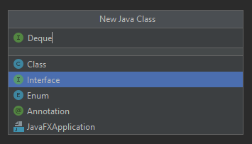

Introduction
------------

Rather than simulating the glorious gravitational physics of our universe,
we'll instead be building data structures! Not the most glamorous thing, but
this will provide you with plenty of practice with concepts we've been learning. Plus this might be the very first data structures you code from scratch.

In this project, we will build implementations of a "Double Ended Queue" using
both linked lists and arrays. You will create exactly three Java files:
`LinkedListDeque.java`, `ArrayDeque.java`, and `Deque.java`, with public methods listed below. 

This project will also introduce you to the idea that when you are implementing a data structure that adheres to some public API ([application programming interface](https://en.wikipedia.org/wiki/Application_programming_interface)) there will be multiple ways to do so. While completing the project try to think about what the difference between the implementations are and when each of them might perform better. In coming labs we will introduce asymptotic analysis which will give us another lens through which we could compare and contrast these different implementations more precisely.

Compared to Project 0, we will providing even less scaffolding. In other words, for this project we will focus on saying what you should do, but not how you should do it.

**We strongly, strongly encourage you to switch to IntelliJ for this project** (if you have not already). While it's not absolutely required, you will have a better time, especially for the later parts of the project while you are testing and debugging your code. The ability to visually debug your code can be incredibly useful, it's also nice to have a development environment that catches syntax errors as you are typing, and it avoids the need to type `javac` and `java` (or pressing arrow keys) a each time you change the code.

Additionally, **we will be enforcing style**. You must follow the [style
guide](../../guides/style-guide.html) or you will lose points on the autograder.

Getting the Skeleton Files
----------------

As explained in [Lab05](../../labs/lab05/#before-you-begin), you should be workng with a partner and you should be using your `su20-p***` repository. If you have not already formed this repository, follow the instructions in Lab05 before continuing.

After pulling from the skeleton, you should see that the only provided files are `LinkedListDequeTest.java` and
`ArrayDequeTest.java`. These files provide examples of how you might write tests to verify the correctness of your code. We strongly encourage you try out the given tests, as well as to [write some of your own](#4-testing-your-code).

Deque API
----------------

> Deque (usually pronounced like "deck") is an irregular acronym of double-ended
queue. Double-ended queues are sequence containers with dynamic sizes that can
be expanded or contracted on both ends (either its front or its back).
Here is a definition from
[cplusplus.com](http://www.cplusplus.com/reference/deque/deque/).

Specifically, any deque implementation must have exactly the following
operations:

* `public void addFirst(T item)`: Adds an item of type `T` to the front of the
deque.
* `public void addLast(T item)`: Adds an item of type `T` to the back of the deque.
* `public boolean isEmpty()`: Returns true if deque is empty, false otherwise. This method should be deleted and migrated to `Deque.java` during Part 3 (The API Checker will fail on this until you get to that point).
* `public int size()`: Returns the number of items in the deque.
* `public void printDeque()`: Prints the items in the deque from first to last, separated by a space. Once all the items have been printed, print out a new line.
* `public T removeFirst()`: Removes and returns the item at the front of the deque. If no such item exists, returns null.
* `public T removeLast()`: Removes and returns the item at the back of the deque. If no such item exists, returns null.
* `public T get(int index)`: Gets the item at the given index, where 0 is the front, 1 is the next item, and so forth. If no such item exists, returns null. Must not alter the deque!

> Above you should notice that your class should accept any generic type (not just integers) which we represent by the generic parameter `T`. We will be covering this in Lab06 (will link once released) and in lecture 2 (again we will link once released). If you want to get a head start before these are released feel free to use [Oracle's documentation](https://docs.oracle.com/javase/tutorial/java/generics/types.html) (a bit more verbose than our labs but will provide all necessary information).

Project Tasks
----------------

### 1. Linked List Deque

Create a file called `LinkedListDeque.java` in your project directory.

As your first deque implementation, you'll build the `LinkedListDeque` class,
which will be implemented using a linked list.

You must implement all of the methods listed in the "Deque API" section above. In addition to the implementation specifics listed above, your `LinkedListDeque` operations are subject to the following rules:

* `add` and `remove` operations must not involve any looping or recursion. A
single such operation must take "constant time", i.e. execution time should not depend on the size of the deque.
* `get` must use iteration, not recursion.
* `size` must take constant time.
* The amount of memory that your program uses at any given time must be
proportional to the number of items. For example, if you add 10,000 items to
the deque, and then remove 9,999 items, the resulting size should be more like
a deque with 1 item than 10,000. Do not maintain references to items that are
no longer in the deque.

For the `LinkedListDeque`, you also need to implement these following methods / constructors:

* `public LinkedListDeque()`: Constructor which creates an empty linked list deque.
* `public T getRecursive(int index)`: Same as `get`, but this method should be implemented using recursion.

When implementing these methods / this class, you may add any `private` helper classes or methods in `LinkedListDeque.java` if you deem it necessary, but you should not add any `public` methods which would alter the API as specified. When you submit to the autograder it will perform an API check for you.

There are many design issues to consider, and you may find the implementation more challenging than you'd expect. Make sure to consult the [lab on doubly linked lists](../../labs/lab06) (will be released by 12pm PDT, Monday 6/29), particularly the section on sentinel nodes. **You are not allowed to use Java's built in LinkedList data structure (or any data structure from `java.util.*`) in your implementation**.

### 2. Array Deque

Create a file called `ArrayDeque.java` in your project directory.

As your second deque implementation, you'll build the `ArrayDeque` class. This
deque must use arrays as the core data structure.

Again you must implement all of the methods listed in the "Deque API" section above. In addition to the implementation specifics listed above, your `ArrayDeque` operations are subject to the following rules:

* `add` and `remove` must take constant time, except during resizing
operations.
* `get` and `size` must take constant time.
* The starting size of your array should be 8.
* The amount of memory that your program uses at any given time must be
proportional to the number of items. For example, if you add 10,000 items to
the deque, and then remove 9,999 items, you shouldn't still be using an array
of length 10,000ish. For arrays of length 16 or more, your usage factor should
always be at least 25%. For smaller arrays, your usage factor can be
arbitrarily low.

For the `ArrayDeque`, you also need to implement this constructor:

* `public ArrayDeque()`: Creates an empty array deque, again the starting size should be 8.

Similar to the `LinkedListDeque`, when implementing these methods / this class, you may add any `private` helper classes or methods in `ArrayDeque.java` if you deem it necessary, You should not add any `public` methods which would alter the API as specified. When you submit to the autograder it will perform an API check for you.

We *strongly recommend* that you treat your array as circular for this
exercise. In other words, if your front pointer is at position zero, and you
`addFirst`, the front pointer should loop back around to the end of the array
(so the new front item in the deque will be the last item in the underlying
array). This will result in far fewer headaches than non-circular approaches.
See the slides from Lecture 2 (will be released by Wednesday 7/1) for more details.

> Correctly resizing your array is **very tricky**, and will require some deep thought. Try drawing out various approaches by hand. It may take you quite some time to come up with the right approach, and we encourage you to debate the big ideas with your fellow students or TAs. Make sure that your actual implementation **is by you alone**. We have included the [About Resizing Arrays section](.#about-resizing-arrays) below which will provide some helpful tips on how you might go about this.

### 3. Deque Interface

> Before beginning this part, read the [About Interfaces](.#about-interfaces) section below. We will be formally introducing interfaces in a later lab, but this section will bring you up to speed on what you will need for this project.

This last task is going to be a little tedious, but it hopefully should not take that much time.

We will begin by creating an interface in a new file named `Deque.java`. This should contains all of the methods that appear in *both* `ArrayDeque` and `LinkedListDeque` (these should be outlined in the "Deque API" section).

To do so in IntelliJ, use **"File -> New -> Java Class"**. IntelliJ will assume you want a class, so when prompted, make sure to select **"Interface"** rather than the default **"Class"**. Before creating the file your prompt should match below, and after you have created the file the first line should begin with `public interface Deque`.

 

Once the file has been created, fill out this interface by adding all of the methods from the API. The next step of this exercise is to modify your `LinkedListDeque` and `ArrayDeque` so that they implement the `Deque` interface by adding `implements Deque<T>` to the line declaring the existence of the class. Please be sure to use `T` instead of another generic type parameter name, for the sake of the autograder. Add `@Override` tags to each method that overrides a `Deque` method.

There will be just one more step to this part of the project. To really embrace the don't repeat yourself philosophy, we will explore the use of  `default` methods. The correct use of `default` methods will result in you writing even less redundant code. 

Consider the `isEmpty()` method. Give it a `default` implementation in `Deque.java`, which will return `true` if the `size()` is `0`. Both your `LinkedListDeque` and `ArrayDeque` should have `size()` methods and probably already have `isEmpty()` implementations similar to this implementation. After the `default` method has been added to `Deque.java`, you can delete the the duplicate implementations inside of the two aforementioned concrete classes (`LinkedListDeque` and `ArrayDeque`), resulting in less redundant code.

### 4. Testing Your Code

Testing is an important part of code writing in industry and academia. It is an essential skill that can prevent monetary loss and hazardous bugs in industry, or in your case, losing points. Learning how to write good, comprehensive unit tests, and developing a good habit of always testing code before shipping are some core objectives of CS 61BL.

You should have learned about and began using testing in Lab04. Here, we have provided you a very simple sanity check, `LinkedListDequeTest.java`, as well as a template for more tests in `ArrayDequeTest.java`. To use the sample `LinkedListDequeTest.java` testing file, you must uncomment
the lines in the sample tests. Only uncomment a test once you have implemented
all of the methods used by that test (otherwise it won't compile).
When testing your project, **remember you can and should use
the debugger and visualizer from inside IntelliJ!**

It is for your benefit to write more comprehensive tests for both `LinkedListDeque` and `ArrayDeque` before submitting. Having local tests that you have written and understand are far more useful because they provide you with more instantaneous feedback, and also they can be debugged more easily using your IntelliJ tools.

> Passing the given tests in `LinkedListDequeTest.java` does *not necessarily* mean that you will pass all of the autograder tests or receive full credit. **You will submit both of your tester files, but besides the standard style check and API check, we will not be displaying the results of the autograder tests on your code.**

Here are some suggested tests that you might want to write for yourself:
- `LinkedListDeque`
    - Do some insertions / deletions that get you in and out of several empty list situations, in order to ensure that these edge cases behave well with your sentinel implementation.
- `ArrayDeque`
    - Test filling up just before resizing to ensure proper operation.
    - Test resizing: fill to N + 1, ensure still correct.
    - Test resizing up and down by adding a large amount and then removing a large amount.
    - Fuzz test (Advanced): A fuzz test here means performing a large number of random insertions / deletions to your `Deque` while ensuring correct behavior. After you have a working `LinkedListDeque`, you can write a test that ensures that the same operations on your `LinkedListDeque` and your `ArrayDeque` yield the same results. You can use `Math.random()` and provide a random seed so that your results are reproducible (more information on this [here](https://stackoverflow.com/questions/17445813/random-seed-math-random-in-java)). Also make sure not to add / remove each with 50% probability since the deque would likely stay small; bias the probability to favor insertions so that your deque will change size over time (i.e. 70% of the time add, 30% of the time remove.

> One last way to write your tests will be to use the benefits of Interface inheritance. You can write tests which accept in a `Deque` then call those methods on both a `LinkedListDeque` and an `ArrayDeque`.
>
> Note that not all types of tests will lend themselves to this approach. E.g. the fuzz test described above might not work like this. Regardless consider using this for some of your tests to avoid writing redundant code.

About Resizing Arrays
---------------

#### `AList`: A Resizing Array-backed List in Java

We have worked with arrays already in the class, but up until now we have worked with arrays whose size remains fixed throughout the execution of our program. What happens if we wanted to work with an array whose size can grow and expand?

> Start by reading **[Arrays, Chapter 2.4][]** of the online textbook.
>
> Most of this information shouldn't be too new as we've worked with arrays as
> part of the [Java introduction][] assignment, labs from last week, and also
> in the Project 0. If you want to get more practice before you begin with the `ArrayDeque` you can always revisit those assignments for more practice / review.

[Arrays, Chapter 2.4]: https://joshhug.gitbooks.io/hug61b/content/chap2/chap24.html
[Java introduction]: {{ site.baseurl }}/java/#arrays

The appendix has a few important pointers for students who are familiar with
array-like structures in other languages.

> It is also important to note that compared to arrays in other languages, Java arrays:
>
> - Have no special syntax for "slicing" (such as in Python).
> - Cannot be shrunk or expanded (such as in Ruby).
> - Do not have member methods (such as in Javascript).
> - Must contain values only of the same type (unlike Python).

If you've taken CS 61A or Data 8 before (or have used Python in some other context), it's important to separate arrays from lists in Python---they're fundamentally different structures. The most important difference is that arrays in Java have a fixed size determined when the array is first initialized, whereas lists can contain as many items as desired.

> Read **[The AList, Chapter 2.5][]** of the online textbook. This will guide you through the design and implementation of a Java array backed list which we will call an `AList`. This `AList` will function similarly to how a Python list performs.
>
> There are a few exercises in this chapter which are optional. While solutions are included in the textbook, we recommend thinking through each of the questions on your own first before checking the answer.

[The AList, Chapter 2.5]: https://joshhug.gitbooks.io/hug61b/content/chap2/chap25.html

#### Recap

Hopefully this chapter of the textbook (along with Josh Hug's videos) will give you a good start to how you might make your array backed resizing `ArrayDeque`! We have summarized some of the most important points below (again we recommend you go through the full textbook chapter as this is an abridged version).

Arrays
: Recall that variables are just boxes of bits. For example, `int x;` gives
us a memory box of 32 bits. Arrays are a special object which consists of a
numbered sequence of memory boxes! To get the `i`-th item of array `A`, use
`A[i]`. The length of an array cannot change, and all the elements of the array
must be of the same type (this is different from a Python list). The boxes are
zero-indexed, meaning that for a list with N elements, the first element is at
`A[0]` and the last element is at `A[N - 1]`. Unlike regular classes, **arrays
do not have methods!** Arrays do have a `length` variable though.

Arrays vs. Classes
:   - Both are used to organize a bunch of memory.
    - Both have a fixed number of "boxes".
    - Arrays are accessed via square bracket notation. Classes are accessed via dot notation.
    - Elements in the array must be all be the same type. Elements in a class
      may be of different types.
    - Array indices are computed at runtime. We cannot compute class member
      variable names.

Instantiating Arrays
:   There are three valid notations for creating arrays. The first way specifies
the size of the array, and fills the array with default values:

    ```java
    int[] y = new int[3];
    ```

    The second and third ways fill up the array with specific values.

    ```java
    int[] x = new int[]{1, 2, 3, 4, 5};
    int[] w = {1, 2, 3, 4, 5};
    ```

    We can set a value in an array by using array indexing. For example, we can
say `A[3] = 4;`. This will access the **fourth** element of array `A` and sets
the value at that box to 4.

Linked Lists vs. Arrays
: The `SLList` has a drawback. Getting the `i`th item is slow; we have to scan
through each item in the list, starting from the beginning or the end, until we reach the `i`th item. For an array named `A`, however, we can quickly access the `i`th item using bracket notation, `A[i]`. Thus, our goal was to implement a list with an array.

Implementing `AList`
:   Each `AList` has an `int[]` called `items`.

    - For `addLast`, we place our item in `items[size]`.
    - For `getLast`, we simply return `items[size - 1]`.
    - For `removeLast`, we simply decrement `size` (we don't need to change
      `items`).  Thus, if `addLast` is called next, it simply overwrites the old value, because size was decremented. **However, it is good practice to null out objects when they are removed, as this will save memory.**

`System.arraycopy`
: In order to make a copy of an array, we can use `System.arraycopy`. It takes
5 parameters; the syntax is hard to memorize, so we suggest using [<u>online
references</u>][arraycopy] and adding it to your course notes for quick reference.

[arraycopy]: https://www.tutorialspoint.com/java/lang/system_arraycopy.htm

Array Resizing
: When the array gets too full, we can resize the array. However, we have
learned that array size cannot change. The solution is, instead, to create a
new array of a larger size, then copy our old array values to the new array.
Now, we have all of our old values, but we have more space to add items.

Resizing Speed
: In the lecture video, we started off resizing the array by one more each time we hit our array size limit. This turns out to be extremely slow, because
copying the array over to the new array means we have to perform the copy
operation for each item. The worst part is, since we only resized by one extra
box, if we choose to add another item, we have to do this again each time we
add to the array.

Improving Resize Performance
: Instead of adding by an extra box, we can instead create a new array with
`size * FACTOR` items, where `FACTOR` could be any number, like 2 for example.
We will discuss why this is fast later in the course.

Downsizing Array Size
: What happens if we have a 1 million length array, but we remove 990,000
elements of the array? Well, similarly, we can downsize our array by creating
an array of half the size, if we reach 250,000 elements, for example. Again, we
will discuss this more rigorously later in the course.

Abstraction
: One key idea of this course is that the implementation details can be hidden
away from the users. For example, a user may want to use a list, but we, as
implementers, can give them any implementation of a list, as long as it meets
their specifications. A user should have no knowledge of the inner workings of
our list. We will see this in both `LinkedListDeque` and in `ArrayDeque`.

About Interfaces
----------------

#### Motivation for Interfaces

One of the key principals that we will try to convey in this class is the [Don't repeat yourself principle][DRY] (abbreviated DRY). If you have been paying attention to the `SLList` we used in Lab06 and the `AList` that was introduced in the section above, you might have noticed that there is some shared structure between these two classes. On one hand we see that they are both implemented in wildly different ways (`SLList` with linked lists and `AList` with arrays), but on the other the API that they share is the same. 

[DRY]: https://en.wikipedia.org/wiki/Don%27t_repeat_yourself

What would happen if we wanted to write some method which operates on both `SLList`s and `AList`s? With the tools that we currently have available we would need to write one version of that method which accepts a `SLList` and another which accepts an `AList`. Even if those two methods do the same exact thing, we would have to write different versions. As a new practitioner of the DRY principle, this should not sit well with you. 

One solution to this problem will be to use the concept of an interface. When a class implements an interface, it is giving a guarantee that it can perform a certain functionality, as defined by the interface it implements. You’ll find that the idea of an interface is actually very central to software engineering in general and this model has many useful benefits.

When you’re asked to implement a set of methods to perform some specific task, that’s implementing an interface. Often when working on a group project, a good approach is to split the work into parts that will be integrated together at the end. In order to allow work to be done in parallel, it is important to establish what each part will accomplish and how it will interact with other parts so that they can be merged together without issue. Establishing what each of these parts will do and how they interact with other parts is essentially treating each part as an interface. Using interfaces is all about not knowing the actual implementation, but instead utilizing the input-to-output, defined behavior given by the interface; implementing an interface to specification like you are asked for assignments and projects is about making sure the program you write under some interface gives the correct output for all inputs.

#### Interfaces in Java

> Start by reading **[Arrays, Chapter 4.1][]** in the online textbook.
> 
> This information will be mostly new, and will go a bit deeper than what will be required for this project. We recommend starting by skimming through this and skipping the exercises. You can later return to this section for more information if you need to.

[Arrays, Chapter 4.1]: https://joshhug.gitbooks.io/hug61b/content/chap4/chap41.html

#### Recap

Method Overloading
: This is when you have two methods which have the same name (and might do the same thing), but they accept different parameters. For example we could have `public static String longest(SLList<String> list)` and `public static String longest(AList<String> list)`.

Superclasses and Subclasses
: Interfaces involve hierarchies of objects. `SLList`s and `AList`s are both belong to the more general class of lists (`List61B` in the textbook). We say that `List61B` is the superclass of `SLList` and `AList`. We also say that `SLList` and `AList` are subclasses of `List61B`.

Coding Interfaces in Java
: To formalize the relationship between `List61B` and `AList` we will have to do the following:
- Create the file `List61B.java`. This is the interface and will specify the contract which any implementation of `List61B` must adhere to. This would look like the following:
```java
    public interface List61B<Item> {
        public void addFirst(Item x);
        // more methods here
    }
```
- We also need to modify our `AList.java` file to specify that `AList` does indeed implement `List61B` which should look like the following:
```java
    public class AList<Item> implements List61B<Item> {
        // implementations of List61B methods
    }
```

Method Overriding
: When implementing required methods in the subclass, we are overriding the "methods" that exist in the interface. It is good practice to include the `@Override` tag above the method signature which acts as a safeguard for you as the programmer by alerting the compiler that you intend to override this method. For example your `addFirst` method in `AList` might look like this:
```java
    @Override
    public void addFirst(Item x) {
        insert(x, 0);
    }
```

`default` Methods
: Interfaces can also have concrete implementations of methods, called `default` methods. You must use the `default` in the method signature. See the following example of a `print` method for `List61B`:
```java
    public interface List61B<Item> {
        default public void print() {
            // print implementation here
        }

        // more methods here
    }
```

Deliverables
----------------
* `LinkedListDeque.java` - Code for your `LinkedListDeque`, should implement `Deque`.
* `LinkedListDequeTest.java` - Tests for your `LinkedListDeque`. 
* `ArrayDeque.java` - Code for your `ArrayDeque`, should implement `Deque`.
* `ArrayDequeTest.java` - Tests for your `ArrayDeque`.
* `Deque.java` - Interface which both `LinkedListDeque` and `ArrayDeque` should implement. 

Tips
----------------

- If you're stuck and don't even know where to start: [Lab 6](../../labs/lab06) contains great hints for
the `LinkedListDeque` and Lecture 2 (will be released by Wednesday 7/1) has slides to help you with `ArrayDeque`.

- Take things a little at a time. Writing tons of code all at once is going to
lead to misery and only misery. If you wrote too much stuff and feel
overwhelmed, comment out whatever is unnecessary.

- If your first try goes badly, don’t be afraid to scrap your code and start
over. The amount of code for each class isn’t actually that much (the staff solution
is about 130 lines for each `ArrayDeque` and `LinkedListDeque`, including all comments and whitespace).

- For `ArrayDeque`, consider not doing resizing at all until you know your code
works without it. Resizing is a performance optimization (and is required for
full credit).

- Work out what your data structures will look like on paper before you try
implementing them in code! Work with your partner and have them give
commands, while you attempt to draw everything out. Try to come up with
operations that might reveal problems with your implementation.

- Make sure you think carefully about what happens if the data structure goes
from empty, to some non-zero size (e.g. 4 items) back down to zero again, and
then back to some non-zero size. This is a common oversight.

- Sentinel nodes make life **much** easier, once you understand them.

- Circular data structures make life easier for both implementations (but
especially the ArrayDeque).

- Consider a helper function to do little tasks like compute array indices. For example, the staff implementation of `ArrayDeque`, we wrote a function called `int minusOne(int index)` that computed the index immediately "before" a given
index.

- Consider using the Java Visualizer (which you installed in [Lab 4](../../guides/using-intellij#using-the-cs-61b-plugins)) to visualize
your `Deque` as you step through with the debugger. The visualizer is an icon of a blue coffee cup with an eye, and is the tab next to the “Console” tab in the debugger panel).

Frequently Asked Questions
----------------

#### Q: How should I print the items in my `Deque` when I don't know their type?

A: It's fine to use the default String that will be printed (this string comes
from an Object's implementation of `toString()`, which you have should have seen before).  For example, if you called the generic type in your
class `Jumanji`, to print `Jumanji j`, you can call `System.out.print(j)`.

#### Q: I can't get Java to create an array of generic objects!

A: Use this:
```java
T[] a = (T[]) new Object[1000];
```
Here, `T` is a generic type, it's a placeholder for other
Object types like "String" or "Integer".

#### Q: I tried that but I'm getting a compiler warning?

A: Sorry, this is something the designers of Java messed up when they introduced generics into Java. There's no nice way around it. Enjoy your compiler warning. We'll talk more about this in a few weeks.

#### Q: How do I make my arrows point to particular fields of a data structure?
In box and pointer diagrams, it sometimes looks like the arrows are able to point to the middle of an array or at specific fields of a node.

A: Those pointer/arrows are always meant to point at the ENTIRE object, not a particular field of an object. In fact it is impossible for a reference to point to the fields of an object in Java.

#### Q: My implementation of LinkedListDeque or ArrayDeque won’t compile.
Make sure your class definition ends with `implements Deque<T>`.
